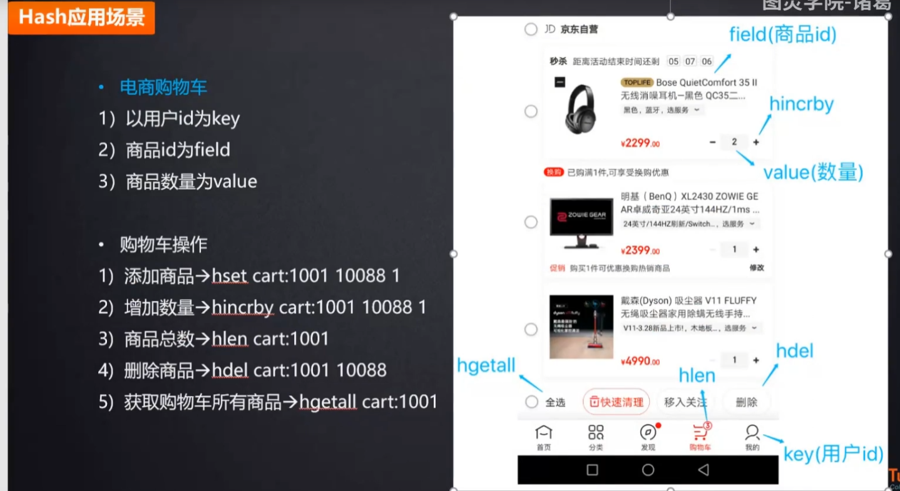
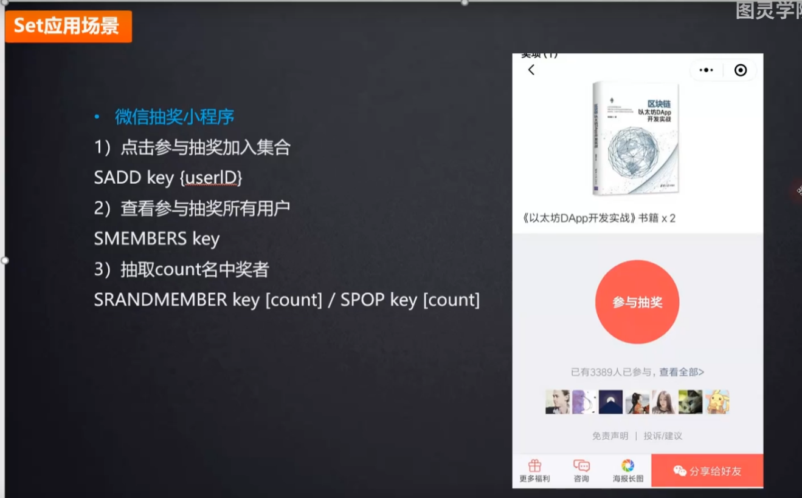
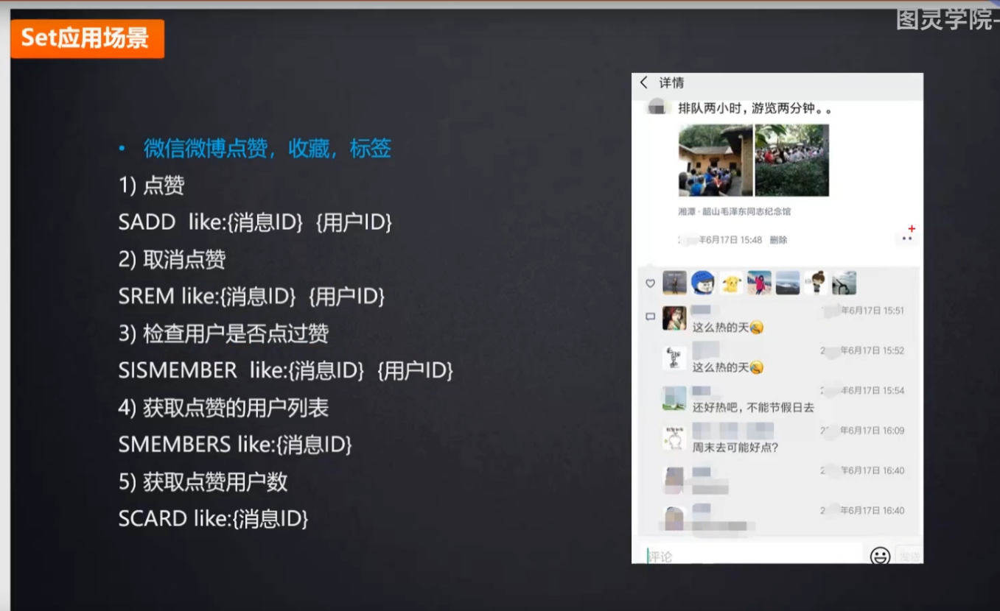

## Redis应用场景

**分布式锁实现**
在分布式场景下，无法使用基于进程的锁来对多个节点上的进程进行同步。可以使用 Redis 自带的 SETNX 命令实现分布式锁。

**热点数据存储**
最新评论，最新文章列表，使用 list 存储,ltrim 取出热点数据，删除老数据。

**社交类需求**
Set 可以实现交集，从而实现共同好友等功能，Set 通过求差集，可以进行好友推荐，文章推荐。

**排行榜**
ZSet 可以实现有序性操作，从而实现排行榜等功能。

**延迟队列**
使用 sorted_set ,使用 **[当前时间戳+需要延迟的时长]** 做 score ,消息内容作为元素，调用 zadd 来生产消息，消费者使用 zrangbyscore 获取当前时间之前的数据做轮询处理。消费完再删除任务 rem key member。

**计数器**
可以对 String 进行自增自减运算，从而实现计数器功能。Redis这种内存型数据库的读写性能非常高，很适合存储频繁读写的计数量。

**分布式ID生成**
利用自增特性，一次请求一个大一 点的步长如incr 2000 ,缓存在本地使用，用完再请求。

**海量数据统计**
位图(bitmap) :存储是否参过某次活动，是否已读谋篇文章，用户是否为会员，日活统计。 

**会话缓存**
可以使用 Redis 来统存储多台应用服务 器的会话信息。当应用服务器不再存储用户的会话信息，也就不再具有状态，一个用户可以请求任意一个应用服务器，从而更容易实现高可用性以及可伸缩性。

**分布式队列阻塞队列**
List是一个双向链表， 可以通过 lpush/rpush 和 rpop/lpop 写入和读取消息。可以通过使用 brpop/blpop来实现阻塞队列。

## Hash 应用场景

**电商购物车**
1) 以用户id为key 
2) 商品id为field
3) 商品数量为value

**购物车操作**
1) 添加商品>hset cart:1001 10088 1
2) 增加数量>hincrby cart:1001 10088 1
3) 商品总数>hlen cart:1001
4) 删除商品>hdel cart:1001 10088
5) 获取购物车所有商品>hgetall cart:1001

## Set 应用场景

