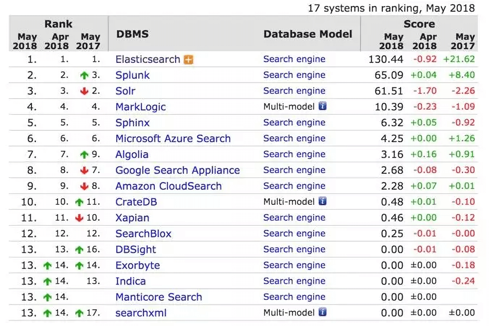

## 01

#### 需求的诞生

刘备一大早就来到了公司，一看张飞和关羽已经在公司了，就问道：“两位贤弟，今天来的还蛮早啊。”

张飞一听就炸毛了，“大哥，你让我和二哥去做什么搜索功能，我们已经一晚没睡了，昨天就没回去好嘛。” 

关羽也来气，“大哥，是啊，我们刚刚才上线电商网站，你这边又要加什么需求，现在用数据库检索不是好好的么，能不能让我们歇口气。”

“两位兄弟辛苦了，我也不想啊，最近咱们一单生意都没有啊。昨天我和一位朋友聊，他说我们的网站很不好用，找不到他想要的鞋，结果只好去别的地方买了。

不过他给我推荐了一位黑客高手，叫诸葛亮的家伙，说是啥都得懂，我们今天找他取经去。”

## 02

#### 三顾茅庐

三人一行来找诸葛亮，不过前面两次都碰了壁。

据诸葛亮书童说，诸葛亮不在家，到了第三次，还是不在家。张飞仔细一听，明明是有人在家啊，而且玩游戏喊的声音还这么大，张飞怒了，搭梯子把诸葛亮家的保险给拔了。诸葛亮正郁闷呢，咋停电了呢？算了，今天没得玩了，于是让书童请他们进来。

“在下诸葛名亮，字孔明，不知三位...”，三人一说，是这么这么回事。诸葛亮一听，“哦，原来是这么这么回事啊，你们的网站我刚看了，你们家的草鞋品种确实不 Nan 少 Kan。

如今客户上网站找东西，都是先用网站的搜索来搜一下，但是你们网站的搜索功能实在是太 La 弱 Ji，明摆在那里的商品我都搜不出来，实在是大问题啊。”

“这样啊，我看你们仨都是好人，给你们推荐一个好东西，叫做 Elasticsearch，这个肯定可以帮助你们。”

“翼德，把先生放下来吧。”

“是，大哥。二哥，你把刀也放下吧。”

关羽一听，好像在哪里听说过 Elasticsearch，“大哥，这个东西好像有点耳熟啊，哦，诸葛亮先生这一说，我倒是记起来了，隔壁公司的吕布最近神神秘秘的，好像就是在用这个，难怪他们最近公司业务好的很”。

## 03

#### Elasticsearch 的故事

诸葛亮清了清嗓子，又从抽屉里摸出一把扇子，“还是让我来给你们讲讲吧”。

“Elasticsearch 以前叫 Elastic Search。顾名思义，就是“弹性的搜索”。很明显，它一开始是围绕着搜索功能，打造了一个分布式搜索引擎，底层是基于开源的搜索引擎库 Lucene，是由 Java 语言编写的，项目大概是 2010 年 2 月份在 Github 正式落户的。

咳咳，有必要首先给你介绍一下 Lucene。

Lucene 是一个非常古老的搜索引擎工具包，也是用 Java 编写，主要用来构建倒排索引（一种数据结构）和对这些索引进行检索，从而实现全文检索功能。

 Lucene 很强大，使用起来也非常灵活，缺点是它仅仅是一个基础类库，也没有考虑到高并发和分布式的场景。

如果你想在自己的程序里面使用 Lucene，还是需要做很多工作，并且涉及很多搜索原理和索引数据结构的知识，这就给我们带来了不少挑战。所以，Lucene 的上手时间一般都比较长。”

关羽插了一句，“Lucene 我知道，确实贼难用，使用起来一堆问题啊，我之前试过来着。” 关羽说完，脸又红了。

诸葛亮接着说。“时间一晃来到 2004 年，有一个以色列小伙子，名字叫谢伊·班农（ Shay Banon），他成亲不久来到伦敦，因为当时他的夫人正好在伦敦学厨师。

初来乍到，也没有找到工作，于是班农就打算写一个叫作 iCook 的小程序来管理和搜索菜谱，一来练练手，方便找工作；二来这个小工具还可以给其夫人用。 

班农在编写 iCook 的过程中，使用了 Lucene，感受到了直接使用 Lucene 开发程序的各种暴击和痛苦，于是他在 Lucene 之上，封装了一个叫作 Compass 的程序框架，与 Hibernate 和 JPA 等 ORM 框架进行集成，通过操作对象的方式来自动地调用 Lucene 以构建索引。

这样做的好处是，可以很方便地实现对‘领域对象’进行索引的创建，并实现‘字段级别’的检索，以及实现‘全文搜索’功能。可以说，Compass 大大简化了给 Java 程序添加搜索功能的开发。Compass 开源出来，变得很流行。

在 Compass 编写到 2.x 版本的时候，社区里面出现了更多需求，比如需要有处理更多数据的能力以及分布式的设计。班农发现只有重写 Compass ，才能更好地实现这些分布式搜索的需求，于是 Compass 3.0 就没有了，取而代之的是一个全新的项目，也就是 Elasticsearch。”

## 04

#### 让人怦然心动的 Elasticsearch

看到刘备三人听的入迷，诸葛亮轻挥羽扇，继续说了下去。

“得益于 Compass 项目的积累，Elasticsearch 问世之初就考虑到了功能的易用性。

Elasticsearch 作为一个独立的搜索服务器，提供了非常方便的搜索功能。用户完全不用关心底层 Lucene 的细节，只需要通过标准的 Http+RESTful 风格的 API，就可以进行索引数据的增删改查。数据的输入输出采用 JSON 格式，以文档和面向对象的方式，这样就能非常方便地理解和表达领域数据。”

张飞一拍桌子，“Elasticsearch 简直就是一个 Compass 的 RESTful 实现啊！”

“没错。同时，Elasticsearch 基于分片和副本的方式实现了一个分布式的 Lucene Directory，再结合Map-reduce 的理念，实现了一个简单的搜索请求分发合并的策略，能轻松化解海量索引和分布式高可用的问题。

可以说，仅仅依靠这两点，Elasticsearch就已经秒杀了当时市面上所有的搜索引擎服务或是程序库，我当时看到 Elasticsearch 也眼前一亮。 

如今，Elasticsearch 基本上已经是搜索引擎市场排名第一的产品了，从 DB-Engines 网站的排名可以看到，Elasitcsearch 基本上是一骑绝红尘，拉开第二名远远一大截。” 

统计数据来源：https://db-engines.com/en/ranking/search+engine

## 05

#### ELK 横空出世

诸葛亮口水狂飙，显得很兴奋，“如果只是 Elasticsearch 单独使用，那我们的故事也就结束了，事实上好戏这才刚刚开始。俗话说，一个好汉三个帮，开源社区亦是如此。”
“这一个好汉三个帮，说的不就是咱仨嘛。” 刘备接过话茬。

“别打岔，”诸葛亮继续说，“这里我要说的是 ‘ELK’ 的出现，不过首先我要给你们讲讲 Logstash。”

Logstash 是一个开源的日志处理工具，用 JRuby 写的，主要特点是基于灵活的 Pipeline 管道架构来处理数据。

什么意思呢？可以理解为将数据放进一个管道内进行处理，并且就跟真正的自来水管一样，管道由一截一截管子组成，每一个小管代表着一个数据处理的流程，每一个流程只做一件事情，然后可以根据数据的处理需要，选择多个不同类型的管子灵活组装。

Logstash 社区非常活跃，支持多种输入数据源和多种输出数据源。一开始， Elasticsearch 只是作为其中一个输出的存储，主要用于日志数据的存储。

不过，随着大家把日志发送到 Elasticsearch 之后，大家发现这家伙用起来很方便嘛，不仅能够存储大量的数据，水平伸缩还很方便。更关键的是，你能够很方便地把数据找出来，也就是进行全文搜索。

全文搜索在日志分析里面是非常基础的一个功能，通过一个关键字就能定位具体的详细日志，相比存放到关系型数据库和普通的文件存储，Elasticsearch 优势非常明显。于是 Logstash 搭配 Elasticsearch 变得很受欢迎。

## 06

#### Kibana 的故事

不过 Logstash 自带的 UI 查询日志的界面有点简陋，于是有一个叫作 Rashid Khan 的运维工程师表示完全忍不了了，用 PHP 写了一个叫作 Kibana 的程序，一个更好看和更好用的前端界面。PHP 写完一版，他又用 Ruby 写一版，后面又用 AngularJS 写了一版，不仅有日志的搜索和查看，还加上了一些统计展示功能。

Kibana 的名字其实是俩个水果的名字的组合（Kiwi+Banana）。

张飞听到这里：“工作不饱和啊这家伙”。孔明瞪了他一眼，继续说道。

这个时候，Elasticsearch 已经有 Facet 概念，也就是分面统计（ 注：1.0 之后推出了 Aggregation 来代替 Facet），可以对数据里面的某个字段进行单个维度的统计，支持多种统计类型。

比如， TermFacet 可以计算字段里面某些值出现了多少次；Histogram Facet 还可以按时间区间进行汇总统计等。

这些统计功能在前端 UI 就可以被利用起来，展示一些饼图、时间曲线等等，在运维的分析里面自然也都是需要的。慢慢的 Kibana 越做越复杂，支持的功能越来越多，Kibana 3 变得流行起来。

于是乎，ELK 横空出世（Elasticsearch、Logstash 和 Kibana 这三个产品的首字母缩写），风靡了整个运维界。

故事讲到这里，相信你们对于 Elasticsearch 就有了一个大概的认识，可以用它做搜索，也可以用它做日志。”

张飞点点头，“还是相当的强悍嘛。”

## 07

#### Elastic Stack 平台的魅力

“不过，这还没完。”诸葛亮吞了吞口水，继续说。

“**Elastic 后面又引入了 Beats 家族**。这是一系列非常轻量级的数据收集端，我给你介绍几个比较典型的，比如：

- Packetbeat 可以实时监听网卡流量，并实时解析网络协议数据，可用来做 NPM 网络数据分析；

- Metricbeat 可以用来收集服务器，以及服务器上部署的应用服务的各项监控指标数据，这样就可以替代 Zabbix 等传统的监控软件，来做服务器的性能指标分析；

- Auditbeat可以实时收集服务器的行为事件，用于安全方面的入侵检测和安全日志审计分析；

- Winlogbeat用于 Windows 平台的事件日志收集；

- Filebeat 用于日志文件的收集等。

Elasticsearch、Logstash、Kibana、Beats ，这几个放在一起，就叫作 Elastic Stack。

如今，Elastic 的版图越来越大，前年，Elastic 收购 Opbeat，开源了业界第一个完整的 APM 解决方案，通过探针可以实现无侵入的代码级别的应用性能监控；

去年7月又收购了代码搜索 Insight.IO，后续可以实现代码级别的语义检索。今年又收购了一个做终端安全的厂商 Endgame。这样 Elastic Stack 这一个平台就可以同时做到：

- 日志分析

- 性能指标分析

- 安全日志分析

- APM 应用性能分析

- NPM 网络性能分析

- 网站站内搜索

- 企业级搜索

- 代码搜索

- 实时 BI 业务分析

- SIEM 解决方案

- 终端设备安全

- ......

试想一下：

在一个风和日丽的下午，你手机上收到一条告警短信，于是点击链接，打开 Kibana 的监控仪表盘，发现某台服务器的 CPU 达到 100% 了。

于是，你顺手点击过滤这台服务器的所有相关信息，可以看到相关的日志显示，是这台服务器上面部署的某一个业务服务的 QPS 有显著下降，然后过滤到这个业务的日志，发现有很多异常的日志信息，前端 Nginx 代理日志还显示有很多请求被拒绝，看样子是后端的微服务处理能力达到瓶颈。

这个时候，继续点击 APM 的分析面板，切换到事务和会话分析界面，看到有很多数据库链接处于开启状态。

你点击查看调用代码，立马就找到了性能瓶颈的原因，原来是某个类的某个方法调用 MySQL 却没有及时释放链接造成了泄露，于是修改这行代码，提交上线，问题解决。然后，你可以若无其事地继续浏览相亲网站啦。

尽管这是一个假想的例子，但是可以看到，基于 Elastic Stack ，你可以覆盖一整套完整的，从全局性能监控到具体代码级别的排障和解决问题的过程，并且使用起来要比很多现有的方案更加高效和便捷。

好了，现在你们是否对 Elasticsearch 已经有了一个初步的了解呢？是不是也有跃跃欲试的打算？”

刘备点点头：“今天来先生这里真的是收获不少，之前多有冒犯，还请多多包涵啊。”

关羽也说：“大哥，明天我就和三弟开始研究 Elasticsearch，争取早日改造好咱们的网站。”

“刚说的相亲网站要不也发我一下”，张飞连忙问道。刘备没好气白了一眼张飞。

“天色已晚，告辞了！”

刘备三人作别孔明，各自高兴的回家了。

“慢走不送，有空来喝茶啊。” 

孔明抹了一把额头，总算送走这仨了，恐怕从此江湖上估计要不平静喽。

---

转载来源：微信公众号--[GitChat](<https://mp.weixin.qq.com/s?__biz=MzIyMjYyMzg3MA==&mid=2247490226&idx=2&sn=6a6d61e991ef8096432c5103d7e17a48&chksm=e82bfba3df5c72b5de0fd78da3539afe6fa82596f4673b4fba6012cf9d4ac0b5aad8123f2d37&mpshare=1&scene=24&srcid=#rd>)