## 前言 

分享自己成功搭建 Laravel Sail 环境的方法和步骤 ，虽然官方文档 描述的 比较详细，但是操作下来总会有官方文档没有出现的问题，同时也是给没有搭建过 Laravel Sail 新手的文档补充。

PS： 按照我文档从头往下操作，成功率可能达到 **99.999%**。


## #1 Window 系统

Laravel Sail 要求支持 WSL 2 的 Windows 10 系统。

在 2020 年五月份发布的 2004 版本才支持 WSL 2 功能，所以我们的系统需更新到等于或大于 2004 版本。

window 10 升级操作 忽略......

系统升级完成之后，搜索打开 **Windows 功能管理** 窗口，确保下图箭头的两个地方都已开启：

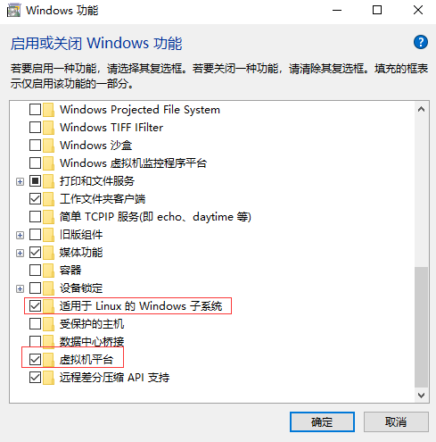

##### 将 WSL 2 设置为默认版本

打开 PowerShell，然后在安装新的 Linux 发行版时运行以下命令，将 WSL 2 设置为默认版本：

```
wsl --set-default-version 2
```

如果执行上面命令弹出以下内容，需要更新内核包， 下载链接 ：https://docs.microsoft.com/zh-cn/windows/wsl/install-win10#step-4---download-the-linux-kernel-update-package

```
WSL 2 需要更新其内核组件。有关信息，请访问 https://aka.ms/wsl2kernel
```


## #2 安装软件

#### 安装 Windows Terminal

为了更好地访问 Windows 的子系统，推荐使用 Windows Terminal 作为命令行工具。

打开微软商店，搜索关键字 `Windows Terminal` ，在搜索结果中点击安装即可：

先下好，后面我再讲如何使用。


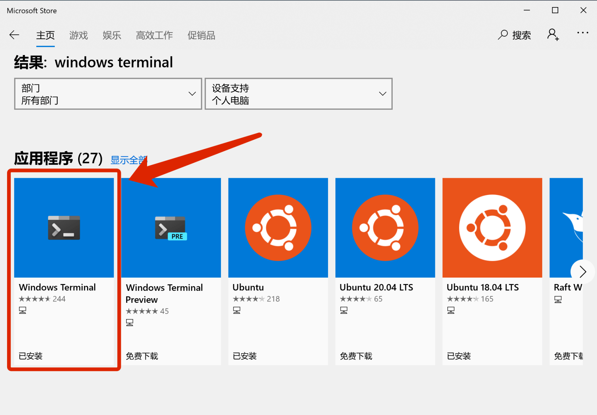


#### 下载 VSCode

打开 [code.visualstudio.com/download](https://code.visualstudio.com/download) ，选择 Windows 版本的 VSCode 进行下载并安装，此处不再赘述。

先安装好，后面我再讲如何使用。


#### 安装 Ubuntu

接下来下载和安装子系统 —— Ubuntu 。

打开微软商店，搜索关键词 Ubuntu，第一和第二个都可以：

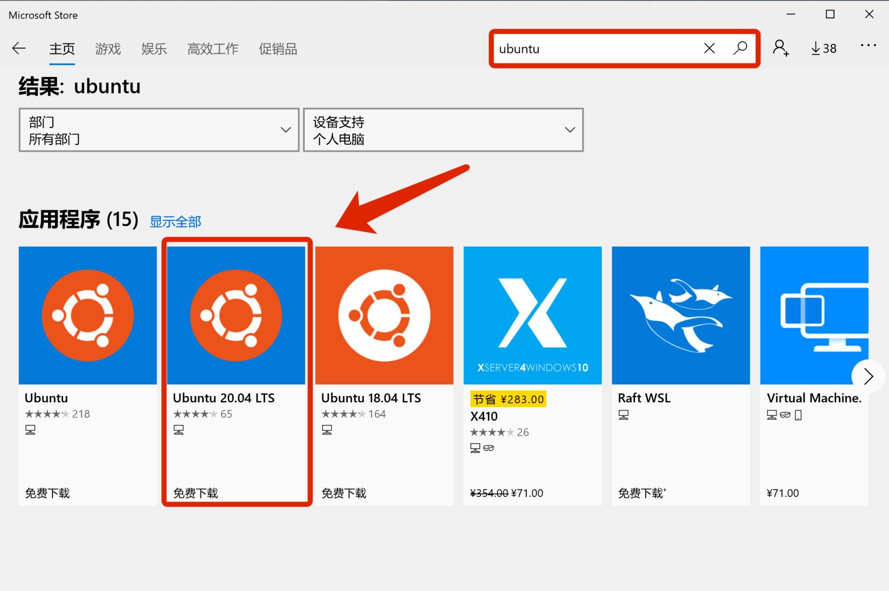


在安装过程中输入密码即可完成 Ubuntu 子系统的安装 ，这个 Ubuntu 为当前 Windows 系统的子系统，接下来我们的 Docker 会基于此系统运行。

打开 `Windows Terminal` ，就会看到我们安装的系统

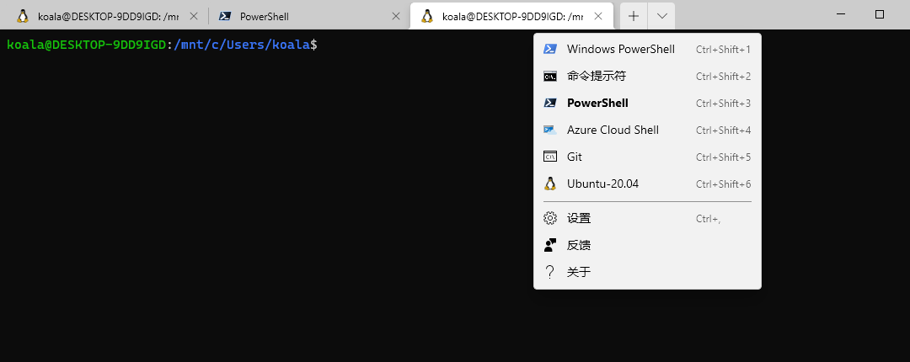


在系统里面， /mnt/ 映射 window 的 C、D盘

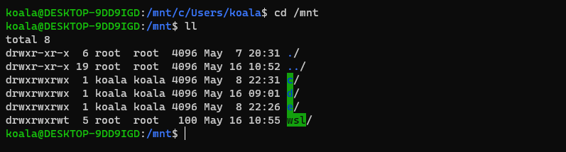


#### 安装 Docker Desktop

##### 1.下载并安装

前往 Docker 官网下载 [Docker Desktop](https://hub.docker.com/editions/community/docker-ce-desktop-windows) ，下载完成后点击安装包安装，一直下一步即可。

##### 2.开启 WSL2 模式

安装完成后运行程序，进入配置页面，开启 WSL2 模式：

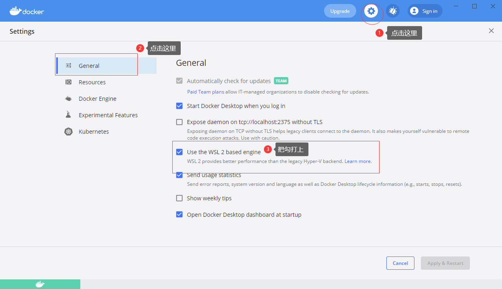


同时这个地方也需要设置，选择我们上一步安装的 Ubuntu 系统，然后点击右下方的按钮应用修改：

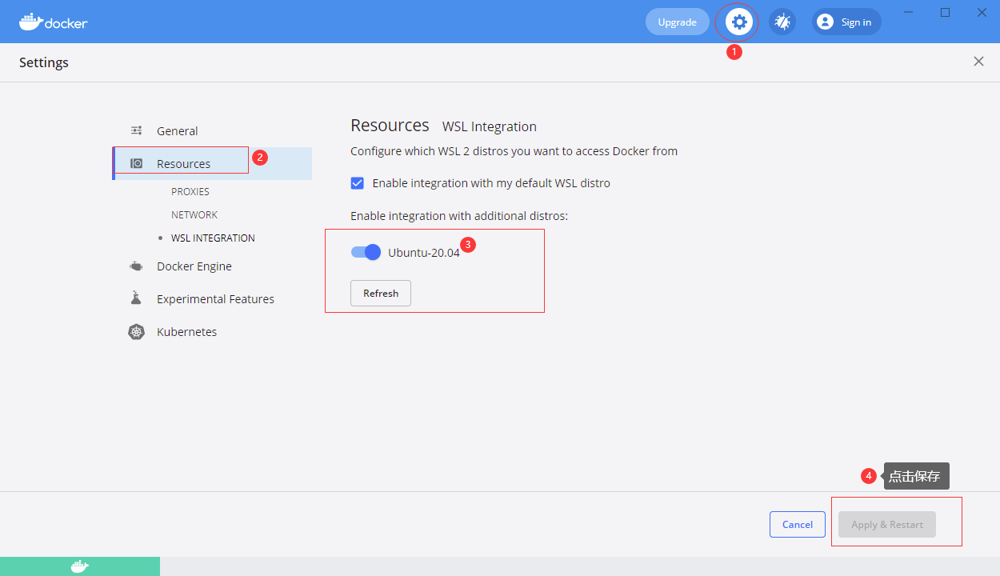


##### 3.Docker Hub 镜像加速

国内从 Docker Hub 拉取镜像有时会遇到困难，此时可以配置镜像加速器。国内很多云服务商都提供了国内加速器服务，例如：

- 阿里云加速器 [(点击管理控制台 -> 登录账号 (淘宝账号) -> 右侧镜像中心 -> 镜像加速器 -> 复制地址)](https://www.aliyun.com/product/acr?source=5176.11533457&userCode=8lx5zmtu)

- 网易云加速器 https://hub-mirror.c.163.com

- 百度云加速器 https://mirror.baidubce.com


**由于镜像服务可能出现宕机，建议同时配置多个镜像。各个镜像站测试结果请到** [**docker-practice/docker-registry-cn-mirror-test**](https://github.com/docker-practice/docker-registry-cn-mirror-test/actions) **查看。**

我们以 [网易云](https://www.163yun.com/) 镜像服务 `https://hub-mirror.c.163.com` 为例进行介绍。

进入 **Docker Engine** 里，黏贴上面的代码，如下：

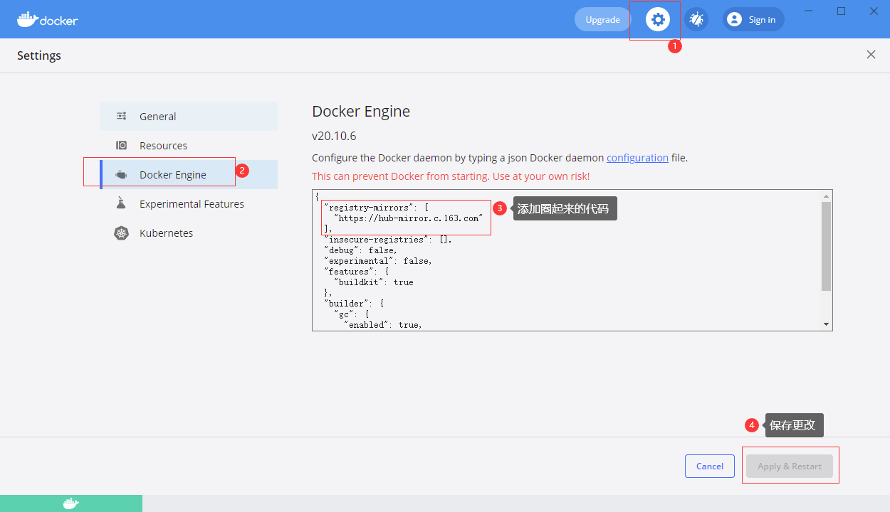

最后点击 **Apply & Restart** ，进行重启，一般需要耗费一两分钟。


## #3 创建测试项目


**Ubuntu 作为 Windows 子系统，可以访问到主系统下的硬盘。**

为了方便管理代码，我在 E 盘下创建了 Code 目录：

```
$ cd /mnt/e
$ mkdir Code
$ cd Code
```

进入此目录后，使用以下命令进行创建一个测试的 Laravel 项目：

```
$ curl -s https://laravel.build/example-app | bash
```

安装过程中，可能会有卡顿，需耐心等待。

最终创建成功的界面：

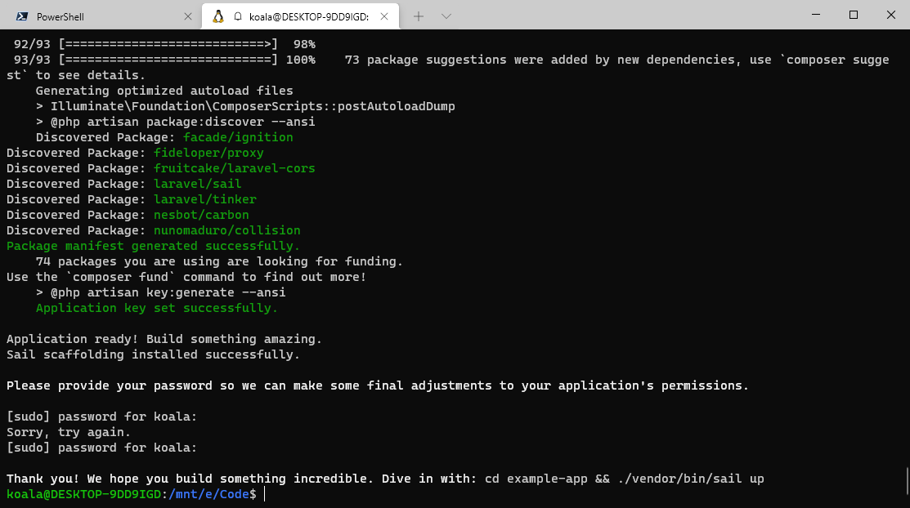


Windows Terminal 工具很好的集成了 VSCode，我们可以在命令行中直接打开编辑器：

```
$ cd example-app/
$ code .
```

VSCode 会在当前目录打开，然后修改 **Dockerfile** 文件

Laravel 8 默认用的是 `vendor/laravel/sail/runtimes/8.0` 目录下的 Dockerfile，本文将以此来讲解。`7.4` 或其他版本与此类似。

#### 1. 加速 Linux 更新

新建文件，内容如下：

*vendor/laravel/sail/runtimes/8.0/sources.list*

```
deb http://mirrors.aliyun.com/ubuntu/ focal main restricted universe multiverse
deb-src http://mirrors.aliyun.com/ubuntu/ focal main restricted universe multiverse
deb http://mirrors.aliyun.com/ubuntu/ focal-security main restricted universe multiverse
deb-src http://mirrors.aliyun.com/ubuntu/ focal-security main restricted universe multiverse
deb http://mirrors.aliyun.com/ubuntu/ focal-updates main restricted universe multiverse
deb-src http://mirrors.aliyun.com/ubuntu/ focal-updates main restricted universe multiverse
deb http://mirrors.aliyun.com/ubuntu/ focal-proposed main restricted universe multiverse
deb-src http://mirrors.aliyun.com/ubuntu/ focal-proposed main restricted universe multiverse
deb http://mirrors.aliyun.com/ubuntu/ focal-backports main restricted universe multiverse
deb-src http://mirrors.aliyun.com/ubuntu/ focal-backports main restricted universe multiverse
```

在 `RUN apt-get update` 之前，新增 `ADD` 命令：

*vendor/laravel/sail/runtimes/8.0/Dockerfile*

```
RUN ln -snf /usr/share/zoneinfo/$TZ /etc/localtime && echo $TZ > /etc/timezone

ADD sources.list /etc/apt/
```

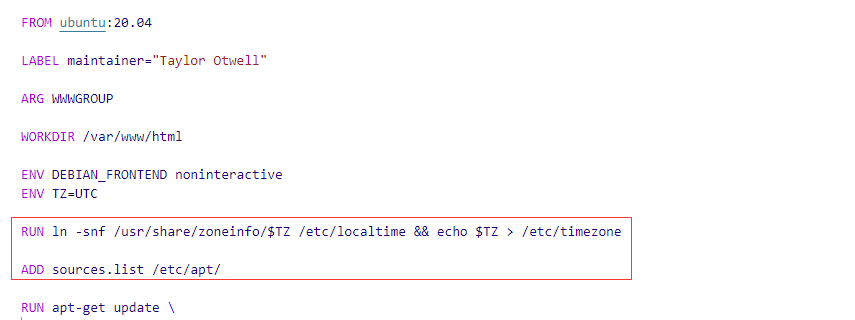

#### 2. Ubuntu PPA 加速

在 vendor/laravel/sail/runtimes/8.0/Dockerfile 文件中，搜索并将：

```
http://ppa.launchpad.net
```

替换为：

```
https://launchpad.proxy.ustclug.org
```

这是中国科学技术大学开源软件提供的镜像。


#### 3.下载 Composer 可执行文件

在 vendor/laravel/sail/runtimes/8.0/Dockerfile 文件中，搜索以下这一行：

```
    && php -r "readfile('http://getcomposer.org/installer');" | php -- --install-dir=/usr/bin/ --filename=composer \
```

替换为：

```
    && curl -so /usr/bin/composer https://mirrors.aliyun.com/composer/composer.phar \
    && chmod a+x /usr/bin/composer \
    && composer --version \
```

这是从阿里云镜像上下载。

#### 4. Node 二进制文件下载[#](https://learnku.com/docs/laravel-development-environment/8.x/setting-up-the-sail-environment-under-windows-10/10352#2aa737)

Node 二进制文件下载是以下这一行代码：

```
    && curl -sL https://deb.nodesource.com/setup_15.x | bash - \
```

目前没有好的加速通道，安装时可能会卡住这里，多尝试几次。


#### 5.运行容器

在项目的根目录下，执行以下命令：

```
$ ./vendor/bin/sail up
```

第一次运行的时候，会初始化容器，有了上面的我们对 Dockerfile 的定制，应该会比较顺利。

**注意** `sail up` 命令运行成功后，会一直显示软件的**实时日志**界面：

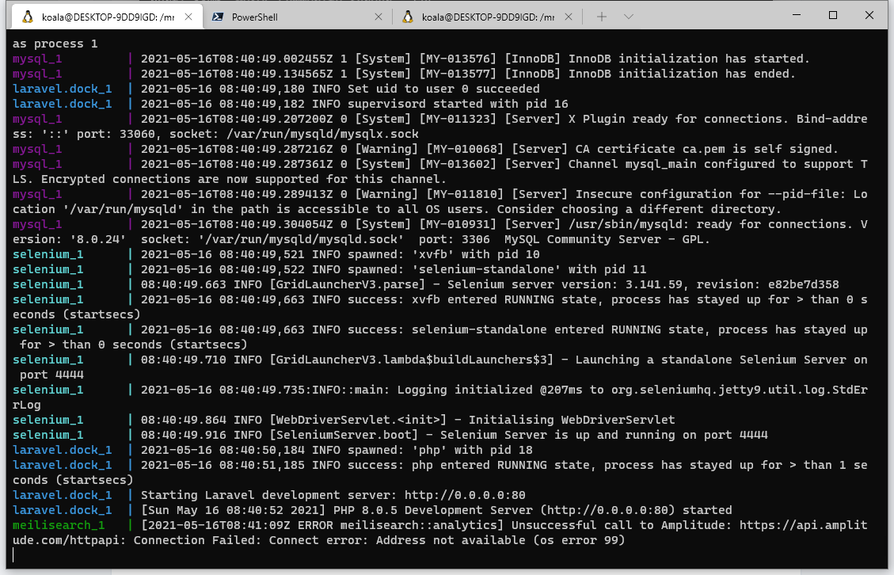


此时你可以 `ctrl+c` 中断运行，再次运行时，可以使用 `-d` 参数让 `sail up` 命令在后台运行：

```
./vendor/bin/sail up -d
```

**扩展知识：**`d` 为 Deamon 的简写。Daemon 程序，又称为**守护进程**，通常在系统后台长时间运行。

**最后劳动成果：**

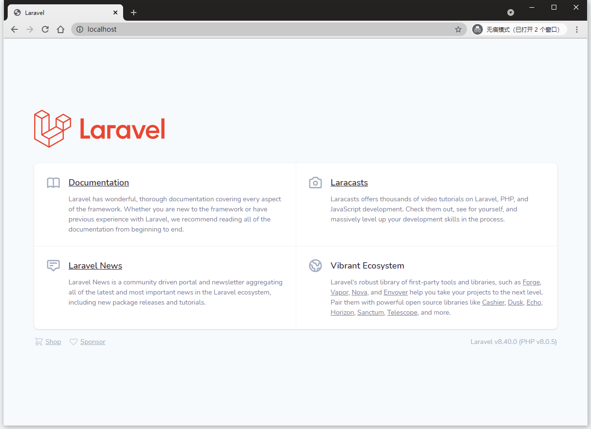


## #4 问题处理

> failed to fetch http://......  
>
> ERROR: Service 'laravel.test' failed to build

原因：镜像源的问题，**要更换镜像源**。

之前在搭建环境的时候，已经对 Laravel Sail 的镜像源定制过，所以更换起来很简单。
之前定义镜像源地址的文件是：
vendor/laravel/sail/runtimes/8.0/sources.list

解决办法：

更换为**中科大**的镜像源

```
deb http://mirrors.ustc.edu.cn/ubuntu/ focal main restricted universe multiverse
deb-src http://mirrors.ustc.edu.cn/ubuntu/ focal main restricted universe multiverse
deb http://mirrors.ustc.edu.cn/ubuntu/ focal-security main restricted universe multiverse
deb-src http://mirrors.ustc.edu.cn/ubuntu/ focal-security main restricted universe multiverse
deb http://mirrors.ustc.edu.cn/ubuntu/ focal-updates main restricted universe multiverse
deb-src http://mirrors.ustc.edu.cn/ubuntu/ focal-updates main restricted universe multiverse
deb http://mirrors.ustc.edu.cn/ubuntu/ focal-proposed main restricted universe multiverse
deb-src http://mirrors.ustc.edu.cn/ubuntu/ focal-proposed main restricted universe multiverse
deb http://mirrors.ustc.edu.cn/ubuntu/ focal-backports main restricted universe multiverse
deb-src http://mirrors.ustc.edu.cn/ubuntu/ focal-backports main restricted universe multiverse
```


> Ports are not available: listen tcp 0.0.0.0:80: bind: An attempt was made to access a socket in a way forbidden by its access permissions.

原因：Window 10 中 80 端口被占用了，一般是 IIS 占用

解决办法： 

1. win+R ，输入 services.msc  弹出服务，

2. 找到 **World Wide Web Publishing Service** ，双击打开后,将启动类型改为**手动,**更改服务状态为 “**停止**”


**参考资料：**

> [适用于 Linux 的 Windows 子系统安装指南]( https://docs.microsoft.com/zh-cn/windows/wsl/install-win10)

> [搭建 Laravel Sail 开发环境 - Windows](https://learnku.com/docs/laravel-development-environment/8.x/setting-up-the-sail-environment-under-windows-10/10352)

> [docker 报错端口被占用 sqlserver 占用80端口](https://my.oschina.net/u/4334671/blog/3659755)