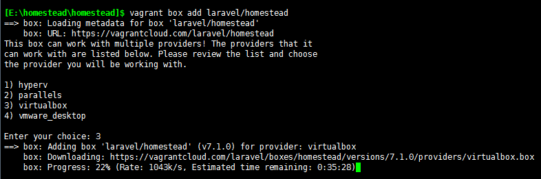
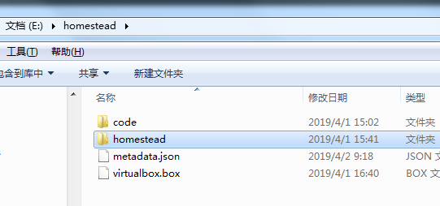

## windows安装方式

#### 在线安装

box下载地址：https://vagrantcloud.com/laravel/boxes/homestead/versions/7.1.0/providers/virtualbox.box

> vagrant box add laravel/homestead



会有四个选项让你选择。这里我们用的varant box 就选3

1) hyperv
2) parallels
3) virtualbox
4) vmware_desktop

线上下载太慢，所以选择手动安装

---


#### 本地安装

**方式一**

步骤一：



```
> vagrant box add metadata.json
```

metadata.json 内容如下：

```
{
    "name": "laravel/homestead",
    "versions": 
    [
        {
            "version": "7.1.10",
            "providers": [
                {
                  "name": "virtualbox",
                  "url": "virtualbox.box"
                }
            ]
        }
    ]
}
```

步骤二：

```
运行以下命令进入 Homestead 管理脚本的目录里：
> cd Homestead

使用以下命令创建新的虚拟机：
> vagrant up
```


**方式二**


```
> vagrant box add laravel/homestead d:/code/homestead.box
```

默认安装的box 镜像储存的位置：以我电脑为例在C:\Users\mengy\.vagrant.d\boxes


##### 安装 Homestead 管理脚本

```
假设路径在E:\vagrant\homestead

clone管理脚本
# git clone https://github.com/laravel/homestead.git
# cd Homestead

因为master不稳定所以切到使用打过标签的稳定版本 
# git checkout v7.18.0	

创建 Homestead.yaml 配置文件
在E:\vagrant\homestead\homestead 执行如下语句：

#init.bat （window中双击）
或
#bash init.sh

注意：
因为本地安装的 homestead.box 版本为0，所以需要修改下面步骤生成的配置文件 E:\vagrant\homestead\homestead\scripts\homestead.rb 以下内容

    config.vm.box_version = settings["version"] ||= ">= 0"
    
使用以下命令创建新的虚拟机：
# vagrant up
```


### SSH 秘钥登录

##### 用于实现 SSH 免密码登录 修改 Homestead.yaml 文件以下内容：

```
keys:
    - C:/Users/mengy/.ssh/id_rsa
    - C:/Users/mengy/.ssh/id_rsa.pub
    
生成 key的方法，在文件里调出Git Bash Here

    ssh-keygen -t rsa -C "youQQ@qq.com"
    
    #后面一真按enter键，设置密码
```


### 配置共享文件夹

##### Homestead.yaml 文件的 folders 属性里列出所有与 Homestead 环境共享的文件夹。这些文件夹中的文件若有变更，它们会保持本地机器与 Homestead 环境之间同步。你可以根据需要配置多个共享文件夹：

```
folders:
    - map: E:/vagrant/code
      to: /home/vagrant/code
      type: nfs
# map 对应的是我们本机的文件夹
# to 对应的是 Homestead 上的文件夹
# type 这样可以提升加载速度
```


### Vagrant命令

```
#启动 如果加上 --provision 选项那么添加的新站点会发布到虚拟机上。
vagrant up
#关闭
vagrant halt
#通过 SSH 登录 vagrant（需要先启动 vagrant）
vagrant ssh
#查看目前安装的box列表
vagrant box list
#删除box镜像
vagrant box remove laravel/homestead
#删除虚拟机
vagrant destroy
#查看当前 Homestead 虚拟机的状态。
vagrant status
```


### homestead 配置修改要重新加载

    # vagrant reload --provision


### 通过 SSH 连接

##### 这样就可以登录的 homestead虚拟主机了，此地可以查看上面定义的本地目录与虚拟机目录同步的情况

> vagrant ssh

##### 利用xshell链接ssh

> 用户名和密码都是vagrant


### 数据库

要从主机的数据库客户端连接到 MySQL，就连接到 127.0.0.1和端口 3306 (MySQL) 。

> 用户名和密码是homestead／secret。

PHP程序连接（虚拟机中连接）端口为 3306


### Redis客户端连接

修改redis配置文件（默认路径/etc/redis/redis.conf）

    requirepass yourpassword ----设置任何你想要的密码
    bind 127.0.0.1 修改为 bind 0.0.0.0

修改完配置后重启redis，执行命令
    
    sudo service redis restart

查看修改情况

    $# ps -ef | grep redis

修改Homestead.yaml文件端口转发，然后执行vagrant reload --provision重启虚拟机

    ports:
          - send: 63790
            to: 6379

此时使用redis desktop manager连接redis

    连接设置：
        名字： homestead
        地址: 192.168.10.10 : 63790
        验证：homestead


## 响应缓慢

解决WINDOS系统下Homestead运行缓慢的问题

> 一定要先备份

首先，命令行进入 Homestead 启动 vagrant

```
> cd ~/Homestead && vagrant up
```

然后运行安装命令（如果下载失败可能被墙了）

```
$ vagrant plugin install vagrant-winnfsd
```

修改文件1：`homestead/scripts/homestead.rb`

查找此段代码（可能略有不同），替换为以下内容

```
if settings.include? 'folders'
  settings["folders"].sort! { |a,b| a["map"].length <=> b["map"].length }

  settings["folders"].each do |folder|
    config.vm.synced_folder folder["map"], folder["to"], 
    id: folder["map"],
    :nfs => true,
    :mount_options => ['nolock,vers=3,udp,noatime']
  end
end
```

文件2：`Homestead.yaml`

```
folders:
    - map: ~/Code
      to: /home/vagrant/Code
      type: nfs
```

重启 Homestead 使配置文件生效，大功告成。


## PHP安装扩展

### Swoole扩展

#### Pecl 安装

```
# pecl install swoole
# 查看php.ini位置
# php -i | grep php.ini
# 往php.ini配置文件添加
# extension=swoole.so
# 重启PHP服务(根据版本号)
# sudo service php7.3-fpm status
```

