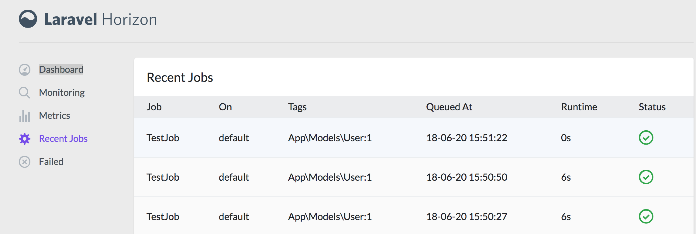

## 消息通知

#### 创建通知

```
php artisan make:notification FindPasswordNotify
```

这个命令会在 `app/Notifications` 目录下生成一个新的通知类。 

### 数据库通知

`database` 通知渠道在一张数据库表里存储通知信息。该表以自定义的 JSON 格式，存储如通知类型等描述通知的信息。需要先创建一个数据库表来存放这些通知。

```
php artisan notifications:table

php artisan migrate
```

修改通知类的 `via` 方法为数据库通知

```
public function via($notifiable)
{
	return ['database'];
}
```

然后定义 `toArray` 方法返回用于储存到数据表中的通知数据。

#### 存取通知

Laravel 的默认模型 `App\User` 已经引入了 Trait `Illuminate\Notifications\Notifiable` ，它包含了一个 Eloquet 关系 `notifications` ，可以为实体返回通知。

```
$user = App\User::find(1);

foreach ($user->notifications as $notification) {
    echo $notification->type;
}
```

如果你仅仅想检索所有「未读」通知，你需要使用 `unreadNotifications` 关系。

```
$user = App\User::find(1);

foreach ($user->unreadNotifications as $notification) {
    echo $notification->type;
}
```

#### 通知标记已读

```
$user = App\User::find(1);

foreach ($user->unreadNotifications as $notification) {
    $notification->markAsRead();
}
```

你可以直接使用 `markAsRead` 方法操作一个通知集合，而不是遍历处理每个通知：

```
$user->unreadNotifications->markAsRead();
```

### 邮件通知

修改通知类中的 `toMail` 与 `__construct` 方法

```
public function __construct($token)
{
	$this->token=$token;
}
public function toMail($notifiable)
{
	return (new MailMessage)
		->subject('验证邮箱')
		->greeting(config('app.name'))->line('点击下面的链接重设密码')
		->action('重置密码',url(route('password.change', $this->token)))
		->line('感谢使用');
}
```

**自定义模板**

你可以通过发布通知包的资源来修改 HTML 模板和纯文本模板。运行这个命令后，邮件通知模板就被放在了 `resources/views/vendor/notifications` 文件夹下： 

```
php artisan vendor:publish --tag=laravel-notifications
```

### 发送通知

**使用 Notifiable Trait**

通知可以通过两种方法发送： `Notifiable` trait 的`notify` 方法或 `Notification` [facade](https://laravel-china.org/docs/laravel/5.6/facades)。首先，让我们探索使用 trait ：

```
<?php namespace App;

use Illuminate\Notifications\Notifiable;
use Illuminate\Foundation\Auth\User as Authenticatable;

class User extends Authenticatable
{
    use Notifiable;
}
```

默认的 `App\User` 模型中使用了这个 trait，它包含着一个可以用来发通知的方法：`notify` 。 `notify` 方法需要一个通知实例做参数：

```
use App\Notifications\InvoicePaid;

$user->notify(new InvoicePaid($invoice));
```

**使用 Notification Facade**

另外，你可以通过 `Notification` `facade` 来发送通知。它主要用在当你给多个可接收通知的实体发送通知的时候，比如给用户集合发通知。要用 facade 发送通知的话，要把可接收通知的实体和通知的实例传递给 `send` 方法：

```
Notification::send($users, new InvoicePaid($invoice));
```

### 队列化通知

发送通知可能很耗时，尤其是是当频道需要一个额外的 API 来发送通知。要加速你的应用响应时间，让你的通知继承 `ShouldQueue` 接口 并且在你的类中添加 `Queueable` trait。这些接口和 trait 已经被使用 `make:notification` 生成的所有通知引入了，所以你可以直接将他们添加到你的通知类：

```
<?php

namespace App\Notifications;

use Illuminate\Bus\Queueable;
use Illuminate\Notifications\Notification;
use Illuminate\Contracts\Queue\ShouldQueue;

class InvoicePaid extends Notification implements ShouldQueue
{
    use Queueable;

    // ...
}
```

做好一上操作并正常配置好队列后，系统将自动使用异步队列发送通知。

## 自定义函数

有时我们需要加载自定义的函数文件，在 `composer.json` 文件中定义如下：

```
"autoload": {
    ...
    "files": ["bootstrap/helpers.php"]
}
```

命令行执行 `composer dump-autoload` 重新生成加载配置

## Redis

在homestead 中的redis允许的IP为 `127.0.0.1` 如果想让windows或mac的GUI工具可访问需要执行以下几步：

```
#修改redis配置文件，将127.0.0.1 改为 0.0.0.0
sudo vim /etc/redis/redis.conf
```

重起redis服务

```
sudo service redis restart
```

Gui 图形管理工具

- Mac   http://getmedis.com/
- Win\Mac\Linux  https://redisdesktop.com/

## 队列

队列用于异步执行消耗时间多的工作，比如发送邮件，商城定单处理等操作，好处是可以快速为客户响应结果，具体处理异步后台操作。

下面的操作使用高效的redis完成处理，所以需要安装相应扩展包

```
composer require "predis/predis:~1.0"
```

#### 配置

修改 `config/queue.php` 队列配置文件。

```
'default' => env('QUEUE_DRIVER', 'sync'),
```

sync 为同步可更改为 database 或 redis即为后台异步操作 ，需要先在 `config/database.php` 文件中将连接设置好。

#### 处理失败任务

有时你的队列任务会失败。Laravel 包含了一个便捷的方式指定任务会被最大尝试的次数。在一个任务达到了它最大尝试次数后，它会被放入 `failed_jobs` 表。要创建 `failed_jobs` 表你可以使用 `queue:failed-table` 命令：

```
php artisan queue:failed-table
php artisan migrate
```

#### 创建任务

```
php artisan make:job TestJob
```

在生成的类中的 `handle` 方法设置任何具体动作，下面是一个简单的示例。

```
protected $user;

public function __construct(User $user)
{
	$this->user = $user;
}

public function handle()
{
	sleep(6);
	file_put_contents('a.php', var_export($this->user->toArray(),true));
}
```

#### 分发任务

```
TestJob::dispatch(User::find(1));
```

#### 队列处理器

队列处理器用于执行推送到队列中的任务

```
php artisan queue:work
```

> 要使 `queue:work` 在后台运行需要使用下面讲到的 `Supervisor` （生产环境必用）

#### Laravel 队列监控面板

Horizon 提供了一个漂亮的仪表盘，并且可以通过代码配置你的 Laravel Redis 队列，同时能够让你轻松地监控你的队列系统中诸如任务吞吐量，运行时间和失败任务等关键指标。

安装

```
composer require laravel/horizon
php artisan vendor:publish --provider="Laravel\Horizon\HorizonServiceProvider"

```

启动执行任务监听

只需一条命令语句即可启动队列执行进程。如果修改了任何代码需要重起 `horizon` 监听（需要在homestead系统执行）

```shell
php artisan horizon
```

可以通过路由 `/horizon` 以图形界面查看任何状态



## Supervisor

Supervisor是一个进程控制系统，用于让我们的队列任务在后台运行，并自动维护进行如果挂了就自动重起。 

#### 修改配置文件 

```
sudo vi /etc/supervisor/conf.d/laravel-worker.conf
```

 内容如下

```
[program:laravel-worker]
process_name=%(program_name)s_%(process_num)02d
command=php /home/vagrant/code/hdcms-laravel/artisan queue:work --sleep=3 --tries=3
autostart=true
autorestart=true
user=vagrant
numprocs=8
redirect_stderr=true
stdout_logfile=/home/vagrant/code/hdcms-laravel/worker.log
```

> 注意 command 与 stdout_logfile 配置根据环境自行更改

#### 运行

依次执行下面命令加载配置并运行 `Supervisor`

```
sudo supervisorctl reread

sudo supervisorctl update

sudo supervisorctl start laravel-worker:*
```

> 这样我们就不需要执行 `php artisan queue:work` 命令了，交给 `Supervisor` 自动维护吧