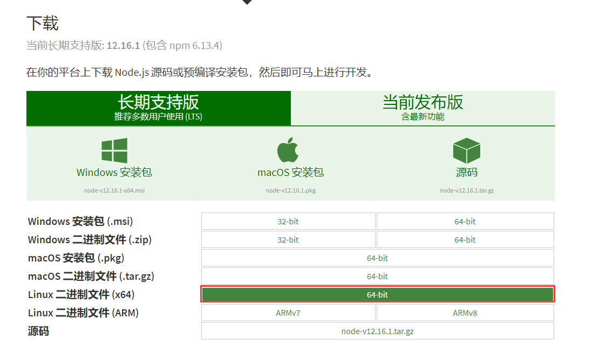

### nodejs安装

安装地址：

https://nodejs.org/zh-cn/download/

http://nodejs.org/dist/


1、 选择Linux对应版本



或者wget下载:

> https://nodejs.org/dist/v12.16.1/node-v12.16.1-linux-x64.tar.xz

2、解压安装包

```
xz -d node-v12.16.1-linux-x64.tar.xz
tar -xvf node-v12.16.1-linux-x64.tar
```

3、创建软连

```
mv node-v12.16.1-linux-x64 /usr/local/nodejs
ln -s /usr/local/nodejs/bin/node /usr/local/bin
ln -s /usr/local/nodejs/bin/npm /usr/local/bin
```

4、查看安装情况

```
node -v
```

