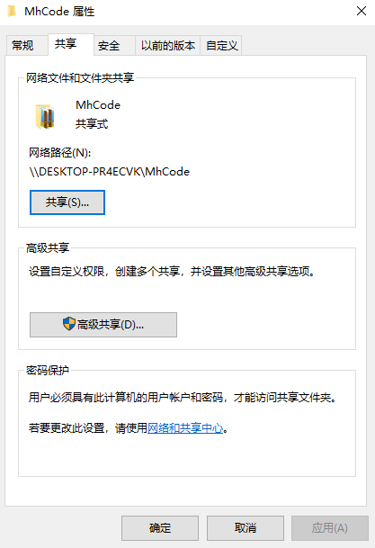
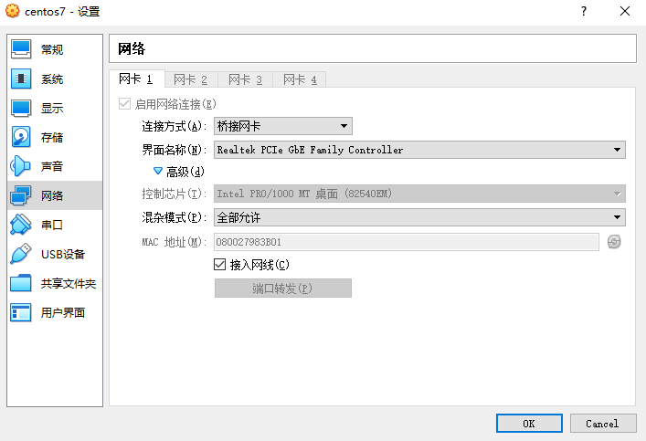

#### VirtualBox 安裝centos7

> 下载地址：https://www.centos.org/download/

#####  VirtualBox加载centos7.iso文件，并按着提示下一步进行

#####  安装中创建用户：koala，密码：12345678，安装完并重启

##### 配置网络设置

###### 开启网络

```
# sudo vi /etc/sysconfig/network-scripts/ifcfg-enp0s3

修改内容如下：

BOOTPROTO=static
IPADDR=192.168.1.101   // ip地址
GATEWAY=192.168.1.1    // 网关
NETMASK=255.255.255.0
DNS1=8.8.8.8
DNS2=8.8.8.4
ONBOOT=yes

修改完成之后：
# sudo systemctl restart network.service
```


##### 防火墙开启ssh端口	

    # sudo firewall-cmd --zone=public --add-port=22/tcp --permanent
    # sudo systemctl restart firewalld.service

##### 安装vim

    # yum -y instll vim


#### Windows共享目录通过挂载形式在虚拟机使用

1. windows配置共享目录




2. 修改/etc/fstab：


**注意事项，如果上面配置没有加载文件夹，那么再加一个参数vers：**

//192.168.1.23/MhCode /data/web cifs username=meng,password=1234,gid=992,uid=995,vers=2.1 0 0


3. 修改虚拟机网络连接方式【桥接网卡】

