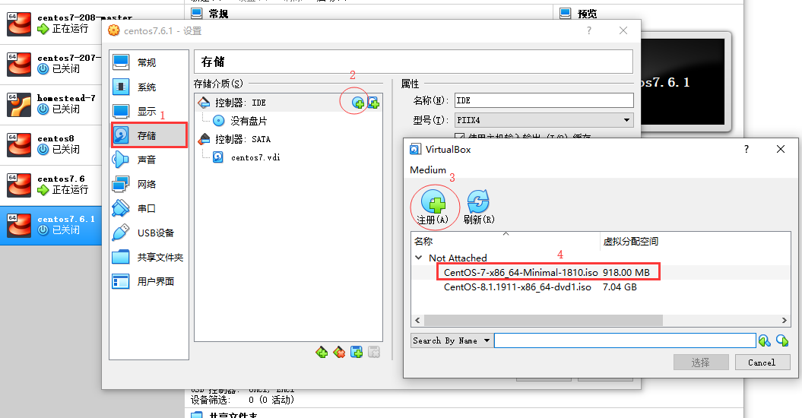
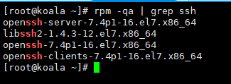

#### Windows环境下使用VirtualBox 安裝centos7

> **下载地址：**https://www.centos.org/download/


#####  1、新建虚拟电脑，然后选择加载centos7.6.iso文件




#####  2、启动虚拟机，然后按照提示一步一步安装centos7


##### 3、安装成功之后，修改网络设置

> \# sudo vi /etc/sysconfig/network-scripts/ifcfg-enp0s3

```
修改内容如下：

BOOTPROTO=static
IPADDR=192.168.1.101   // ip地址
GATEWAY=192.168.1.1    // 网关
NETMASK=255.255.255.0
DNS1=8.8.8.8
DNS2=8.8.8.4
ONBOOT=yes

修改完成之后：
# sudo systemctl restart network.service
```


##### 4、查看网络的连通性

> ping 192.168.1.23  

如果连通失败，修改虚拟机网络连接方式【桥接网卡】，如果还不行且关闭防火墙


##### 5、 使用ssh工具（`xshell`），登录虚拟机


##### 防火墙开启ssh端口	

    # sudo firewall-cmd --zone=public --add-port=22/tcp --permanent
    # sudo systemctl restart firewalld.service


如果登陆失败，先检查有没有安装ssh服务

> rpm -qa | grep ssh



如果没有显示上面图片内容，可以参考这个 [地址](https://blog.csdn.net/baibaigao/article/details/80956417) 进行操作


##### 6、 Windows共享目录通过挂载形式在虚拟机使用

1. windows配置共享目录


2. 修改/etc/fstab：


**注意事项，如果上面配置没有加载文件夹，那么再加一个参数vers：**

//192.168.1.23/MhCode /data/web cifs username=meng,password=1234,gid=992,uid=995,vers=2.1 0 0


##### 7、 重启虚拟机，然后可以随心所欲配置你需要的环境了


