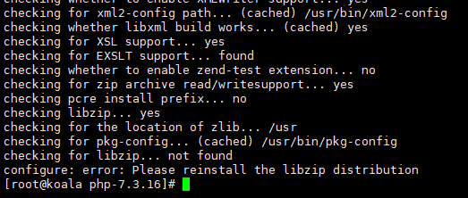

# 编译安装php7.3

> centos系统版本7.6.*，php版本7.3.16


### 第一：依赖安装

```
yum -y install gcc libxml2 libxml2-devel openssl openssl-devel curl-devel libjpeg-devel bzip2-devel.x86_64 libXpm-devel gmp-devel icu libicu libicu-devel php-mcrypt libmcrypt libmcrypt-devel postgresql-devel libxslt-devel libpng libpng-devel freetype-devel php-devel
```


### 第二：编译安装

> 下载php安装包到home

```
# cd /home
# wget http://cn2.php.net/distributions/php-7.3.16.tar.gz
```

#### **解压php安装包**

```
# tar -zxvf php-7.3.16.tar.gz
# cd php-7.3.16
```

#### 编译参数配置

```
./configure --prefix=/usr/local/php --with-pdo-pgsql --with-zlib-dir --with-freetype-dir --enable-mbstring --with-libxml-dir=/usr --enable-soap --enable-calendar --with-curl --with-gd --with-pgsql --disable-rpath --enable-inline-optimization --with-bz2 --with-zlib --enable-sockets --enable-sysvsem --enable-sysvshm --enable-pcntl --enable-mbregex --enable-exif --enable-bcmath --with-mhash --enable-zip --with-pcre-regex --with-pdo-mysql --with-mysqli --with-jpeg-dir=/usr --with-png-dir=/usr --with-openssl --with-fpm-user=nginx --with-fpm-group=nginx --with-libdir=/lib/x86_64-linux-gnu/ --enable-ftp --with-gettext --with-xmlrpc --with-xsl --enable-opcache --enable-fpm --with-iconv --with-xpm-dir=/usr
```

**注意事项**：

1、在php7.1时，官方就开始建议用openssl_*系列函数代替Mcrypt_*系列的函数；从php7.2开始不支持：unrecognized options: –with-mcrypt, –enable-gd-native-ttf

2、一些文章这里的参数写这个`--with-fpm-user=www --with-fpm-group=www` , 

会出现错误：`ERROR: [pool www] cannot get uid for user 'www'`
解决办法是：新建www 用户组：

```
# groupadd www
# useradd -g www www
```

3、Nginx报403 forbidden错误 (13: Permission denied)的解决办法

```
1、检查目录权限问题
2、nginx和php 用户组不一样的问题，可以跟我一样把php用户组设为nginx
```


#### **编译&安装**

```
make && make install
```

安装完成后，我们要把源码包中的配置文件复制到PHP安装目录下，源码包中有两个配置  php.ini-development  php.ini-production  ，看名字就知道，一个是开发环境，一个是生产环境，我们这里就复制生产环境的

```
# cp php.ini-production /usr/local/php/lib/php.ini
```

另外还需要设置环境变量

修改`/etc/profile`文件使其永久性生效，并对所有系统用户生效，在文件末尾加上如下两行代码

```
PATH=$PATH:/usr/local/php/bin
export PATH
```

然后执行 命令 `source /etc/profile`

php -v 就可以看到PHP版本信息了


#### 此时还需要配置PHP-fpm:

```
修改配置文件：
# cp php.ini-production /usr/local/php/conf/php.ini
# cp /usr/local/php/etc/php-fpm.conf.default /usr/local/php/etc/php-fpm.conf
# cp /usr/local/php/etc/php-fpm.d/www.conf.default /usr/local/php/etc/php-fpm.d/www.conf
```

systemctl文件加入开机启动文件

```
# cp sapi/fpm/php-fpm.service /usr/lib/systemd/system/php-fpm.service
# systemctl start php-fpm.service
# systemctl enable php-fpm.service
```


## 安装过程问题解答：

1、 在./configure这个一步的时候，可能会抛出以下错误：



```
其原因是：libzip版本过低
解决办法：卸载现在的低版本，重新安装新的版本
	
# yum remove libzip libzip-devel

然后下载新版本：

//1.2.0版本
# wget https://nih.at/libzip/libzip-1.2.0.tar.gz
# tar -zxvf libzip-1.2.0.tar.gz
# cd libzip-1.2.0
# ./configure
# make && make install

// 1.5.0新版本

如果直接 './configure' 安装,会弹出提示：-bash: ./configure: No such file or directory,我们可以通过查看软件目录下的readme和INSTALL文件，里面会告诉你怎么安装软件，例如本软件是通过cmake安装的。

同时CentOS 7上官方的CMake版本是2.8.12，比较旧。许多新的C/C++项目要求的最低版本至少是3，需要升级旧版本或者直接安装新版。

// cmake 和 cmake3都要安装
# yum install -y cmake
# yum install -y cmake3
// 如果提示cmake3 没有找到，可以`yum install epel-release` 再install

# wget https://libzip.org/download/libzip-1.5.0.tar.gz
# tar -zxvf libzip-1.5.0.tar.gz
# cd libzip-1.5.0/
# mkdir build && cd build && cmake3 .. && make && make install
```


2、centos7编译php7 configure: error: off_t undefined; check your library configuration

```
# 添加搜索路径到配置文件
echo '/usr/local/lib64
/usr/local/lib
/usr/lib
/usr/lib64'>>/etc/ld.so.conf
# 更新配置
ldconfig -v
```


3、 Nginx和php-fpm用Sock套接字连接时，Nginx错误日志报以下错误提示

> [crit] 1654#0: *1 connect() to unix:/usr/local/php/var/run/php-fpm.sock failed (13: Permission denied) while connecting to upstream, client: 192.168.1.204, server: laravel.test, request: "GET /favicon.ico HTTP/1.1", upstream: "fastcgi://unix:/usr/local/php/var/run/php-fpm.sock:", 

```
解决办法一：看看Nginx和php-fpm在同一个用户组，如果不是则设置统一

查看Nginx和php-fpm信息
# ps aux|grep nginx 
# ps aux|grep php

修改配置文件：
/etc/nginx/nginx.conf 中修改以下内容：
user nginx;

/usr/local/php/etc/php-fpm.d/www.conf 中修改以下内容：
    user = nginx
    group = nginx
    listen.owner = nginx
    listen.group = nginx
	listen.mode = 0666
修改linten:
    ;listen = 127.0.0.1:9000
    listen = /usr/local/php/var/run/php-fpm.sock

解决办法二：解决办法一还没有解决，那么其原因有可能是“SELinux”设置为开启状态（enabled）的原因，将状态改为关闭

查看本机SELinux的开启状态
    # /usr/sbin/sestatus -v

临时关闭（不用重启）
	# setenforce 0

永久关闭（需要重启）
修改配置文件 /etc/selinux/config,将SELINUX=enforcing 改为 SELINUX=disabled

	# vi /etc/selinux/config

修改
    #SELINUX=enforcing
    SELINUX=disabled

重启生效
	# reboot
```


4、报错/usr/local/include/zip.h:59:21: fatal error: zipconf.h: No such file or directory

```
cp /usr/local/lib/libzip/include/zipconf.h /usr/local/include/zipconf.h
```


5、 报错/package/php-7.3.16/ext/zip/php_zip.c:3318:48: error: ‘LIBZIP_VERSION’ undeclared (first use in this function)

```
重新正确安装 libzip
```


参考链接：

https://cloud.tencent.com/document/product/213/38056

https://blog.csdn.net/ijijni/article/details/89913738

