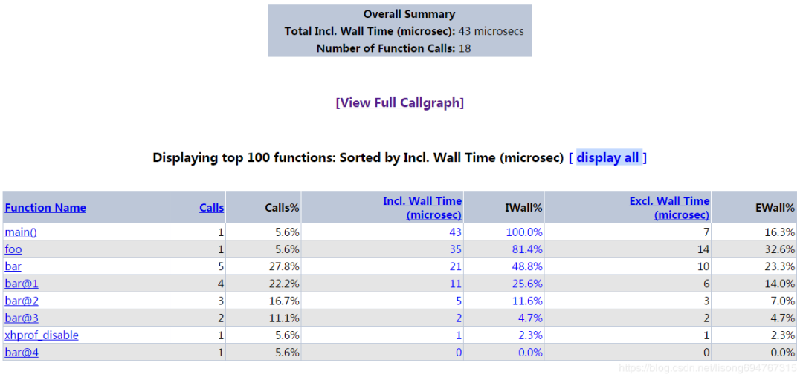

### Xhprof

> 源自FaceBook的PHP性能分析工具

`Xhprof`是一个轻量级的分层性能测量分析器。在数据收集阶段，它跟踪调用次数与测量数据，展示程序动态调用的弧线图。它在报告、后期处理阶段计算了独占的性能度量，例如运行经过的时间、CPU 计算时间和内存开销。

`Xhprof`包含了一个基于 HTML 的简单用户界面(由 PHP 写成)，可以方便地浏览性能分析报告，这对理解代码执行结构常常很有帮助。


## 安装

`Xhprof` 是PHP的一个扩展，所以只需要按照PHP扩展的编译安装方法来安装即可。

**1、下载扩展包**

支持PHP 7+的`Xhprof`扩展包：https://github.com/longxinH/xhprof

```
wget https://github.com/longxinH/xhprof/archive/v2.2.0.tar.gz
```

**2、解压编译**

PHP扩展编译三部曲：`phpize`、`configure`、`make`。

```
$ tar xzf xhprof-2.2.0.tar.gz
$ cd xhprof-2.2.0/extension
$ /usr/local/services/php7/bin/phpize
$ ./configure --prefix=/usr/local/services/php7/lib/php/extensions/no-debug-zts-20160303 --with-php-config=/usr/local/services/php7/bin/php-config
$ make
```

然后就可以在当前的 `modules` 目录下看到编译生成的 `so` 文件，将它拷贝到扩展目录。

注：安装 autoconf 库：`yum -y install autoconf`

**3、配置php.ini**

在 php 的配置文件中添加两行配置，并重启 php-fpm：

```
extension=xhprof.so
xhprof.output_dir=/data/release/xhprof_project/output
```

其中 `xhprof.output_dir` 用于指定存储 xhprof 分析数据的目录。


## 创建Xhprof项目

**1、创建目录**

```
mkdir /data/release/xhprof_project
```

**2、将相关文件拷贝到目录下**

```
cp -r /data/software/xhprof-2.2.0/xhprof_html /data/release/xhprof_project/
cp -r /data/software/xhprof-2.2.0/xhprof_lib /data/release/xhprof_project/
```

**3、添加nginx访问配置**

```
server {
        listen  80;
        server_name xhprof.report.com;
        root /data/release/xhprof_project/xhprof_html;
        index index.php index.html;

        location ~* \.php$ {
                include fastcgi_params;
                fastcgi_param SCRIPT_FILENAME $document_root$fastcgi_script_name;
                fastcgi_pass  127.0.0.1:9000;
                fastcgi_index index.php;
        }
}
```


## 使用

在PHP脚本中使用的模式如下：

```
<?php

// 开始分析
xhprof_enable();

// 你的代码

// 停止分析
$xhprof_data = xhprof_disable();

// 导入两个库文件
$XHPROF_ROOT = "/data/release/xhprof_project";
include_once $XHPROF_ROOT . "/xhprof_lib/utils/xhprof_lib.php";
include_once $XHPROF_ROOT . "/xhprof_lib/utils/xhprof_runs.php";

// 保存这次分析的结果数据
$xhprof_runs = new XHProfRuns_Default();
$run_id = $xhprof_runs->save_run($xhprof_data, "xhprof_foo");

// 查看地址
echo "http://xhprof.report.com/index.php?run=$run_id&source=xhprof_foo"
```

默认只会分析代码的耗时，可以通过传参控制是否分析代码的memory和CPU性能数据：

```
xhprof_enable(XHPROF_FLAGS_CPU | XHPROF_FLAGS_MEMORY);
```

在浏览器打开输出的地址，可以看到如下结果分析页：



图中的表格给出了代码的性能分析数据，分别表示：

- `Funciton Name`：函数名
- `Calls`：调用次数
- `Calls%`：调用占比
- `Incl. Wall Time (microsec)`：函数运行时间（包括子函数）
- `IWall%`：函数运行时间（包括子函数）占比
- `Excl. Wall Time(microsec)`：函数运行时间（不包括子函数）
- `EWall%`：函数运行时间（不包括子函数）占比

点击页面中`[View Full Callgraph]`链接，可以绘制出一张可视化的性能分析图。如果点击后报错`failed to execute cmd：" dot -Tpng". stderr：sh：dot：command not found`，可能是缺少依赖库`graphviz`，安装即可。


文章参考：

https://blog.csdn.net/lisong694767315/article/details/84929602