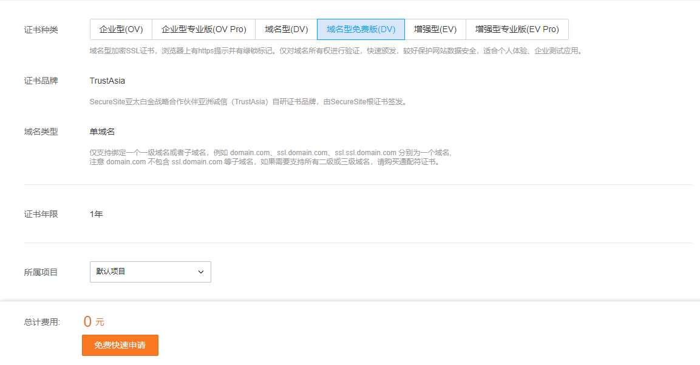
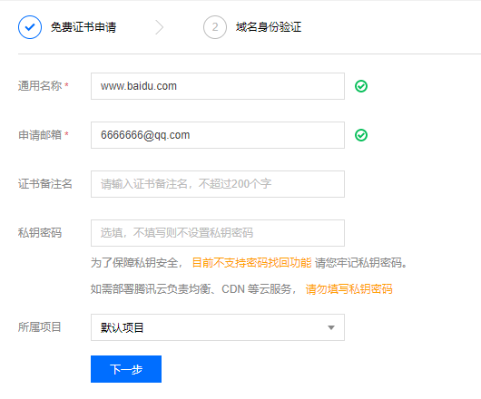
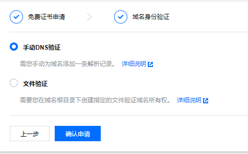
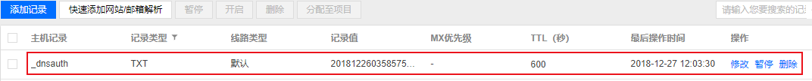
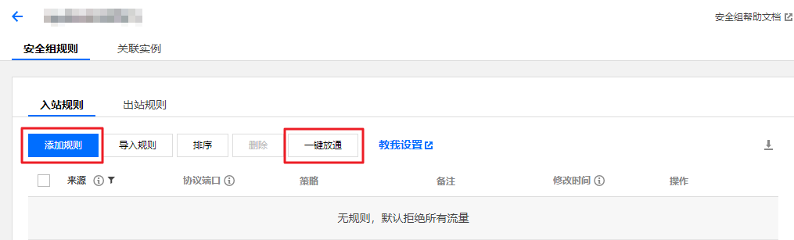
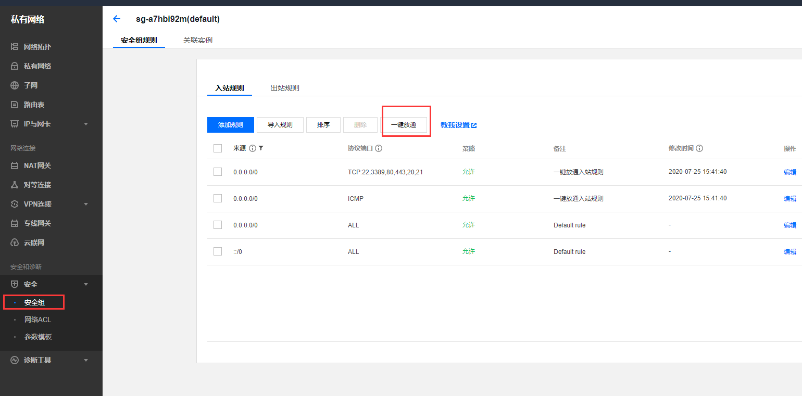

通过上一篇文章，我们已经通过腾讯云服务器搭建自己的网站，其中还有些不完美的地方，就是网站还没有设置HTTPS。


这次我们为网站配置一下SSL，在脑海里简单构思一下接下来要操作的流程：

​		申请证书  ==>  配置Nginx ==> 配置安全组规则（443端口开发）


#### SSL证书

1. 选择腾讯免费提供的 SSL 证书，值得注意的是这个免费仅支持绑定一个一级域名或子域名，有多个需求的选择其他类型。





2. 选择你要绑定的域名



3. 域名身份验证



查看 [详细说明](https://cloud.tencent.com/document/product/400/4142#2.E3.80.81.E6.89.8B.E5.8A.A8dns.E9.AA.8C.E8.AF.81) 知道，我域名解析是阿里云，所以选择 **手动DNS验证**

然后在 阿里云解析中添加一条记录类型为 TXT 的 DNS 记录




最后是等待验证，如果验证通过则腾讯云会通过短信或者微信提醒。


#### Nginx 配置

证书通过之后，将证书下载放到自己的服务器中，然后进行Nginx配置。

腾讯云提供了相关文档了解: [文档链接](https://cloud.tencent.com/document/product/400/35244)

由于我使用的是 Nginx，所以我只需要腾讯云证书压缩包中的 Nginx 目录中的两个文件 xxx.crt、xxx.key，修改Nginx 的配置文件 default.conf

```
server {
    #SSL 访问端口号为 443
    listen 443 ssl;

    #填写绑定证书的域名
    server_name www.yoursite.com;
    root /data/www/hexo-blog/;
    index  index.html index.htm;

    #证书文件名称
    ssl_certificate /etc/nginx/ssl/1_www.yoursite.com_bundle.crt;
    #私钥文件名称
    ssl_certificate_key /etc/nginx/ssl/2_www.yoursite.com.key;
    ssl_session_timeout 5m;
    #请按照以下协议配置
    ssl_protocols TLSv1 TLSv1.1 TLSv1.2;
    #请按照以下套件配置，配置加密套件，写法遵循 openssl 标准。
    ssl_ciphers ECDHE-RSA-AES128-GCM-SHA256:HIGH:!aNULL:!MD5:!RC4:!DHE;
    ssl_prefer_server_ciphers on;

    location / {
        index  index.html index.htm;
    }
}

# HTTP 自动跳转 HTTPS 的安全配置
server {
    listen 80;
    server_name www.yoursite.com;
    return 301 https://$host$request_uri;
}

```


然后重启Nginx 。


#### 配置安全组规则

由于现在的云服务器提供商对端口做了限制，所以要想使用 **443端口**，就需要在腾讯云 设置 安全组，官方相关文档了解： [文档地址](https://cloud.tencent.com/document/product/213/39740) 。

在腾讯云控制台 左侧导航栏点击 **安全组**， 进入安全组管理页面，然后点击 **一键放通** 按钮。

一键放通，适用于无需设置 ICMP 协议规则，并通过22，3389，ICMP，80，443，20，21端口便能完成操作的场景。

点击前的页面效果




点击后的页面效果




完成上面的操作，我们就可以通过域名查看自己的劳动成果了。