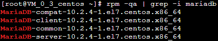

> 腾讯云yum 一键安装 LNMP [相关资料](https://cloud.tencent.com/document/product/213/38056)

### 安装 Nginx

1. 执行以下命令，在 `/etc/yum.repos.d/` 下创建 `nginx.repo` 文件。

```
vi /etc/yum.repos.d/nginx.repo
```

2. 按 “**i**” 切换至编辑模式，写入以下内容。

```
[nginx] 
name = nginx repo 
baseurl = https://nginx.org/packages/mainline/centos/7/$basearch/ 
gpgcheck = 0 
enabled = 1
```

3. 按 “**Esc**”，输入 “**:wq**”，保存文件并返回。
4. 执行以下命令，安装 nginx。

```
yum install -y nginx
```

5. 执行以下命令，打开 `nginx.conf` 文件

```
vim /etc/nginx/nginx.conf
```

6. 按 “**i**” 切换至编辑模式，编辑 `nginx.conf` 文件。

7. 找到 `server{...}`，并将 `server` 大括号中相应的配置信息替换为如下内容。用于取消对 IPv6 地址的监听，同时配置 Nginx，实现与 PHP 的联动。

```
server {
 listen       80;
 root   /usr/share/nginx/html;
 server_name  localhost;
 #charset koi8-r;
 #access_log  /var/log/nginx/log/host.access.log  main;
 #
 location / {
       index index.php index.html index.htm;
 }
 #error_page  404              /404.html;
 #redirect server error pages to the static page /50x.html
 #
 error_page   500 502 503 504  /50x.html;
 location = /50x.html {
   root   /usr/share/nginx/html;
 }
 #pass the PHP scripts to FastCGI server listening on 127.0.0.1:9000
 #
 location ~ .php$ {
   fastcgi_pass   127.0.0.1:9000;
   fastcgi_index  index.php;
   fastcgi_param  SCRIPT_FILENAME  $document_root$fastcgi_script_name;
   include        fastcgi_params;
 }
}
```

8. 保存配置，然后执行以下命令启动 Nginx。

```
systemctl start nginx
```

9. 执行以下命令，设置 Nginx 为开机自启动。

```
systemctl enable nginx
```

10. 在本地浏览器中访问以下地址，查看 Nginx 服务是否正常运行.

```
http://云服务器实例的公网 IP
```


### 安装数据库

1. 执行以下命令，查看系统中是否已安装 MariaDB。

```
rpm -qa | grep -i mariadb
```

返回结果类似如下内容，则表示已存在 MariaDB。



为避免安装版本不同造成冲突，请执行以下命令移除已安装的 MariaDB。

```
yum -y remove 包名
```

若返回结果为空，则说明未预先安装，则执行下一步。


2. 执行以下命令，在 `/etc/yum.repos.d/` 下创建 `MariaDB.repo` 文件。

```
vi /etc/yum.repos.d/MariaDB.repo
```

3. 按 “**i**” 切换至编辑模式，写入以下内容，添加 MariaDB 软件库。

> 说明：不同操作系统的 MariaDB 软件库不同，您可前往 [MariaDB 官网](https://downloads.mariadb.org/) 获取其他版本操作系统的 MariaDB 软件库安装信息。

```
# MariaDB 10.4 CentOS repository list - created 2019-11-05 11:56 UTC
# http://downloads.mariadb.org/mariadb/repositories/
[mariadb]
name = MariaDB
baseurl = http://yum.mariadb.org/10.4/centos7-amd64
gpgkey=https://yum.mariadb.org/RPM-GPG-KEY-MariaDB
gpgcheck=1
```

4. 按 “**Esc**”，输入 “**:wq**”，保存文件并返回。

5. 执行以下命令，安装 MariaDB。

```
yum -y install MariaDB-client MariaDB-server
```

6. 执行以下命令，启动 MariaDB 服务。

```
systemctl start mariadb
```

7. 执行以下命令，设置 MariaDB 为开机自启动。

```
systemctl enable mariadb
```

8. 执行以下命令，验证 MariaDB 是否安装成功。

```
mysql
```


### 安装PHP

1. 依次执行以下命令，更新 yum 中 PHP 的软件源。

```
rpm -Uvh https://mirrors.cloud.tencent.com/epel/epel-release-latest-7.noarch.rpm
rpm -Uvh https://mirror.webtatic.com/yum/el7/webtatic-release.rpm
```

2. 执行以下命令，安装 PHP 7.2 所需要的包。

```
yum -y install mod_php72w.x86_64 php72w-cli.x86_64 php72w-common.x86_64 php72w-mysqlnd php72w-fpm.x86_64
```

3. 执行以下命令，启动 PHP-FPM 服务。

```
systemctl start php-fpm
```

4. 执行以下命令，设置 PHP-FPM 服务为开机自启动。

```
systemctl enable php-fpm
```


### 验证环境配置

当您完成环境配置后，可以通过以下验证 LNMP 环境是否搭建成功

1. 执行以下命令，创建测试文件。

```
echo "<?php phpinfo(); ?>" >> /usr/share/nginx/html/index.php
```

2. 执行以下命令，重启 Nginx 服务。

```
systemctl restart nginx
```

3. 在本地浏览器中访问如下地址，查看环境配置是否成功。

```
http://云服务器实例的公网 IP
```

