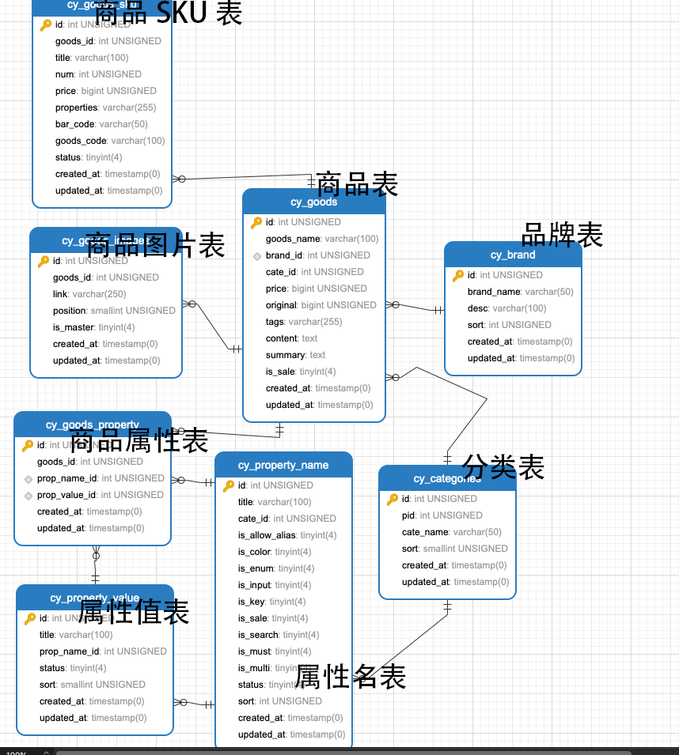

> 文章来源：https://www.cnblogs.com/yehuisir/p/12378068.html

# 表模型

- 商品有品牌丶分类丶属性丶图片丶规格等属性。
- 品牌丶分类丶属性可以重复使用，独立建立表进行存储。
- 商品可能有一张或多张图片，跟商品之间是一对多的关系。
- 商品有一至多个规格，商品和规格是一对多的关系。




# SQL

- 商品表

```
CREATE TABLE `cy_goods` (
  `id` int(10) unsigned NOT NULL AUTO_INCREMENT,
  `goods_name` varchar(100) COLLATE utf8mb4_unicode_ci NOT NULL COMMENT '商品名称',
  `brand_id` int(10) unsigned NOT NULL COMMENT '品牌ID',
  `cate_id` int(10) unsigned NOT NULL COMMENT '分类ID',
  `price` bigint(20) unsigned NOT NULL,
  `original` bigint(20) unsigned NOT NULL COMMENT '商品原价',
  `tags` varchar(255) COLLATE utf8mb4_unicode_ci NOT NULL COMMENT '商品标签',
  `content` text COLLATE utf8mb4_unicode_ci NOT NULL COMMENT '商品内容',
  `summary` text COLLATE utf8mb4_unicode_ci NOT NULL COMMENT '商品描述',
  `is_sale` tinyint(4) NOT NULL COMMENT '上架状态: 1是0是',
  `created_at` timestamp NULL DEFAULT NULL,
  `updated_at` timestamp NULL DEFAULT NULL,
  PRIMARY KEY (`id`),
  KEY `goods_brand_id_foreign` (`brand_id`),
  KEY `goods_cate_id_foreign` (`cate_id`),
  CONSTRAINT `goods_brand_id_foreign` FOREIGN KEY (`brand_id`) REFERENCES `cy_brand` (`id`) ON DELETE CASCADE ON UPDATE CASCADE,
  CONSTRAINT `goods_cate_id_foreign` FOREIGN KEY (`cate_id`) REFERENCES `cy_categories` (`id`) ON DELETE CASCADE ON UPDATE CASCADE
) ENGINE=InnoDB AUTO_INCREMENT=18 DEFAULT CHARSET=utf8mb4 COLLATE=utf8mb4_unicode_ci
```

- 分类表

```
CREATE TABLE `cy_categories` (
  `id` int(10) unsigned NOT NULL AUTO_INCREMENT,
  `pid` int(10) unsigned NOT NULL DEFAULT '0' COMMENT '父级分类ID，0为顶级分类',
  `cate_name` varchar(50) COLLATE utf8mb4_unicode_ci NOT NULL COMMENT '分类名称',
  `sort` smallint(5) unsigned NOT NULL DEFAULT '99' COMMENT '排序字段',
  `created_at` timestamp NULL DEFAULT NULL,
  `updated_at` timestamp NULL DEFAULT NULL,
  PRIMARY KEY (`id`),
  UNIQUE KEY `categories_cate_name_unique` (`cate_name`)
) ENGINE=InnoDB AUTO_INCREMENT=33 DEFAULT CHARSET=utf8mb4 COLLATE=utf8mb4_unicode_ci
```

- 品牌表

```
CREATE TABLE `cy_brand` (
  `id` int(10) unsigned NOT NULL AUTO_INCREMENT,
  `brand_name` varchar(50) COLLATE utf8mb4_unicode_ci NOT NULL,
  `desc` varchar(100) COLLATE utf8mb4_unicode_ci NOT NULL DEFAULT '' COMMENT '品牌描述',
  `sort` int(10) unsigned NOT NULL DEFAULT '99' COMMENT '排序字段',
  `created_at` timestamp NULL DEFAULT NULL,
  `updated_at` timestamp NULL DEFAULT NULL,
  PRIMARY KEY (`id`)
) ENGINE=InnoDB AUTO_INCREMENT=2 DEFAULT CHARSET=utf8mb4 COLLATE=utf8mb4_unicode_ci
```

- 商品图片表

```
CREATE TABLE `cy_goods_images` (
  `id` int(10) unsigned NOT NULL AUTO_INCREMENT,
  `goods_id` int(10) unsigned NOT NULL COMMENT '商品ID',
  `link` varchar(250) COLLATE utf8mb4_unicode_ci NOT NULL COMMENT '图片URL地址',
  `position` smallint(5) unsigned NOT NULL COMMENT '图片位置',
  `is_master` tinyint(4) NOT NULL DEFAULT '0' COMMENT '是否主图: 1是,0否',
  `created_at` timestamp NULL DEFAULT NULL,
  `updated_at` timestamp NULL DEFAULT NULL,
  PRIMARY KEY (`id`),
  KEY `goods_images_goods_id_foreign` (`goods_id`),
  CONSTRAINT `goods_images_goods_id_foreign` FOREIGN KEY (`goods_id`) REFERENCES `cy_goods` (`id`) ON DELETE CASCADE ON UPDATE CASCADE
) ENGINE=InnoDB AUTO_INCREMENT=13 DEFAULT CHARSET=utf8mb4 COLLATE=utf8mb4_unicode_ci
```

- 商品SKU表

```
CREATE TABLE `cy_goods_sku` (
  `id` int(10) unsigned NOT NULL AUTO_INCREMENT,
  `goods_id` int(10) unsigned NOT NULL COMMENT '商品ID',
  `title` varchar(100) COLLATE utf8mb4_unicode_ci NOT NULL COMMENT '规格名称',
  `num` int(10) unsigned NOT NULL COMMENT 'SKU库存',
  `price` bigint(20) unsigned NOT NULL COMMENT '商品售价',
  `properties` varchar(255) COLLATE utf8mb4_unicode_ci DEFAULT NULL COMMENT '商品属性表ID，以逗号分隔',
  `bar_code` varchar(50) COLLATE utf8mb4_unicode_ci NOT NULL DEFAULT '' COMMENT '条码',
  `goods_code` varchar(100) COLLATE utf8mb4_unicode_ci NOT NULL DEFAULT '' COMMENT '商品码',
  `status` tinyint(4) NOT NULL DEFAULT '1' COMMENT '状态:1启用,0禁用',
  `created_at` timestamp NULL DEFAULT NULL,
  `updated_at` timestamp NULL DEFAULT NULL,
  PRIMARY KEY (`id`),
  KEY `goods_sku_goods_id_foreign` (`goods_id`),
  CONSTRAINT `goods_sku_goods_id_foreign` FOREIGN KEY (`goods_id`) REFERENCES `cy_goods` (`id`) ON DELETE CASCADE ON UPDATE CASCADE
) ENGINE=InnoDB AUTO_INCREMENT=6 DEFAULT CHARSET=utf8mb4 COLLATE=utf8mb4_unicode_ci
```

- 属性名表

```
CREATE TABLE `cy_property_name` (
  `id` int(10) unsigned NOT NULL AUTO_INCREMENT,
  `title` varchar(100) COLLATE utf8mb4_unicode_ci NOT NULL COMMENT '属性名',
  `cate_id` int(10) unsigned NOT NULL COMMENT '分类ID',
  `is_allow_alias` tinyint(4) NOT NULL DEFAULT '0' COMMENT '是否允许别名: 1是0否',
  `is_color` tinyint(4) NOT NULL DEFAULT '0' COMMENT '是否颜色属性: 1是0否',
  `is_enum` tinyint(4) NOT NULL DEFAULT '0' COMMENT '是否枚举: 1是0否',
  `is_input` tinyint(4) NOT NULL DEFAULT '0' COMMENT '是否输入属性: 1是0否',
  `is_key` tinyint(4) NOT NULL DEFAULT '0' COMMENT '是否关键属性: 1是0否',
  `is_sale` tinyint(4) NOT NULL DEFAULT '0' COMMENT '是否销售属性:1是0否',
  `is_search` tinyint(4) NOT NULL DEFAULT '0' COMMENT '是否搜索字段: 1是0否',
  `is_must` tinyint(4) NOT NULL DEFAULT '0' COMMENT '是否必须属性: 1是0否',
  `is_multi` tinyint(4) NOT NULL DEFAULT '0' COMMENT '是否多选: 1是0否',
  `status` tinyint(4) NOT NULL DEFAULT '1' COMMENT '状态: 1启用,0禁用',
  `sort` int(10) unsigned NOT NULL DEFAULT '99' COMMENT '排序字段',
  `created_at` timestamp NULL DEFAULT NULL,
  `updated_at` timestamp NULL DEFAULT NULL,
  PRIMARY KEY (`id`),
  KEY `property_name_cate_id_foreign` (`cate_id`),
  CONSTRAINT `property_name_cate_id_foreign` FOREIGN KEY (`cate_id`) REFERENCES `cy_categories` (`id`) ON DELETE CASCADE ON UPDATE CASCADE
) ENGINE=InnoDB AUTO_INCREMENT=2 DEFAULT CHARSET=utf8mb4 COLLATE=utf8mb4_unicode_ci
```

- 属性值表

```
CREATE TABLE `cy_property_name` (
  `id` int(10) unsigned NOT NULL AUTO_INCREMENT,
  `title` varchar(100) COLLATE utf8mb4_unicode_ci NOT NULL COMMENT '属性名',
  `cate_id` int(10) unsigned NOT NULL COMMENT '分类ID',
  `is_allow_alias` tinyint(4) NOT NULL DEFAULT '0' COMMENT '是否允许别名: 1是0否',
  `is_color` tinyint(4) NOT NULL DEFAULT '0' COMMENT '是否颜色属性: 1是0否',
  `is_enum` tinyint(4) NOT NULL DEFAULT '0' COMMENT '是否枚举: 1是0否',
  `is_input` tinyint(4) NOT NULL DEFAULT '0' COMMENT '是否输入属性: 1是0否',
  `is_key` tinyint(4) NOT NULL DEFAULT '0' COMMENT '是否关键属性: 1是0否',
  `is_sale` tinyint(4) NOT NULL DEFAULT '0' COMMENT '是否销售属性:1是0否',
  `is_search` tinyint(4) NOT NULL DEFAULT '0' COMMENT '是否搜索字段: 1是0否',
  `is_must` tinyint(4) NOT NULL DEFAULT '0' COMMENT '是否必须属性: 1是0否',
  `is_multi` tinyint(4) NOT NULL DEFAULT '0' COMMENT '是否多选: 1是0否',
  `status` tinyint(4) NOT NULL DEFAULT '1' COMMENT '状态: 1启用,0禁用',
  `sort` int(10) unsigned NOT NULL DEFAULT '99' COMMENT '排序字段',
  `created_at` timestamp NULL DEFAULT NULL,
  `updated_at` timestamp NULL DEFAULT NULL,
  PRIMARY KEY (`id`),
  KEY `property_name_cate_id_foreign` (`cate_id`),
  CONSTRAINT `property_name_cate_id_foreign` FOREIGN KEY (`cate_id`) REFERENCES `cy_categories` (`id`) ON DELETE CASCADE ON UPDATE CASCADE
) ENGINE=InnoDB AUTO_INCREMENT=2 DEFAULT CHARSET=utf8mb4 COLLATE=utf8mb4_unicode_ci
```

- 商品属性表

```
CREATE TABLE `cy_goods_property` (
  `id` int(10) unsigned NOT NULL AUTO_INCREMENT,
  `goods_id` int(10) unsigned NOT NULL COMMENT '商品ID',
  `prop_name_id` int(10) unsigned NOT NULL COMMENT '属性名ID',
  `prop_value_id` int(10) unsigned NOT NULL COMMENT '属性值ID',
  `created_at` timestamp NULL DEFAULT NULL,
  `updated_at` timestamp NULL DEFAULT NULL,
  PRIMARY KEY (`id`),
  KEY `goods_property_prop_name_id_foreign` (`prop_name_id`),
  KEY `goods_property_prop_value_id_foreign` (`prop_value_id`),
  KEY `goods_property_goods_id_foreign` (`goods_id`),
  CONSTRAINT `goods_property_goods_id_foreign` FOREIGN KEY (`goods_id`) REFERENCES `cy_goods` (`id`) ON DELETE CASCADE ON UPDATE CASCADE,
  CONSTRAINT `goods_property_prop_name_id_foreign` FOREIGN KEY (`prop_name_id`) REFERENCES `cy_property_name` (`id`) ON DELETE CASCADE ON UPDATE CASCADE,
  CONSTRAINT `goods_property_prop_value_id_foreign` FOREIGN KEY (`prop_value_id`) REFERENCES `cy_property_value` (`id`) ON DELETE CASCADE ON UPDATE CASCADE
) ENGINE=InnoDB AUTO_INCREMENT=3 DEFAULT CHARSET=utf8mb4 COLLATE=utf8mb4_unicode_ci
```

