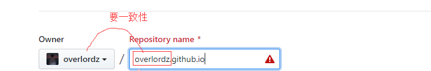
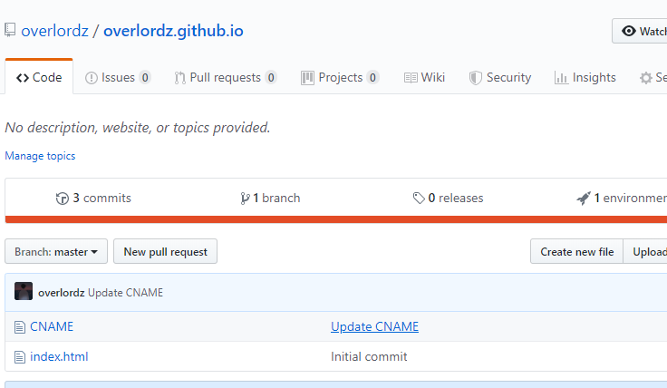
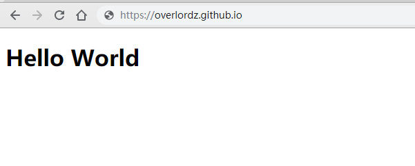
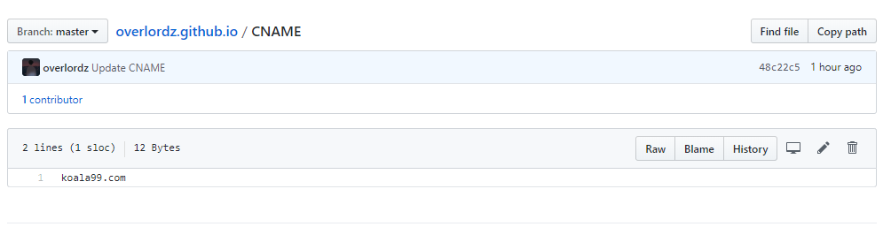
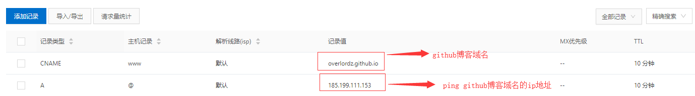

# Github+Hexo搭建个人博客

##### # 前言

查看一些技术博客时发现他们的域名都是 ***.github.io **，就怀着好奇的心思百度了解一下，原来github可以创建免费的博客网站，然后只要再利用Hexo那就可以搭建好看的博客了。


##### # 准备工作

```javascript
1. 有一个github账号；
2. 安装了nodejs、npm；
```


##### # 搭建GitHub博客

1. 创建仓库
建一个名为 你的用户名.github.io 的仓库，比如说，如果你的github用户名是yourname，那么你就新建yourname.github.io的仓库（必须是你的用户名，其它名称无效），之后你的网站访问地址就是 https://yourname.github.io 。



2. 创建一个html文件提交访问看看

   

   


##### # Hexo主题更换

1. 选择Next主题，[点击跳转](http://theme-next.iissnan.com/getting-started.html)

2. 安装主题

```
$ cd your-hexo-site
$ git clone https://github.com/iissnan/hexo-theme-next themes/next
```

3. 更改配置文件

```
站点配置文件：
_config.yml
	theme: next
	language: zh-Hans
	author: 作者名称
	description： 描述
 
主题配置文件 
next/_config.yml
	(放置在 source/images/ 目录下)
	avatar: /images/avatar.png
	主题
	scheme: Pisces
```

4. 创建文章和新建页面

```
hexo new "文章名" #新建文章
hexo new page "页面名" #新建页面
```

5. 编辑文章

```
文章路径：source/_posts/hello-world.md
```

6. 删除文章

在上面编辑路径中删除相对应的文件

7. 启动服务

hexo s 或 hexo server


##### # 绑定阿里云域名（其他原理相同）

1. 在github项目根目录**创建CNAME文件** （注意没有后缀，且文件名是大写），然后在该文件增加**你的域名**，告诉Github Pages服务器你想指定的域名。该域名不能包含前缀信息，即不能添加http://前缀。 




2. 阿里云云解析设置如下图




上面都设置后然后等几分钟，就可以通过域名访问github博客。


记录类型

```
A记录： 将域名指向一个IPv4地址（例如：8.8.8.8）
CNAME：将域名指向另一个域名（例如www.baidu.com）
MX： 将域名指向邮件服务器地址
TXT： 可任意填写，长度限制255，通常做SPF记录（反垃圾邮件）
NS： 域名服务器记录，将子域名指定其他DNS服务器解析
AAAA：将域名指向一个iPv6地址（例如：ff06:0:0:0:0:0:0:c3）
```


主机记录

```
www： 解析后的域名为www.baidu.com
@： 直接解析主域名 baidu.com
*： 泛解析，匹配其他所有域名 *.baidu.com
二级域名： 如：abc.qcloud.com，填写abc
```


## 安装过程遇到问题

1、`npm install` 过程弹出 Error: ENOTSUP: operation not supported on socket, symlink '../../_abbrev@1.1.1@abbrev' -> '/data/web/code/hexo-blog/node_modules/_hexo@4.2.0@hexo/node_modules/abbrev'

解决办法

```
// 原因是创建不能创建链接
# npm install -no-bin-links
```


> PS:发现一个写Hexo文章比较全的，想看更具体的请点击[直接跳转](<https://www.simon96.online/2018/10/12/hexo-tutorial/>)！

