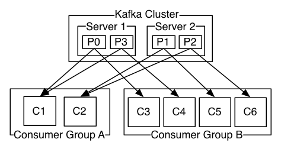

> 转自：Object：https://segmentfault.com/a/1190000015765348
>

### **简介**

```
Kafka 是一种高吞吐量的分布式发布订阅消息系统
```

### **kafka 角色必知**

```
producer：生产者。
consumer：消费者。
topic: 消息以topic为类别记录,Kafka将消息种子(Feed)分类, 每一类的消息称之为一个主题(Topic)。
broker：以集群的方式运行,可以由一个或多个服务组成，每个服务叫做一个broker;消费者可以订阅一个或多个主题(topic), 并从Broker拉数据,从而消费这些已发布的消息。
```

### **经典模型**

```
1. 一个主题下的分区不能小于消费者数量，即一个主题下消费者数量不能大于分区属，大了就浪费了空闲了
2. 一个主题下的一个分区可以同时被不同消费组其中某一个消费者消费
3. 一个主题下的一个分区只能被同一个消费组的一个消费者消费
```



### **常用参数说明**

#### request.required.acks

```
Kafka producer的ack有3中机制，初始化producer时的producerconfig可以通过配置request.required.acks不同的值来实现。

0：这意味着生产者producer不等待来自broker同步完成的确认继续发送下一条（批）消息。此选项提供最低的延迟但最弱的耐久性保证（当服务器发生故障时某些数据会丢失，如leader已死，但producer并不知情，发出去的信息broker就收不到）。

1：这意味着producer在leader已成功收到的数据并得到确认后发送下一条message。此选项提供了更好的耐久性为客户等待服务器确认请求成功（被写入死亡leader但尚未复制将失去了唯一的消息）。

-1：这意味着producer在follower副本确认接收到数据后才算一次发送完成。 
此选项提供最好的耐久性，我们保证没有信息将丢失，只要至少一个同步副本保持存活。

三种机制，性能依次递减 (producer吞吐量降低)，数据健壮性则依次递增。

```

### auto.offset.reset

```
1. earliest：自动将偏移重置为最早的偏移量
2. latest：自动将偏移量重置为最新的偏移量（默认）
3. none：如果consumer group没有发现先前的偏移量，则向consumer抛出异常。
4. 其他的参数：向consumer抛出异常（无效参数）

```

**kafka 安装和简单测试**
-----------------

### **安装 kafka（不需要安装，解包即可）**

```
# 官方下载地址：http://kafka.apache.org/downloads
# wget https://www.apache.org/dyn/closer.cgi?path=/kafka/1.1.1/kafka_2.12-1.1.1.tgz
tar -xzf kafka_2.12-1.1.1.tgz
cd kafka_2.12-1.1.0

```

### **启动 kafka server**

```
# 需先启动zookeeper
# -daemon 可启动后台守护模式
bin/zookeeper-server-start.sh config/zookeeper.properties
bin/kafka-server-start.sh config/server.properties

```

### **启动 kafka 客户端测试**

```
# 创建一个话题，test话题2个分区
bin/kafka-topics.sh --create --zookeeper localhost:2181 --replication-factor 1 --partitions 2 --topic test
Created topic "test".
# 显示所有话题
bin/kafka-topics.sh --list --zookeeper localhost:2181
test
# 显示话题信息
bin/kafka-topics.sh --describe --zookeeper localhost:2181 --topic test
Topic:test    PartitionCount:2    ReplicationFactor:1    Configs:
    Topic: test    Partition: 0    Leader: 0    Replicas: 0    Isr: 0
    Topic: test    Partition: 1    Leader: 0    Replicas: 0    Isr: 0
# 启动一个生产者（输入消息）
bin/kafka-console-producer.sh --broker-list localhost:9092 --topic test
[等待输入自己的内容 出现>输入即可]
>i am a new msg !
>i am a good msg ?
# 启动一个消费者（等待消息） 
# 注意这里的--from-beginning，每次都会从头开始读取，你可以尝试去掉和不去掉看下效果
bin/kafka-console-consumer.sh --bootstrap-server localhost:9092 --topic test --from-beginning
[等待消息]
i am a new msg !
i am a good msg ?

```

### **安装 kafka 的 php 扩展**

```
# 先安装rdkfka库文件
git clone https://github.com/edenhill/librdkafka.git
cd librdkafka/
./configure 
make
sudo make install
git clone https://github.com/arnaud-lb/php-rdkafka.git
cd php-rdkafka
phpize
./configure
make all -j 5
sudo make install
vim [php]/php.ini
extension=rdkafka.so

```

**php 代码实践**
------------

### **生产者**

```php
<?php
$conf = new RdKafka\Conf();
$conf->setDrMsgCb(function ($kafka, $message) {
    file_put_contents("./dr_cb.log", var_export($message, true).PHP_EOL, FILE_APPEND);
});
$conf->setErrorCb(function ($kafka, $err, $reason) {
    file_put_contents("./err_cb.log", sprintf("Kafka error: %s (reason: %s)", rd_kafka_err2str($err), $reason).PHP_EOL, FILE_APPEND);
});
$rk = new RdKafka\Producer($conf);
$rk->setLogLevel(LOG_DEBUG);
$rk->addBrokers("127.0.0.1");
$cf = new RdKafka\TopicConf();
// -1必须等所有brokers同步完成的确认 1当前服务器确认 0不确认，这里如果是0回调里的offset无返回，如果是1和-1会返回offset
// 我们可以利用该机制做消息生产的确认，不过还不是100%，因为有可能会中途kafka服务器挂掉
$cf->set('request.required.acks', 0);
$topic = $rk->newTopic("test", $cf);
$option = 'qkl';
for ($i = 0; $i < 20; $i++) {
    //RD_KAFKA_PARTITION_UA自动选择分区
    //$option可选
    $topic->produce(RD_KAFKA_PARTITION_UA, 0, "qkl . $i", $option);
}
$len = $rk->getOutQLen();
while ($len > 0) {
    $len = $rk->getOutQLen();
    var_dump($len);
    $rk->poll(50);
}

```

### **运行生产者**

```
php producer.php
# output
int(20)
int(20)
int(20)
int(20)
int(0)
# 你可以查看你刚才上面启动的消费者shell应该会输出消息
qkl . 0
qkl . 1
qkl . 2
qkl . 3
qkl . 4
qkl . 5
qkl . 6
qkl . 7
qkl . 8
qkl . 9
qkl . 10
qkl . 11
qkl . 12
qkl . 13
qkl . 14
qkl . 15
qkl . 16
qkl . 17
qkl . 18
qkl . 19

```

### **Low Level 消费者**

```
<?php
$conf = new RdKafka\Conf();
$conf->setDrMsgCb(function ($kafka, $message) {
    file_put_contents("./c_dr_cb.log", var_export($message, true), FILE_APPEND);
});
$conf->setErrorCb(function ($kafka, $err, $reason) {
    file_put_contents("./err_cb.log", sprintf("Kafka error: %s (reason: %s)", rd_kafka_err2str($err), $reason).PHP_EOL, FILE_APPEND);
});
//设置消费组
$conf->set('group.id', 'myConsumerGroup');
$rk = new RdKafka\Consumer($conf);
$rk->addBrokers("127.0.0.1");
$topicConf = new RdKafka\TopicConf();
$topicConf->set('request.required.acks', 1);
//在interval.ms的时间内自动提交确认、建议不要启动
//$topicConf->set('auto.commit.enable', 1);
$topicConf->set('auto.commit.enable', 0);
$topicConf->set('auto.commit.interval.ms', 100);
// 设置offset的存储为file
//$topicConf->set('offset.store.method', 'file');
// 设置offset的存储为broker
 $topicConf->set('offset.store.method', 'broker');
//$topicConf->set('offset.store.path', __DIR__);
//smallest：简单理解为从头开始消费，其实等价于上面的 earliest
//largest：简单理解为从最新的开始消费，其实等价于上面的 latest
//$topicConf->set('auto.offset.reset', 'smallest');
$topic = $rk->newTopic("test", $topicConf);
// 参数1消费分区0
// RD_KAFKA_OFFSET_BEGINNING 重头开始消费
// RD_KAFKA_OFFSET_STORED 最后一条消费的offset记录开始消费
// RD_KAFKA_OFFSET_END 最后一条消费
$topic->consumeStart(0, RD_KAFKA_OFFSET_BEGINNING);
//$topic->consumeStart(0, RD_KAFKA_OFFSET_END); //
//$topic->consumeStart(0, RD_KAFKA_OFFSET_STORED);
while (true) {
    //参数1表示消费分区，这里是分区0
    //参数2表示同步阻塞多久
    $message = $topic->consume(0, 12 * 1000);
    if (is_null($message)) {
        sleep(1);
        echo "No more messages\n";
        continue;
    }
    switch ($message->err) {
        case RD_KAFKA_RESP_ERR_NO_ERROR:
            var_dump($message);
            break;
        case RD_KAFKA_RESP_ERR__PARTITION_EOF:
            echo "No more messages; will wait for more\n";
            break;
        case RD_KAFKA_RESP_ERR__TIMED_OUT:
            echo "Timed out\n";
            break;
        default:
            throw new \Exception($message->errstr(), $message->err);
            break;
    }
}

```

### **High LEVEL 消费者**

```
<?php
/**
 * Created by PhpStorm.
 * User: qkl
 * Date: 2018/8/22
 * Time: 17:58
 */
$conf = new \RdKafka\Conf();
function rebalance(\RdKafka\KafkaConsumer $kafka, $err, array $partitions = null) {
    global $offset;
    switch ($err) {
        case RD_KAFKA_RESP_ERR__ASSIGN_PARTITIONS:
            echo "Assign: ";
            var_dump($partitions);
            $kafka->assign();
//            $kafka->assign([new RdKafka\TopicPartition("qkl01", 0, 0)]);
            break;
        case RD_KAFKA_RESP_ERR__REVOKE_PARTITIONS:
            echo "Revoke: ";
            var_dump($partitions);
            $kafka->assign(NULL);
            break;
        default:
            throw new \Exception($err);
    }
}
// Set a rebalance callback to log partition assignments (optional)
$conf->setRebalanceCb(function(\RdKafka\KafkaConsumer $kafka, $err, array $partitions = null) {
    rebalance($kafka, $err, $partitions);
});
// Configure the group.id. All consumer with the same group.id will consume
// different partitions.
$conf->set('group.id', 'test-110-g100');
// Initial list of Kafka brokers
$conf->set('metadata.broker.list', '192.168.216.122');
$topicConf = new \RdKafka\TopicConf();
$topicConf->set('request.required.acks', -1);
//在interval.ms的时间内自动提交确认、建议不要启动
$topicConf->set('auto.commit.enable', 0);
//$topicConf->set('auto.commit.enable', 0);
$topicConf->set('auto.commit.interval.ms', 100);
// 设置offset的存储为file
$topicConf->set('offset.store.method', 'file');
$topicConf->set('offset.store.path', __DIR__);
// 设置offset的存储为broker
// $topicConf->set('offset.store.method', 'broker');
// Set where to start consuming messages when there is no initial offset in
// offset store or the desired offset is out of range.
// 'smallest': start from the beginning
$topicConf->set('auto.offset.reset', 'smallest');
// Set the configuration to use for subscribed/assigned topics
$conf->setDefaultTopicConf($topicConf);
$consumer = new \RdKafka\KafkaConsumer($conf);
//$KafkaConsumerTopic = $consumer->newTopic('qkl01', $topicConf);
// Subscribe to topic 'test'
$consumer->subscribe(['qkl01']);
echo "Waiting for partition assignment... (make take some time when\n";
echo "quickly re-joining the group after leaving it.)\n";
while (true) {
    $message = $consumer->consume(120*1000);
    switch ($message->err) {
        case RD_KAFKA_RESP_ERR_NO_ERROR:
            var_dump($message);
//            $consumer->commit($message);
//            $KafkaConsumerTopic->offsetStore(0, 20);
            break;
        case RD_KAFKA_RESP_ERR__PARTITION_EOF:
            echo "No more messages; will wait for more\n";
            break;
        case RD_KAFKA_RESP_ERR__TIMED_OUT:
            echo "Timed out\n";
            break;
        default:
            throw new \Exception($message->errstr(), $message->err);
            break;
    }
}

```

### **消费组特别说明**

```
特别注意，High LEVEL消费者设置的消费组，kafka服务器才会记录, Low Level消费者设置的消费组，服务器不会记录

```

具体查看消费组信息，你可以翻阅本篇文章

### **查看服务器元数据（topic/partition/broker）**

```
<?php
$conf = new RdKafka\Conf();
$conf->setDrMsgCb(function ($kafka, $message) {
    file_put_contents("./xx.log", var_export($message, true), FILE_APPEND);
});
$conf->setErrorCb(function ($kafka, $err, $reason) {
    printf("Kafka error: %s (reason: %s)\n", rd_kafka_err2str($err), $reason);
});
$conf->set('group.id', 'myConsumerGroup');
$rk = new RdKafka\Consumer($conf);
$rk->addBrokers("127.0.0.1");
$allInfo = $rk->metadata(true, NULL, 60e3);
$topics = $allInfo->getTopics();
echo rd_kafka_offset_tail(100);
echo "--";
echo count($topics);
echo "--";
foreach ($topics as $topic) {
    $topicName = $topic->getTopic();
    if ($topicName == "__consumer_offsets") {
        continue ;
    }
    $partitions = $topic->getPartitions();
    foreach ($partitions as $partition) {
//        $rf = new ReflectionClass(get_class($partition));
//        foreach ($rf->getMethods() as $f) {
//            var_dump($f);
//        }
//        die();
        $topPartition = new RdKafka\TopicPartition($topicName, $partition->getId());
        echo  "当前的话题：" . ($topPartition->getTopic()) . " - " . $partition->getId() . " - ";
        echo  "offset：" . ($topPartition->getOffset()) . PHP_EOL;
    }
}

```

### **如果需远端生产和消费**

```
vim config/server.properties
advertised.listeners=PLAINTEXT://ip:9092
# ip 未你kafka的外网ip即可

```

### **分享一个打包好的 php-rdkafka 的类库**

https://github.com/qkl9527/php-rdkafka-class

