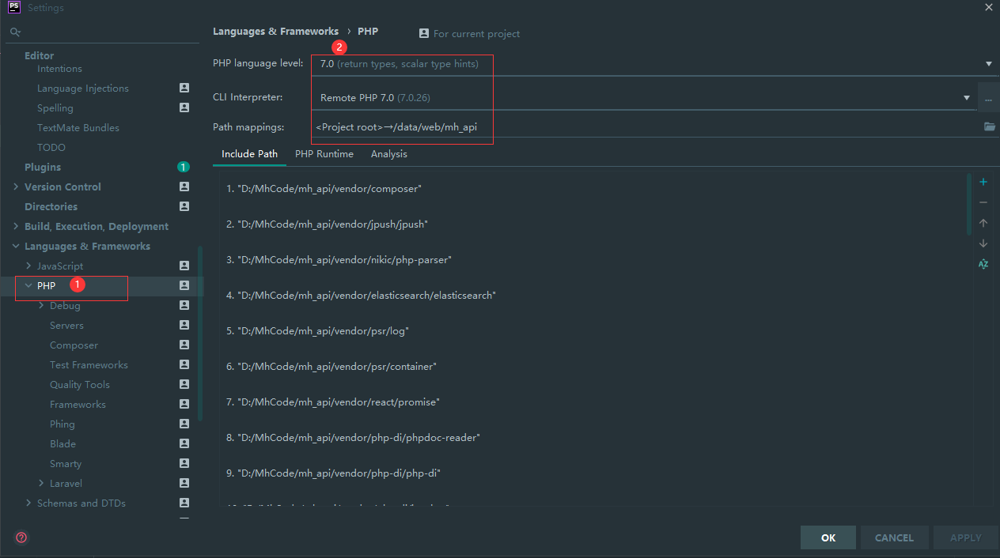
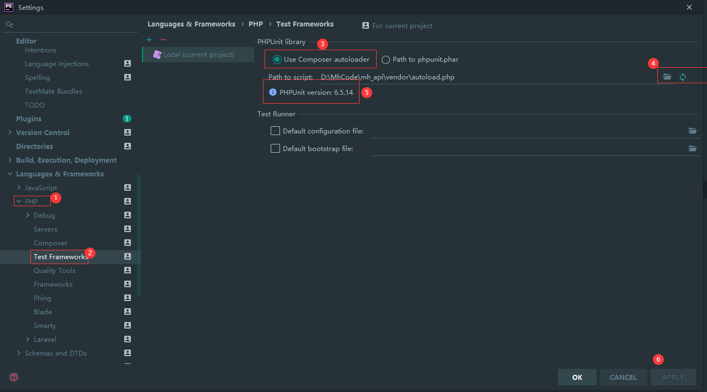
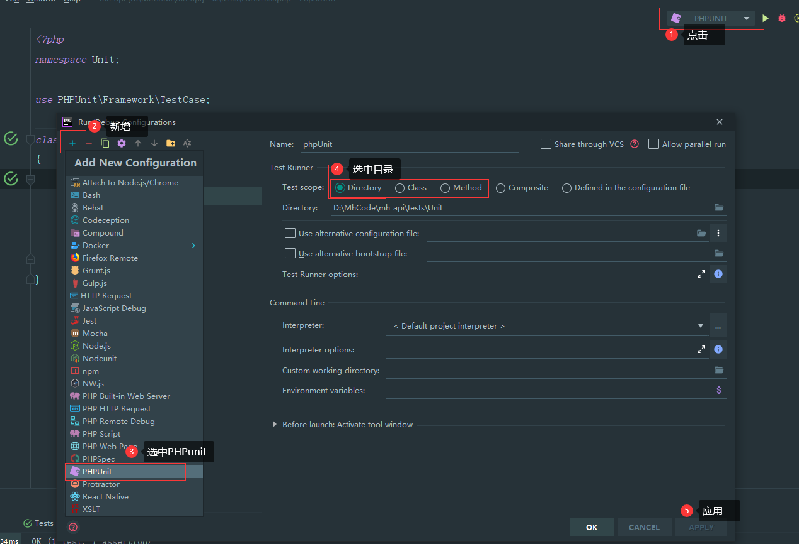
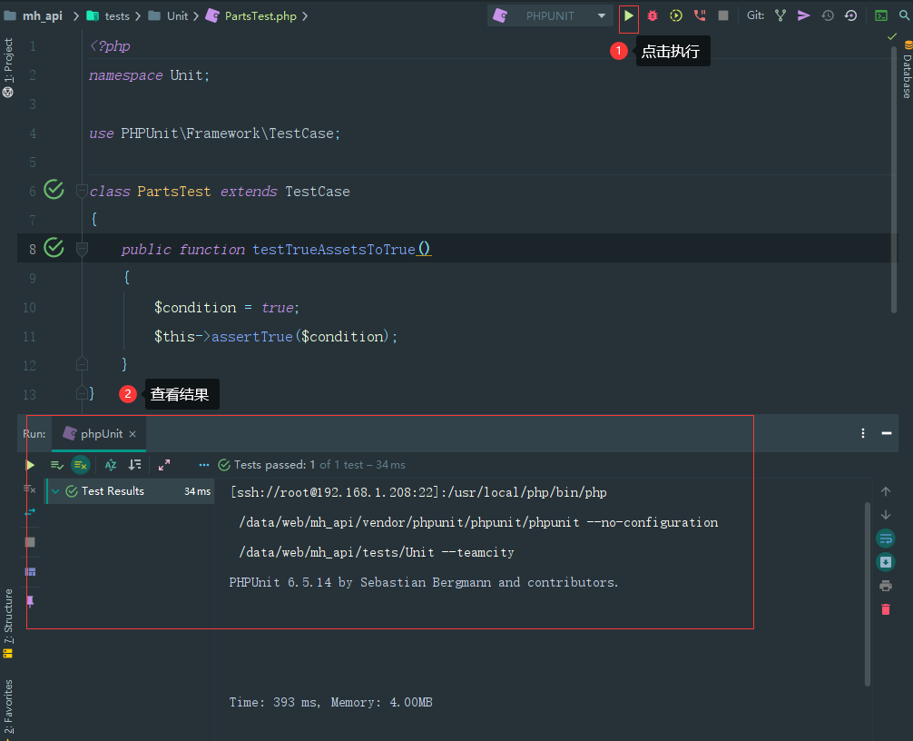

#### [PHPUnit中国官网](http://www.phpunit.cn/)

由于公司的php版本是7.0x，所以只能选择PHPunit版本为6.0x

| 主板号    | 初始版本     | PHP兼容性                 | 支持                   |
| --------- | ------------ | ------------------------- | ---------------------- |
| PHPUnit 9 | 2020年2月7日 | PHP 7.3, PHP 7.4          | 在2022年2月4日结束支持 |
| PHPUnit 8 | 2019年2月1日 | PHP 7.2, PHP 7.3, PHP 7.4 | 在2021年2月5日结束支持 |
| PHPUnit 7 | 2018年2月2日 | PHP 7.1, PHP 7.2, PHP 7.3 | 在2020年2月7日结束支持 |
| PHPUnit 6 | 2017年2月3日 | PHP 7.0, PHP 7.1, PHP 7.2 | 在2019年2月1日结束支持 |


#### composer安装

> composer require --dev phpunit/phpunit ^6


#### 在项目根目录查看是否安装成功

> ./vendor/bin/phpunit


仿Laravel创建目录`tests/Unit`，新建文件 `FirstTest.php`，编辑如下：

```php
<?php
namespace Unit;

use PHPUnit\Framework\TestCase;

class FirstTest extends TestCase
{
    public function testTrueAssetsToTrue()
    {
        $condition = true;
        $this->assertTrue($condition);
    }
}
```


**代码解释：**

1. FirstTest为测试类,以Test 后缀结尾
2. FirstTest 继承于 `PHPUnit\Framework\TestCase`
3. 测试方法testTrueAssetsToTrue()，测试方法必须为`public`权限
4. 在测试方法内，类似于 `assertTrue()` 这样的断言方法用来对实际值与预期值的匹配做出断言


#### **命令行执行:**

phpunit 命令 测试文件命名

> \#  ./vendor/bin/phpunit ./tests/Unit/FirstTest.php 


## PHPStorm 配置使用PHPunit

##### 1、配置phpstorm的php版本以及PHP解析器




##### 2、配置phpunit



##### 如果出现 标记5  的内容证明配置成功


##### 3、配置测试文件



我需要测试的是tests目录下所有的测试脚本，所以就选择Directory，然后目录就是指向我创建的tests目录


然后点击右边的小箭头，就会自动运行 上面我配置的tests目录下面所有的测试脚本




参考链接：

1. http://www.php20.cn/article/181