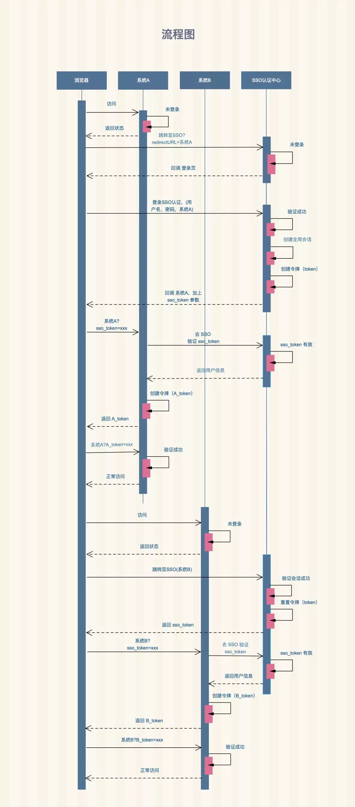

##### 什么是单点登录？

单点登录（Single Sign On），简称为 SSO，意思是在多个应用系统中，用户只需要登录一次就可以访问所有相互信任的其它应用系统。一般常用于同一家公司的不同子系统之间的登录认证。

单点登录有多种实现方式，这里我们只介绍两种，一种是基于 Cookie 凭证，这种方式适用于子系统之间主域名一致，因为只有这样才能让不同子系统之间共享 Cookie；另一种是通过 CAS 实现 SSO 系统，这种方案适用于所有场景，只是相比较 Cookie 凭证来说理解和实现起来更复杂一些。

值得注意的是：基于 Cookie 实现的基于 Session 的单点登录有其局限性，那就是不同系统之间主域名需要一致，否则不能生效。

基于 Cookie 实现SSO的原理：就是子系统登录注册模块统一跳转到主系统的用户模块， 并将Cookie 作用域名设置为 `.blog.test`

