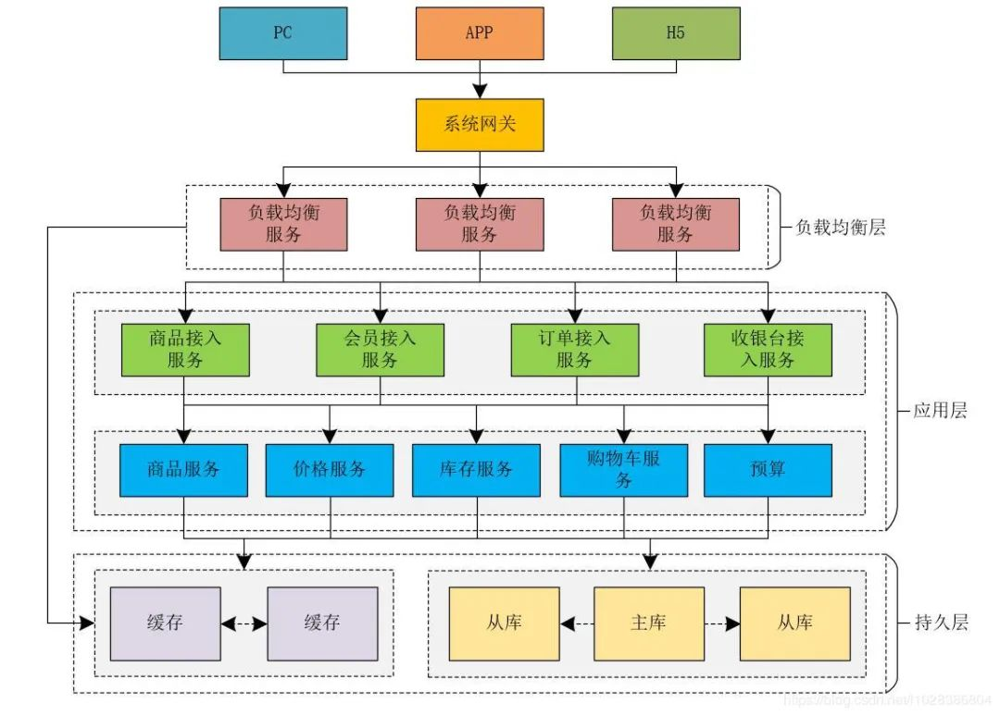
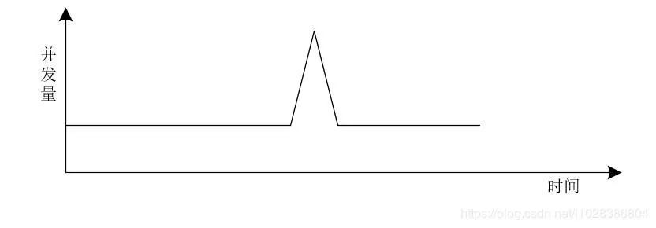
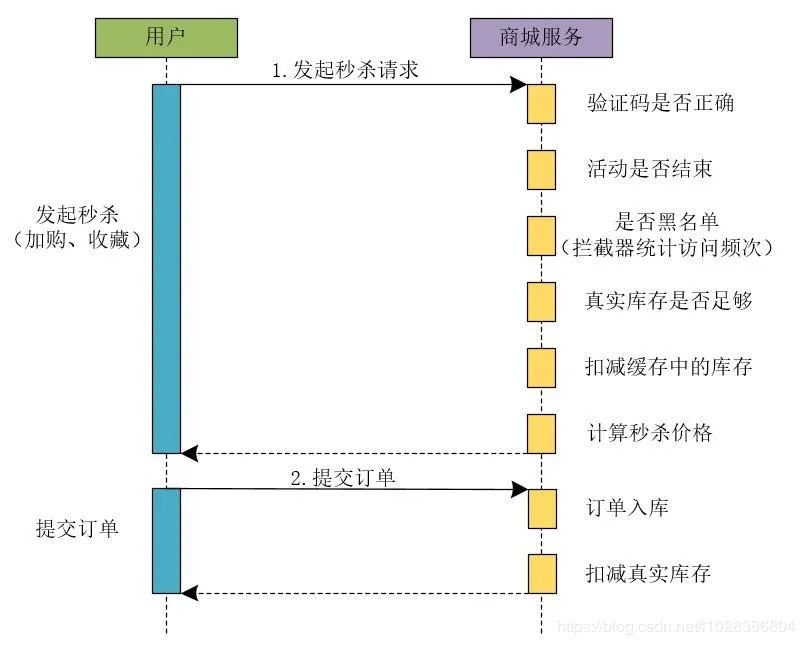
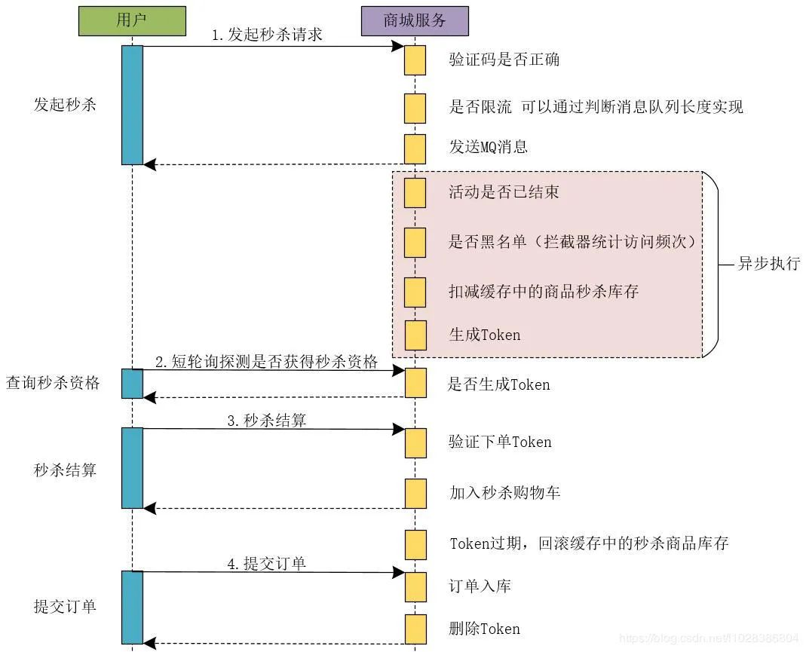
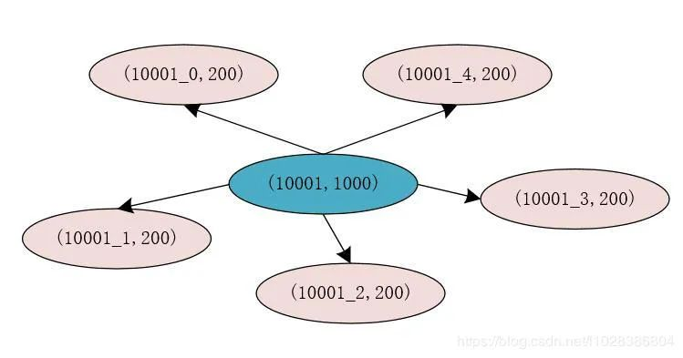
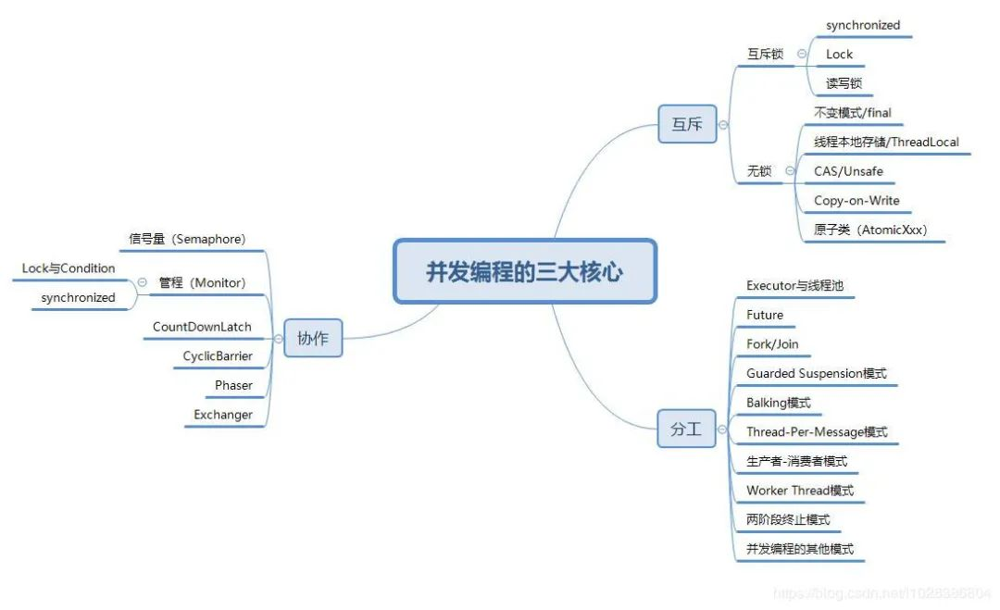

> 原文地址 \[mp.weixin.qq.com\](https://mp.weixin.qq.com/s/jpUXX165JaXEd5uBg22-iQ)

#### **前言**

很多小伙伴反馈说，高并发学了那么久，但是在真正做项目时，仍然不知道如何下手处理高并发业务场景！甚至很多小伙伴仍然停留在只是简单的提供接口（CRUD）阶段，不知道学习的并发知识如何运用到实际项目中，就更别提如何构建高并发系统了！

究竟什么样的系统算是高并发系统？今天，我们就一起解密高并发业务场景下典型的秒杀系统的架构，让大家学以致用。

#### **电商系统架构**

在电商领域，存在着典型的秒杀业务场景，那何谓秒杀场景呢。简单的来说就是一件商品的购买人数远远大于这件商品的库存，而且这件商品在很短的时间内就会被抢购一空。比如每年的 618、双 11 大促，小米新品促销等业务场景，就是典型的秒杀业务场景。

我们可以将电商系统的架构简化成下图所示：

由图所示，我们可以简单的将电商系统的核心层分为：负载均衡层、应用层和持久层。接下来，我们就预估下每一层的并发量。

*   假如负载均衡层使用的是高性能的 Nginx，则我们可以预估 Nginx 最大的并发度为：10W+，这里是以万为单位。

*   假设应用层我们使用的是 Tomcat，而 Tomcat 的最大并发度可以预估为 800 左右，这里是以百为单位。  

*   假设持久层的缓存使用的是 Redis，数据库使用的是 MySQL，MySQL 的最大并发度可以预估为 1000 左右，以千为单位。Redis 的最大并发度可以预估为 5W 左右，以万为单位。  

所以，负载均衡层、应用层和持久层各自的并发度是不同的，那么，为了提升系统的总体并发度和缓存，我们通常可以采取哪些方案呢？

**1）系统扩容**

系统扩容包括垂直扩容和水平扩容，增加设备和机器配置，绝大多数的场景有效。

**2）缓存**

本地缓存或者集中式缓存，减少网络 IO，基于内存读取数据。大部分场景有效。

**3）读写分离**

采用读写分离，分而治之，增加机器的并行处理能力。

**秒杀系统的特点**

对于秒杀系统来说，我们可以从业务和技术两个角度来阐述其自身存在的一些特点。

1、业务特点

  

这里，我们可以使用 12306 网站来举例，每年春运时，12306 网站的访问量是非常大的，但是网站平时的访问量却是比较平缓的，也就是说，每年春运时节，12306 网站的访问量会出现瞬时突增的现象。

再比如，小米秒杀系统，在上午 10 点开售商品，10 点前的访问量比较平缓，10 点时同样会出现并发量瞬时突增的现象。

所以，秒杀系统的流量和并发量我们可以使用下图来表示：

由图可以看出，秒杀系统的并发量存在瞬时凸峰的特点，也叫做流量突刺现象。

我们可以将秒杀系统的特点总结如下：

**1）限时、限量、限价**

在规定的时间内进行；秒杀活动中商品的数量有限；商品的价格会远远低于原来的价格，也就是说，在秒杀活动中，商品会以远远低于原来的价格出售。

例如，秒杀活动的时间仅限于某天上午 10 点到 10 点半，商品数量只有 10 万件，售完为止，而且商品的价格非常低，例如：1 元购等业务场景。

限时、限量和限价可以单独存在，也可以组合存在。

**2）活动预热**

需要提前配置活动；活动还未开始时，用户可以查看活动的相关信息；秒杀活动开始前，对活动进行大力宣传。

**3）持续时间短**

购买的人数数量庞大；商品会迅速售完。

在系统流量呈现上，就会出现一个突刺现象，此时的并发访问量是非常高的，大部分秒杀场景下，商品会在极短的时间内售完。

2、技术特点

  

我们可以将秒杀系统的技术特点总结如下：

**1）瞬时并发量非常高**

大量用户会在同一时间抢购商品；瞬间并发峰值非常高。

**2）读多写少**

系统中商品页的访问量巨大；商品的可购买数量非常少；库存的查询访问数量远远大于商品的购买数量。

在商品页中往往会加入一些限流措施，例如早期的秒杀系统商品页会加入验证码来平滑前端对系统的访问流量，近期的秒杀系统商品详情页会在用户打开页面时，提示用户登录系统。这都是对系统的访问进行限流的一些措施。

**3）流程简单**

秒杀系统的业务流程一般比较简单；总体上来说，秒杀系统的业务流程可以概括为：下单减库存。

针对这种短时间内大流量的系统来说，就不太适合使用系统扩容了，因为即使系统扩容了，也就是在很短的时间内会使用到扩容后的系统，大部分时间内，系统无需扩容即可正常访问。那么，我们可以采取哪些方案来提升系统的秒杀性能呢？

**秒杀系统方案**

针对秒杀系统的特点，我们可以采取如下的措施来提升系统的性能。

**1）异步解耦**

将整体流程进行拆解，核心流程通过队列方式进行控制。

**2）限流防刷**

控制网站整体流量，提高请求的门槛，避免系统资源耗尽。

**3）资源控制**

将整体流程中的资源调度进行控制，扬长避短。

由于应用层能够承载的并发量比缓存的并发量少很多。所以，在高并发系统中，我们可以直接使用 OpenResty 由负载均衡层访问缓存，避免了调用应用层的性能损耗。同时，由于秒杀系统中，商品数量比较少，我们也可以使用动态渲染技术，CDN 技术来加速网站的访问性能。

OpenResty：https://openresty.org/cn/

如果在秒杀活动开始时，并发量太高时，我们可以将用户的请求放入队列中进行处理，并为用户弹出排队页面。

**秒杀系统时序图**

网上很多的秒杀系统和对秒杀系统的解决方案，并不是真正的秒杀系统，他们采用的只是同步处理请求的方案，一旦并发量真的上来了，他们所谓的秒杀系统的性能会急剧下降。

1、下单流程

  

我们先来看一下秒杀系统在同步下单时的时序图：

**1）用户发起秒杀请求**

在同步下单流程中，首先，用户发起秒杀请求。商城服务需要依次执行如下流程来处理秒杀请求的业务。

**① 识别验证码是否正确**

商城服务判断用户发起秒杀请求时提交的验证码是否正确。

**② 判断活动是否已经结束**

验证当前秒杀活动是否已经结束。

**③ 验证访问请求是否处于黑名单**

在电商领域中，存在着很多的恶意竞争，也就是说，其他商家可能会通过不正当手段来恶意请求秒杀系统，占用系统大量的带宽和其他系统资源。此时，就需要使用风控系统等实现黑名单机制。为了简单，也可以使用拦截器统计访问频次实现黑名单机制。

**④ 验证真实库存是否足够**

系统需要验证商品的真实库存是否足够，是否能够支持本次秒杀活动的商品库存量。

**⑤ 扣减缓存中的库存**

在秒杀业务中，往往会将商品库存等信息存放在缓存中，此时，还需要验证秒杀活动使用的商品库存是否足够，并且需要扣减秒杀活动的商品库存数量。

**⑥ 计算秒杀的价格**

由于在秒杀活动中，商品的秒杀价格和商品的真实价格存在差异，所以，需要计算商品的秒杀价格。

注意：如果在秒杀场景中，系统涉及的业务更加复杂的话，会涉及更多的业务操作，这里，我只是列举出一些常见的业务操作。

**2）提交订单**

**① 订单入口**

将用户提交的订单信息保存到数据库中。

**② 扣减真实库存**

订单入库后，需要在商品的真实库存中将本次成功下单的商品数量扣除。

如果我们使用上述流程开发了一个秒杀系统，当用户发起秒杀请求时，由于系统每个业务流程都是串行执行的，整体上系统的性能不会太高，当并发量太高时，我们会为用户弹出下面的排队页面，来提示用户进行等待。

此时的排队时间可能是 15 秒，也可能是 30 秒，甚至是更长时间。这就存在一个问题：在用户发起秒杀请求到服务器返回结果的这段时间内，客户端和服务器之间的连接不会被释放，这就会占大量占用服务器的资源。

网上很多介绍如何实现秒杀系统的文章都是采用的这种方式，那么，这种方式能做秒杀系统吗？答案是可以做，但是这种方式支撑的并发量并不是太高。此时，有些网友可能会问：我们公司就是这样做的秒杀系统啊！上线后一直在用，没啥问题啊！

我想说的是：使用同步下单方式确实可以做秒杀系统，但是同步下单的性能不会太高。之所以你们公司采用同步下单的方式做秒杀系统没出现大的问题，那是因为你们的秒杀系统的并发量没达到一定的量级，也就是说，你们的秒杀系统的并发量其实并不高。

**所以，很多所谓的秒杀系统，存在着秒杀的业务，但是称不上真正的秒杀系统**，原因就在于他们使用的是同步的下单流程，限制了系统的并发流量。之所以上线后没出现太大的问题，是因为系统的并发量不高，不足以压死整个系统。

如果 12306、淘宝、天猫、京东、小米等大型商城的秒杀系统是这么玩的话，那么，他们的系统迟早会被玩死，他们的系统工程师不被开除才怪！所以，在秒杀系统中，这种同步处理下单的业务流程的方案是不可取的。

以上就是同步下单的整个流程操作，如果下单流程更加复杂的话，就会涉及到更多的业务操作。

2、异步下单流程

  

既然同步下单流程的秒杀系统称不上真正的秒杀系统，那我们就需要采用异步的下单流程了。异步的下单流程不会限制系统的高并发流量。

**1）用户发起秒杀请求**

用户发起秒杀请求后，商城服务会经过如下业务流程。

**① 检测验证码是否正确**

用户发起秒杀请求时，会将验证码一同发送过来，系统会检验验证码是否有效，并且是否正确。

**② 是否限流**

系统会对用户的请求进行是否限流的判断，这里，我们可以通过判断消息队列的长度来进行判断。因为我们将用户的请求放在了消息队列中，消息队列中堆积的是用户的请求，我们可以根据当前消息队列中存在的待处理的请求数量来判断是否需要对用户的请求进行限流处理。

例如，在秒杀活动中，我们出售 1000 件商品，此时在消息队列中存在 1000 个请求，如果后续仍然有用户发起秒杀请求，则后续的请求我们可以不再处理，直接向用户返回商品已售完的提示。

所以，使用限流后，我们可以更快的处理用户的请求和释放连接的资源。

**③ 发送 MQ**

用户的秒杀请求通过前面的验证后，我们就可以将用户的请求参数等信息发送到 MQ 中进行异步处理，同时，向用户响应结果信息。在商城服务中，会有专门的异步任务处理模块来消费消息队列中的请求，并处理后续的异步流程。

在用户发起秒杀请求时，异步下单流程比同步下单流程处理的业务操作更少，它将后续的操作通过 MQ 发送给异步处理模块进行处理，并迅速向用户返回响应结果，释放请求连接。

**2）异步处理**

我们可以将下单流程的如下操作进行异步处理。

*   判断活动是否已经结束。

*   判断本次请求是否处于系统黑名单，为了防止电商领域同行的恶意竞争可以为系统增加黑名单机制，将恶意的请求放入系统的黑名单中。可以使用拦截器统计访问频次来实现。

*   扣减缓存中的秒杀商品的库存数量。

*   生成秒杀 Token，这个 Token 是绑定当前用户和当前秒杀活动的，只有生成了秒杀 Token 的请求才有资格进行秒杀活动。

这里我们引入了异步处理机制，在异步处理中，系统使用多少资源，分配多少线程来处理相应的任务，是可以进行控制的。

**3）短轮询查询秒杀结果**

这里，可以采取客户端短轮询查询是否获得秒杀资格的方案。例如，客户端可以每隔 3 秒钟轮询请求服务器，查询是否获得秒杀资格，这里，我们在服务器的处理就是判断当前用户是否存在秒杀 Token，如果服务器为当前用户生成了秒杀 Token，则当前用户存在秒杀资格。否则继续轮询查询，直到超时或者服务器返回商品已售完或者无秒杀资格等信息为止。

采用短轮询查询秒杀结果时，在页面上我们同样可以提示用户排队处理中，但是此时客户端会每隔几秒轮询服务器查询秒杀资格的状态，相比于同步下单流程来说，无需长时间占用请求连接。

此时，可能会有网友会问：采用短轮询查询的方式，会不会存在直到超时也查询不到是否具有秒杀资格的状态呢？答案是：有可能！这里我们试想一下秒杀的真实场景，商家参加秒杀活动本质上不是为了赚钱，而是提升商品的销量和商家的知名度，吸引更多的用户来买自己的商品。所以，我们不必保证用户能够 100% 的查询到是否具有秒杀资格的状态。

**4）秒杀结算**

**① 验证下单 Token**

客户端提交秒杀结算时，会将秒杀 Token 一同提交到服务器，商城服务会验证当前的秒杀 Token 是否有效。

**② 加入秒杀购物车**

商城服务在验证秒杀 Token 合法并有效后，会将用户秒杀的商品添加到秒杀购物车。

**5）提交订单**

**① 订单入库**

将用户提交的订单信息保存到数据库中。

**② 删除 Token**

秒杀商品订单入库成功后，删除秒杀 Token。

这里大家可以思考一个问题：我们为什么只在异步下单流程的粉色部分采用异步处理，而没有在其他部分采取异步削峰和填谷的措施呢？

这是因为在异步下单流程的设计中，无论是在产品设计上还是在接口设计上，我们在用户发起秒杀请求阶段对用户的请求进行了限流操作，可以说，系统的限流操作是非常前置的。在用户发起秒杀请求时进行了限流，系统的高峰流量已经被平滑解决了，再往后走，其实系统的并发量和系统流量并不是非常高了。

所以，网上很多的文章和帖子中在介绍秒杀系统时，说是在下单时使用异步削峰来进行一些限流操作，那都是在扯淡！因为下单操作在整个秒杀系统的流程中属于比较靠后的操作了，限流操作一定要前置处理，在秒杀业务后面的流程中做限流操作是没啥用的。

**高并发 “黑科技” 与致胜奇招**

假设，在秒杀系统中我们使用 Redis 实现缓存，假设 Redis 的读写并发量在 5 万左右。我们的商城秒杀业务需要支持的并发量在 100 万左右。如果这 100 万的并发全部打入 Redis 中，Redis 很可能就会挂掉，那么，我们如何解决这个问题呢？接下来，我们就一起来探讨这个问题。

在高并发的秒杀系统中，如果采用 Redis 缓存数据，则 Redis 缓存的并发处理能力是关键，因为很多的前缀操作都需要访问 Redis。而异步削峰只是基本的操作，关键还是要保证 Redis 的并发处理能力。

解决这个问题的关键思想就是：分而治之，将商品库存分开放。

1、暗度陈仓

  

我们在 Redis 中存储秒杀商品的库存数量时，可以将秒杀商品的库存进行 “分割” 存储来提升 Redis 的读写并发量。

例如，原来的秒杀商品的 id 为 10001，库存为 1000 件，在 Redis 中的存储为 (10001, 1000)，我们将原有的库存分割为 5 份，则每份的库存为 200 件，此时，我们在 Redia 中存储的信息为 (10001\_0, 200)，(10001\_1, 200)，(10001\_2, 200)，(10001\_3, 200)，(10001\_4, 200)。

此时，我们将库存进行分割后，每个分割后的库存使用商品 id 加上一个数字标识来存储，这样，在对存储商品库存的每个 Key 进行 Hash 运算时，得出的 Hash 结果是不同的，这就说明，存储商品库存的 Key 有很大概率不在 Redis 的同一个槽位中，这就能够提升 Redis 处理请求的性能和并发量。

分割库存后，我们还需要在 Redis 中存储一份商品 id 和分割库存后的 Key 的映射关系，此时映射关系的 Key 为商品的 id，也就是 10001，Value 为分割库存后存储库存信息的 Key，也就是 10001\_0，10001\_1，10001\_2，10001\_3，10001\_4。在 Redis 中我们可以使用 List 来存储这些值。

在真正处理库存信息时，我们可以先从 Redis 中查询出秒杀商品对应的分割库存后的所有 Key，同时使用 AtomicLong 来记录当前的请求数量，使用请求数量对从 Redia 中查询出的秒杀商品对应的分割库存后的所有 Key 的长度进行求模运算，得出的结果为 0，1，2，3，4。再在前面拼接上商品 id 就可以得出真正的库存缓存的 Key。此时，就可以根据这个 Key 直接到 Redis 中获取相应的库存信息。

2、移花接木

  

在高并发业务场景中，我们可以直接使用 Lua 脚本库（OpenResty）从负载均衡层直接访问缓存。

这里，我们思考一个场景：如果在秒杀业务场景中，秒杀的商品被瞬间抢购一空。此时，用户再发起秒杀请求时，如果系统由负载均衡层请求应用层的各个服务，再由应用层的各个服务访问缓存和数据库，其实，本质上已经没有任何意义了，因为商品已经卖完了，再通过系统的应用层进行层层校验已经没有太多意义了！！而应用层的并发访问量是以百为单位的，这又在一定程度上会降低系统的并发度。

为了解决这个问题，此时，我们可以在系统的负载均衡层取出用户发送请求时携带的用户 id，商品 id 和秒杀活动 id 等信息，直接通过 Lua 脚本等技术来访问缓存中的库存信息。如果秒杀商品的库存小于或者等于 0，则直接返回用户商品已售完的提示信息，而不用再经过应用层的层层校验了。针对这个架构，我们可以参见本文中的电商系统的架构图（正文开始的第一张图）。

**写在最后**

最后，附上并发编程需要掌握的核心技能知识图，祝大家在学习并发编程时，少走弯路。

