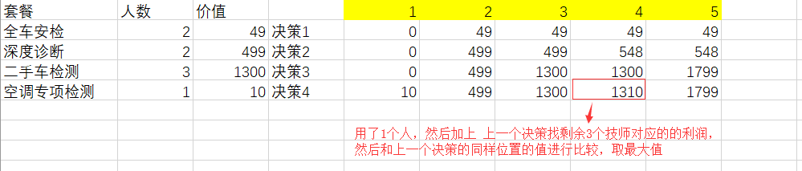

### 事情原由

由于我司举办一个算法编程大赛，随机抽签下面图片的算法题目，想了一段时间记起之前在书（算法图解）上有一个算法比较符合，那就是动态规划中的“背包问题”。


背包问题(Knapsack problem)是一种组合优化的NP完全问题。问题可以描述为：给定一组物品，每种物品都有自己的重量和价格，在限定的总重量内，我们如何选择，才能使得物品的总价格最高。


如何选择最合适的物品放置于给定背包中，与我们的题目相符合，所以这次我们使用的是“0-1背包问题”，用我们这次的题目进行代入，“总人数” 等价于 “背包”，“物品” 等价于 “工单类型”，物品的重量就是所需人数。


**补充**：

背包问题解法延伸问题有三个：无界背包问题、0-1背包问题、二次背包问题 （不做详细延伸，只需我们使用的）


**算法题目如下**


动态规划所处理的问题是**一个多阶段决策问题**，一般由初始状态开始，通过对中间阶段决策的选择，达到结束状态。这些决策形成了**一个决策序列**，同时确定了完成整个过程的一条活动路线(通常是求最优的活动路线)。动态规划的设计都有着一定的模式，一般要经历以下几个步骤。

**初始状态→│决策１│→│决策２│→…→│决策ｎ│→结束状态**


**动态规划解题公式**: 

**f(n,m)=max{f(n-1,m),f(n-1,m-w[n])+P(n,m)}** 

- 横向m(总人数),纵向n(4辆车做的工单类型)

- f(n-1,m)  ==> (决策1)上一个工单类型对应的技师人数，做的工单利润

- P(n,m)  ==> (决策2)当前工单类型对应的技师人数，做的工单利润

- f(n-1,m-w[n]) ==>  用减去当前工单所需人数，在上一个决策中对应人数的利润




所以最优解的答案是：**决策n中五个技师中对应的值**，1799元


#### PostMan提交参数：

```
people:5
carDetail[0][technician]:2
carDetail[0][amount]:49
carDetail[0][type]:全车安检
carDetail[1][technician]:2
carDetail[1][amount]:499
carDetail[1][type]:深度诊断
carDetail[2][technician]:3
carDetail[2][amount]:1300
carDetail[2][type]:二手车检测
carDetail[3][technician]:1
carDetail[3][amount]:10
carDetail[3][type]:空调专项检测
```


**解答方式一：动态规划**

```php
<?php
// 动态规划
error_reporting(E_ALL ^ E_NOTICE);
$t1 = microtime(true);

class bestMatch
{
    public function getMethod($postData)
    {
        $peopleArr = $gainArr = $nameArr = [0];
        foreach ($postData['carDetail'] as $val) {
            // 初始化各个套餐：所需人数、利润和套餐名称数组
            $peopleArr[] = $val['technician'];
            $gainArr[] = $val['amount'];
            $nameArr[] = $val['type'];
        }

        // 获取人数总数（背包）
        $totalPeople = $postData['people'];
        // 做检测单数
        $items = count($peopleArr);
        // 利润列表 - 初始状态
        $cacheMap[] = array_fill(1, $items, 0);
        // 套餐列表 - 初始状态
        $cacheMapName[] = array_fill(1, $items, '');

        //中间的各种决策(依次放入物品a,b,c,d,e)
        // 第一个循环是总人数
        for($i = 1; $i <= $totalPeople; $i++)
        {
            // 第二个循环是套餐
            for($j = 1; $j < $items; $j++)
            {
                $requiredPeople = $peopleArr[$j];
                $gain = $gainArr[$j];
                $name = $nameArr[$j];
                // 上一行坐标数
                $preLine = $j-1;
                $prevGain = $cacheMap[$preLine][$i];
                $prevName = $cacheMapName[$preLine][$i];
                if($requiredPeople > $i)
                {
                    $cacheMap[$j][$i] = $prevGain;
                    $cacheMapName[$j][$i] = $prevName;
                }
                else
                {
                    // 剩余价值
                    if ($i-$requiredPeople >= 0) {
                        $surplusPeople = $i-$requiredPeople;
                        $surplusGain = $cacheMap[$preLine][$surplusPeople];
                        $surplusName = $cacheMapName[$preLine][$surplusPeople];
                    }else {
                        $surplusGain = 0;
                        $surplusName = '';
                    }
                    $nowTotalGain = $gain + $surplusGain;
                    $cacheMap[$j][$i] = max($prevGain, $nowTotalGain);

                    if ($prevGain > $nowTotalGain) {
                        $cacheMapName[$j][$i] = $prevName;
                    }else{
                        $cacheMapName[$j][$i] = $name.'+'.$surplusName;
                    }
                }
            }
        }

        $actual = count($postData['carDetail']);
        return [
            'maxMatch' => $cacheMap[$actual][$totalPeople],
            'maxMatchName' => trim($cacheMapName[$actual][$totalPeople],'+')
        ];
    }
}
$bestMatch = new bestMatch;
if (empty($_POST) || isset($_POST['people']) && $_POST['people'] > 0) {
    die('提交参数有误');
}
$res = $bestMatch->getMethod($_POST);
$t2 = microtime(true);
echo '动态规划: '.'<br/>';
echo '最佳金额: '.$res['maxMatch'].'<br/>';
echo '最佳套餐搭配: '.$res['maxMatchName'].'<br/>';
echo '耗时'.round($t2-$t1,7).'秒'.'<br/>' ;
echo '消耗内存: ' . memory_get_usage().'字节'.'<br/>' ;
```


**解答方式二：递归**

```php
<?php
// 递归查询
error_reporting(E_ALL ^ E_NOTICE);
$t1 = microtime(true);

class optimal
{
    public function getSortList($array,$index = 0,$up =0,&$result =[])
    {
        for ($i=$index; $i < count($array); $i++) {
            if($index > 0 ){
                $value['name'] = $up['name'].'+'.$array[$i]['type'];
                $value['amount'] = bcadd($up['amount'],$array[$i]['amount']);
                $value['technician'] = bcadd($up['technician'],$array[$i]['technician']);
            }else{
                $value['name'] = $array[$i]['type'];
                $value['amount'] = bcadd($array[$i]['amount'],0);
                $value['technician'] = bcadd($array[$i]['technician'],0);
            }
            $result[]  = $value;
            $this->getSortList($array,$i+1,$value,$result);
        }
        return $result ;
    }

    public function getMethod($postData)
    {
        $people = $postData['people'];
        $carDetail = $postData['carDetail'];
        $allResult = $this->getSortList($carDetail);
        $bestMatch = [];
        foreach ($allResult as $val) {
            if ($val['technician'] <= $people) {
                if ($bestMatch) {
                    if ($val['amount'] > $bestMatch['amount']) {
                        $bestMatch = $val;
                    }
                }else{
                    $bestMatch = $val;
                }
            }
        }
        return $bestMatch;
    }
}

$optimal = new optimal();
if (empty($_POST) || isset($_POST['people']) && $_POST['people'] > 0) {
    die('提交参数有误');
}
$bestMatch = $optimal->getMethod($_POST);

$t2 = microtime(true);
echo '递归查询: '.'<br/>';
echo '最佳金额: '.$bestMatch['amount'].'<br/>';
echo '最佳套餐搭配: '.$bestMatch['name'].'<br/>';
echo '耗时'.round($t2-$t1,7).'秒'.'<br/>' ;
echo '消耗内存: ' . memory_get_usage().'字节'.'<br/>' ;
```


参考文章链接：

- 书籍：算法图解

- <https://blog.51cto.com/chinalx1/2109247>
