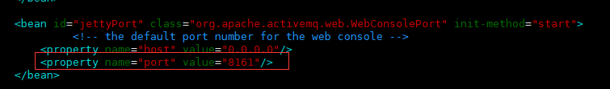
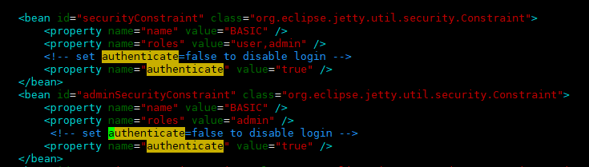
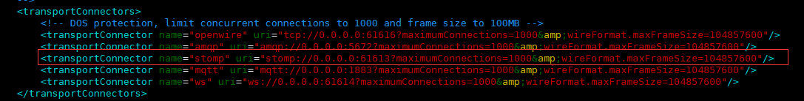
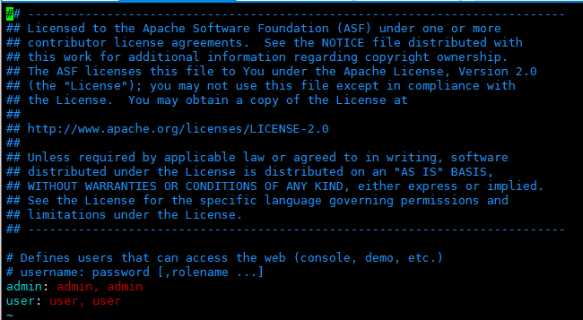

## 一、ActiveMQ的安装与配置

##### 1. 安装JDK

	# yum install java
	# java -version  // 查看安装是否成功

##### 2. 安装ActiveMQ

- 下载地址：http://activemq.apache.org/components/classic/download/
- 根据环境复制下载地址
- 本人使用的环境是（centos7）,且下载地址有 ‘&’ 需要补加转移符，复制下面命令

```
# wget http://www.apache.org/dyn/closer.cgi?filename=/activemq/5.15.9/apache-activemq-5.15.9-bin.tar.gz\&action=download -O apache-activemq-5.15.9-bin.tar.gz

wget的命名规则是取最后一个"/"后面的内容，文件重命名
# mv ./closer.cgifilename=%2Factivemq%2F5.15.9%2Fapache-activemq-5.15.9-bin.tar.gz&action=download ./apache-activemq-5.15.9-bin.tar.gz
```

- 解压文件

```
- /usr/local/activemq 目录下解压
# tar -xzvf ./apache-activemq-5.15.8-bin.tar.gz
```


##### 3. 启动ActiveMQ

1. ActiveMQ内置了jetty Web容器，jetty的相关配置在jetty.xml中

> vim /usr/local/activemq/apache-activemq-5.15.9/conf/jetty.xml



​		（修改端口号）



​	（是否密码登陆）


2. ActiveMQ的配置文件

> vim /usr/local/activemq/apache-activemq-5.15.9/conf/activemq.xml




3. ActiveMQ管控台的用户名密码配置

> vim /usr/local/activemq/apache-activemq-5.15.9/conf/jetty-realm.properties





4. 进入bin目录，启动ActiveMQ


```
# /usr/local/activemq/apache-activemq-5.15.9/bin/activemq start
或
# /usr/local/activemq/apache-activemq-5.15.9/bin/linux-x86-64/activemq start
```


5. 登录ActiveMQ管控台  (用户名和密码都是：admin)

> http://192.168.1.200:8061/admin/


## 二、安装php的stomp扩展

##### 1.stomp地址

> http://pecl.php.net/package/stomp

##### 2.下载stomp扩展包
```
#cd /home
#wget http://pecl.php.net/get/stomp-2.0.2.tgz
```

##### 3.编译安装
> phpize报 Cannot find autoconf 请安装 autoconf后再执行

> yum install m4 和 yum install autoconf

```
#tar -xzvf stomp-2.0.2.tgz
#cd stomp-2.0.2
#/usr/local/php/bin/phpize
#./configure --with-php-config=/usr/local/php/bin/php-config
其中 php-config 和 phpize 所在的目录是相同的，

如果php-config路径不是上面,比如上面我用 /usr/bin/phpize，则在这一步我用：
# ./configure --with-php-config=/usr/bin/php-config

# make && make install

返回提示如下：
	Installing shared extensions:    /usr/local/php/lib/php/extensions/no-debug-non-zts-20151012/

```

##### 3.修改php.ini
> 请通过phpinfo()查看ini文件位置

```
#vim /usr/local/php/lib/php.ini
增加行：
extension="/usr/local/php/lib/php/extensions/no-debug-non-zts-20151012/stomp.so"
重启PHP
#systemctl restart php-fpm
```


## 三、php---实现定时从消息队列里取出数据

```
### 1.php
<?php
$queue = 'phpQueueDev';
$amqIp = 'tcp://192.168.1.208:61613';
$amqUser = 'admin';
$amqPwd = 'admin';
try{
    if(!class_exists('\Stomp')) {
        addLog('Stomp not found');
        return true;
    }else{
        $stomp = new \Stomp($amqIp, $amqUser, $amqPwd);
        $params = [
            'name' => '张三',
			'age' => '27'
        ];
        $result = $stomp->send($queue, json_encode($params));
        unset($stomp);
        if($result === true){
            echo '成功了'.PHP_EOL;
        }
    }
}catch (\StompException $e) {
    var_dump('ActiveMQ: ' , $e->getMessage());
}
?>


### 2.php
<?php
$queue = 'phpQueueDev';
$amqIp = 'tcp://192.168.1.208:61613';
$amqUser = 'admin';
$amqPwd = 'admin';

$stomp = new \Stomp($amqIp, $amqUser, $amqPwd);
//订阅只对一个有效，如果启动多个脚本，只有一个会接收到消息
$stomp->subscribe($queue);
 
while(true) {
    //判断是否有读取的信息
    if($stomp->hasFrame()) {
        $frame = $stomp->readFrame();
 
        $data = json_decode($frame->body, true);
        // 逻辑处理---
        var_dump($data); 
        //表示消息被处理掉了，ack()函数很重要
        $stomp->ack($frame);
    }
    sleep(1);
}
?>


```


### 四、参考资料

- http://activemq.apache.org/
- http://activemq.apache.org/version-5-getting-started.html
- http://activemq.apache.org/examples.html
- http://activemq.apache.org/contributing.html
- ActiveMq 安装：<https://yq.aliyun.com/articles/672413>