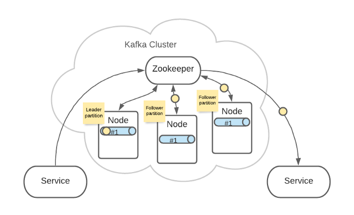

> 文章来源：

[转译：51CTO技术栈](https://mp.weixin.qq.com/s/Qd8djgMCSi1QuxdyToSAIQ)

[出处：外国原作者](https://timothystepro.medium.com/visualizing-kafka-20bc384803e7)

**Kafka** 是主流的消息流系统，其中的概念还是比较多的，下面通过图示的方式来梳理一下 **Kafka** 的核心概念，以便在我们的头脑中有一个清晰的认识。

#### 01

 **基础**  

Kafka 是一套流处理系统，可以让后端服务轻松的相互沟通，是微服务架构中常用的组件。  

#### 02

 **生产者消费者**  

生产者服务 Producer 向 Kafka 发送消息，消费者服务 Consumer 监听 Kafka 接收消息。

一个服务可以同时为生产者和消费者。  

#### 03

 **Topics 主题**  

  

Topic 是生产者发送消息的目标地址，是消费者的监听目标。

一个服务可以监听、发送多个 Topics。  

Kafka 中有一个【consumer-group（消费者组）】的概念。  

  

这是一组服务，扮演一个消费者。

如果是消费者组接收消息，Kafka 会把一条消息路由到组中的某一个服务。

这样有助于消息的负载均衡，也方便扩展消费者。  

Topic 扮演一个消息的队列。首先，一条消息发送了。

然后，这条消息被记录和存储在这个队列中，不允许被修改。  

接下来，消息会被发送给此 Topic 的消费者。  

  

但是，这条消息并不会被删除，会继续保留在队列中。

继续发送消息。  

像之前一样，这条消息会发送给消费者、不允许被改动、一直呆在队列中。（消息在队列中能呆多久，可以修改 Kafka 的配置）

#### 04

 **Partitions 分区**  

上面 Topic 的描述中，把 Topic 看做了一个队列，实际上，一个 Topic 是由多个队列组成的，被称为【Partition（分区）】。

  

这样可以便于 Topic 的扩展。

生产者发送消息的时候，这条消息会被路由到此 Topic 中的某一个 Partition。  

消费者监听的是所有分区并消耗所有人的事件。  

生产者发送消息时，默认是面向 Topic 的，由 Topic 决定放在哪个 Partition，默认使用轮询策略。  

也可以配置 Topic，让同类型的消息都在同一个 Partition。  

  

例如，处理用户消息，可以让某一个用户所有消息都在一个 Partition。

  

例如，用户 1 发送了 3 条消息：A、B、C，默认情况下，这 3 条消息是在不同的 Partition 中（如 P1、P2、P3）。

  

在配置之后，可以确保用户 1 的所有消息都发到同一个分区中（如 P1）。

这个功能有什么用呢？这是为了提供消息的【有序性】。

  

消息在不同的 Partition 是不能保证有序的，只有一个 Partition 内的消息是有序的。

#### 05

 **架构**  

Kafka 是集群架构的，ZooKeeper 是重要组件。

ZooKeeper 管理着所有的 Topic 和 Partition。

  

Topic 和 Partition 存储在 Node 物理节点中，ZooKeeper 负责维护这些 Node。

例如，有 2 个 Topic，各自有 2 个 Partition。

这是逻辑上的形式，但在 Kafka 集群中的实际存储可能是这样的：

Topic A 的 Partition #1 有 3 份，分布在各个 Node 上。

  

这样可以增加 Kafka 的可靠性和系统弹性。

  

3 个 Partition #1 中，ZooKeeper 会指定一个 Leader，负责接收生产者发来的消息。

其他 2 个 Partition #1 会作为 Follower，Leader 接收到的消息会复制给 Follower。

这样，每个 Partition 都含有了全量消息数据。

即使某个 Node 节点出现了故障，也不用担心消息的损坏。

  

Topic A 和 Topic B 的所有 Partition 分布可能就是这样的：

  

