# PHPSTORM


## 风格

1. 安装插件 `Material Theme UI  ` ，安装后重起软件
2. `Tools -> Material Theme ` 中选择喜欢的样式就可以了


## 快捷键【window环境】

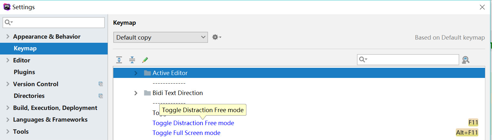 

全屏幕快捷键 

   ```
   Keymap>Main menu>View>Toggle Distraction Free mode 为 f11健
   Keymap>Main menu>View>Toggle Full Screen mode 为 alt f11健
   ```

#### [查询]


| 按 Press               | 功能 Function                                          |
| ---------------------- | ----------------------------------- |
| Ctrl + N               | 查找类                              |
| Ctrl + Shift + N       | 全局搜索文件 ,优先文件名匹配的文件    |
| Ctrl + Shift + ALT + N | 查找php类名/变量名 ,js方法名/变量名, css 选择器        |
| CIRL + B   | 找变量的来源，跳到变量申明处 (Ctrl +  鼠标单击 也可以) |
| Ctrl + G   | 定位行，跳转行 |
| Ctrl + F   | 在当前窗口查找文本 |
| Ctrl + Shift + F   | 在指定路径查找文本字符 |
| Ctrl + E   | 最近打开的文件 |
| Ctrl + ALT←/→   | 返回上次编辑的位置 |
| ALT + ←/→   | 切换代码视图，标签切换 |
| ALT + ↑/↓   | 在方法间快速移动定位 |
| Ctrl  +  '-/ + '      | 可以折叠项目中的任何代码块,包括htm中的任意nodetype=3的元素，function,或对象直接量等等。它不是选中折叠，而是自动识别折叠 |
| Ctrl  + F12  | 文件结构弹出 类似 ALT  +  7 |
| Ctrl + ALT + F12  | 资源管理器打开文件夹，跳转至当前文件在磁盘上的位置 |
| Ctrl + [] |	光标移动到{}[]开头或结尾位置	|

#### [编辑]

| 按 Press             | 功能 Function                       |
| -------------------- | ----------------------------------- |
| Ctrl + Q | 快速文档查询  |
| Ctrl + Shift + i   | 快速查看变量或方法定义源 , 也可以鼠标按住 + Ctrl    |
| Ctrl + R     | 当前窗口替换文本   |
| Ctrl + Shift + R    | 在指定路径替换文本 |
| Ctrl + ALT + T   | 把选中的代码放在TRY{} IF{} ELSE{} 里 |
| Ctrl + Shift + J   | 多行合成一行，所有多余的字符(空格，引号和加号)被去掉了 |
| Ctrl + Shift + U   | 选中的字符大小写转换 |
| Ctrl + W   | 块状选中代码，连续按会有其他效果 Ctrl + Shift + W 减少当前选择到以前的状态 |
| Ctrl + Shift + []   | 直接选中块代码 = Ctrl + W 按好几下 |


#### [自动代码]

| 按 Press             | 功能 Function                       |
| -------------------- | ----------------------------------- |
| Ctrl + I | 实现方法(构造函数)  |
| Ctrl + J | 自动代码提示，自动补全    |
| ALT + Enter     | 导入包,自动修正   |
| Ctrl + ALT + L   | 格式化代码 |
| Ctrl + ALT + I   | 自动缩进 |
| Ctrl + Shift + enter   | (智能完善代码 如if()) |
| Ctrl + P   | 方法参数提示，显示默认参数 |


## bootstrap


## 关闭angular提示

以前使用angular.js比较多，现在主要使用vue.js，所在angular.js的提示暂时不需要。

`settings>Editor>Live Templates`

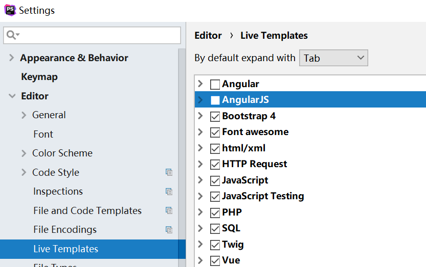

## Blade

PHPstorm 默认支持Laravel的blade 模板提示，但我们需要定义一下快捷键。

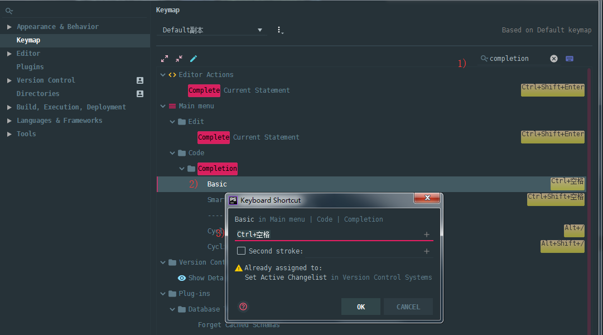

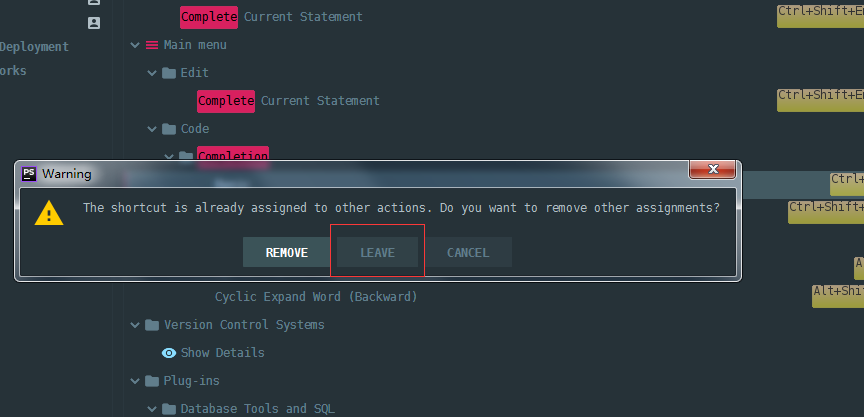

## 修改代码风格

`Editor>Code Style>PHP` 点击 `Set From...`  ,我使用的是`Symfony2`

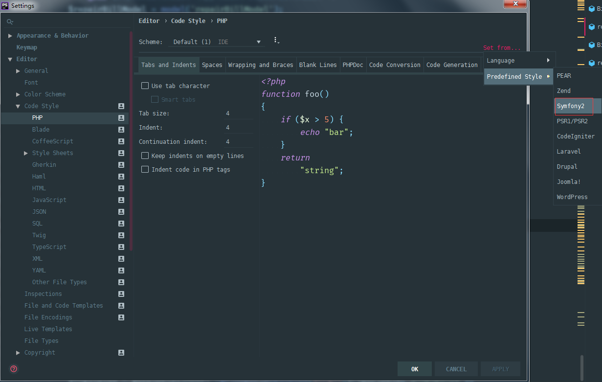

## Shell

windows10 更改 Shell（用于全局使用ls，rm等Linux命令），Mac与Linux不需要设置。

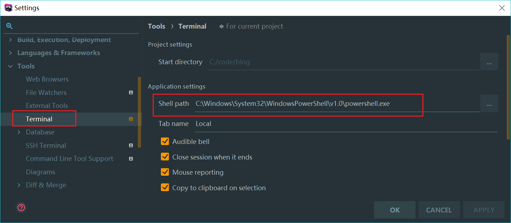

```
C:\Windows\System32\WindowsPowerShell\v1.0\powershell.exe
```

## 字体大小设置

鼠标滚动改变大小

```
Preferences | Editor | Font >Change font Size(Zoom)...
```

改变编辑区大小

```
Preferences | Editor | Font
```

改变终端字体大小

```
Preferences | Editor | Color Scheme | Console Font
```

改变文件列表等dialog字体大小

```
Preferences | Appearance & Behavior | Appearance > Use custom font
```

> 一般我的设置是 编辑区 35，终端35，文件列表25

## PHP命令

Phpstorm中大量使用composer或命令行指令，所以需要设置合适的php命令

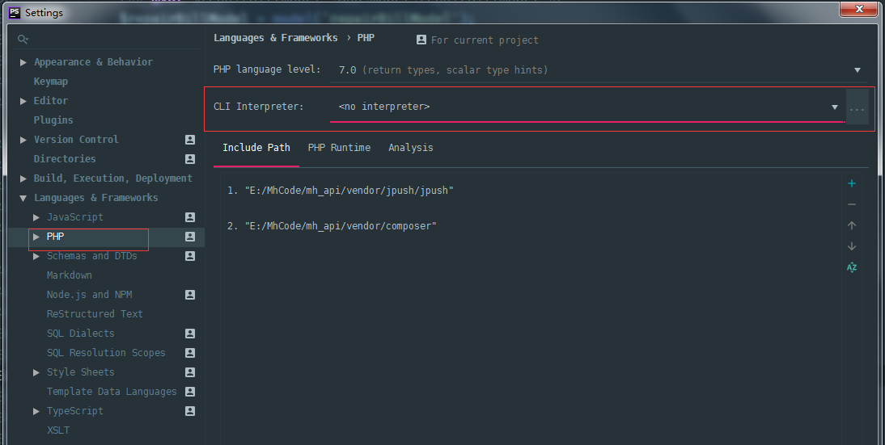

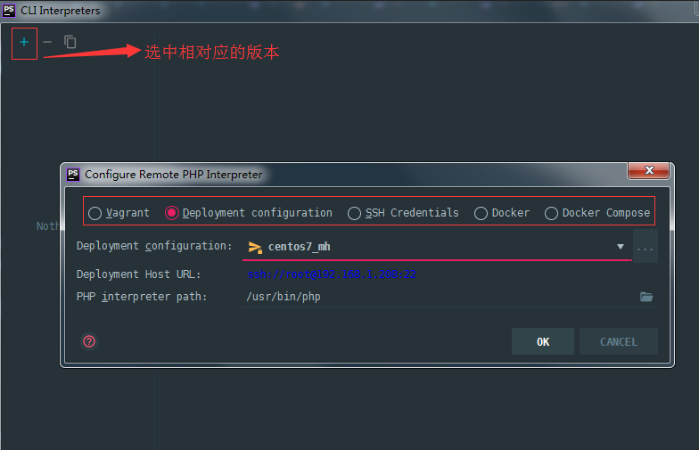

## 创建项目

软件启动时 `Create New Project` 或 选择菜单 `File>new Project` ，下面是演示安装 `Laravel` 项目

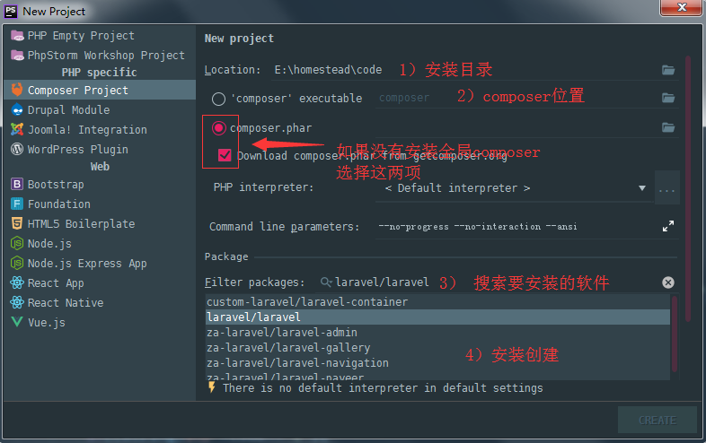

## Laravel

### Laravel Plugin

在phpstorm中安装 `laravel plugin` 插件.

`Settings > Languages & Frameworks > PHP > Laravel `  点击开启 `Enable for this project`

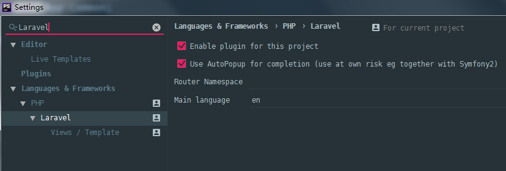

### laravel-ide-helper

laravel-ide-helper 用于实现方便的代码提示功能，详细[查看插件官网](https://github.com/barryvdh/laravel-ide-helper)

使用composer安装插件

```
composer require --dev barryvdh/laravel-ide-helper
```

生成代码跟踪支持 

```
php artisan ide-helper:generate
```

### 其他插件

在 IDE 中设置中搜索插件 `Preferences | Plugins`需要安装的插件列表如下：

- Laravel Plugin
- Laravel Snippets

## 命令提示

`settings>Tools>Command Line Tool Support` 

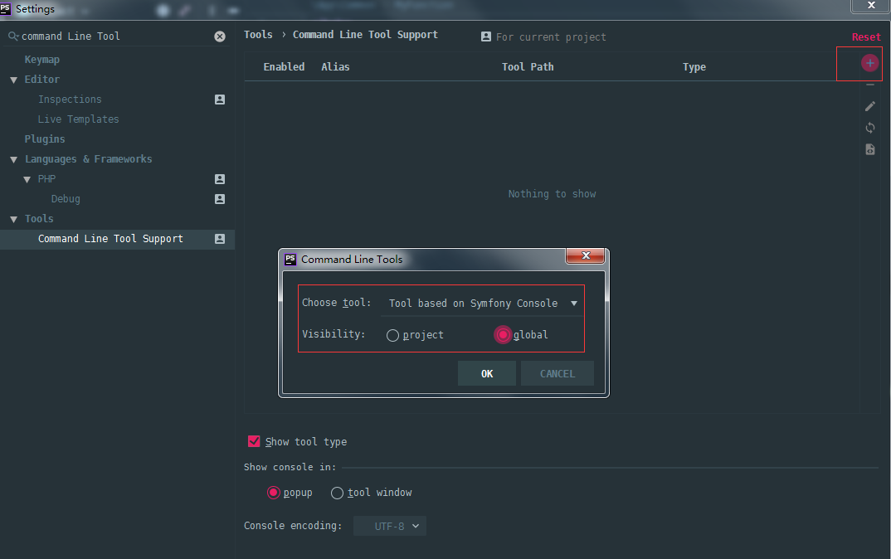

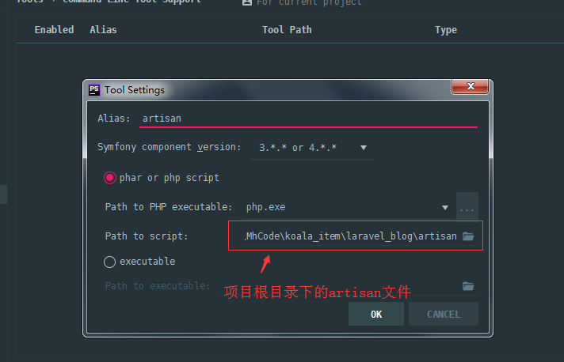

## Git

phpstorm很好的内置支持版本库管理。选择菜单 `VCS>Enable Version Control Integration`

安装 `.ignore` 插件用于管理 Git的 `.gitignore` 文件

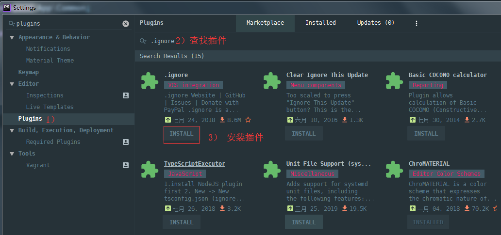

提交代码

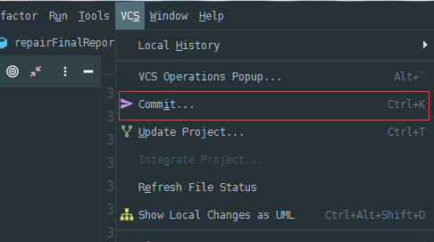

## editorconfig

editorConfig可以帮助开发人员在不同的编辑器和IDE中定义和维护一致的编码风格。下面是`laravel` 项目的配置，也是使用的配置。官网 https://editorconfig.org/

主流开源项目的 `editorconfig` 配置 https://github.com/editorconfig/editorconfig/wiki/Projects-Using-EditorConfig

在 `phpstorm` 插件中安装 `editorconfig` 插件，然后在项目根目录创建 `.editorconfig` 文件内容如下：

```
root = true

[*]
charset = utf-8
end_of_line = lf
insert_final_newline = true
indent_style = space
indent_size = 4
trim_trailing_whitespace = true

[*.md]
trim_trailing_whitespace = false

[*.yml]
indent_style = space
indent_size = 2
```

说明

```
indent_style    设置缩进风格(tab是硬缩进，space为软缩进)
indent_size     用一个整数定义的列数来设置缩进的宽度，如果indent_style为tab，则此属性默认为tab_width
tab_width       用一个整数来设置tab缩进的列数。默认是indent_size
end_of_line     设置换行符，值为lf、cr和crlf
charset         设置编码，值为latin1、utf-8、utf-8-bom、utf-16be和utf-16le，不建议使用utf-8-bom
trim_trailing_whitespace  设为true表示会去除换行行首的任意空白字符。
insert_final_newline      设为true表示使文件以一个空白行结尾
root        　　　表示是最顶层的配置文件，发现设为true时，才会停止查找.editorconfig文件   
```

## composer

composer.json 配置文件管理，需要安装插件

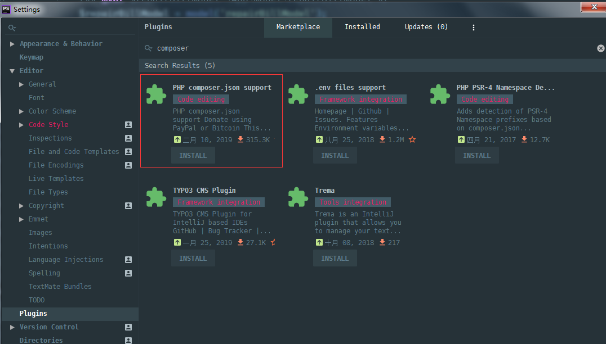


## 其他设置


### 取消格式化代码时 自动换行

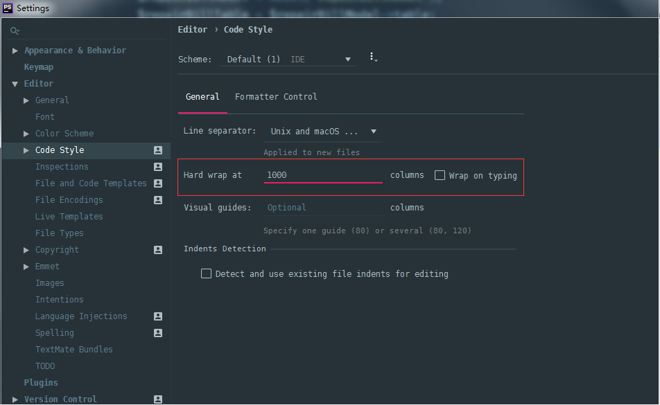


### 快速加符号

为选中字符快速添加引号或其他包裹符号。

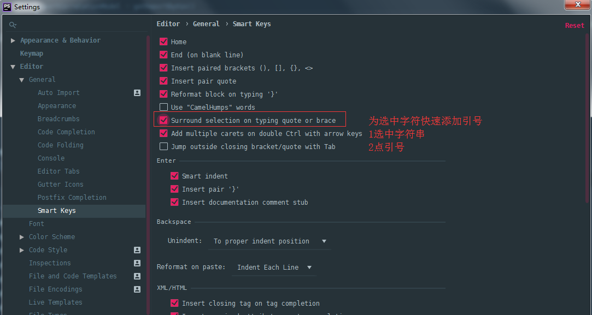


### 解决NPM变慢的问题

生成 `node_modules` 目录后，加载特别慢并会卡死，解决方法如下：

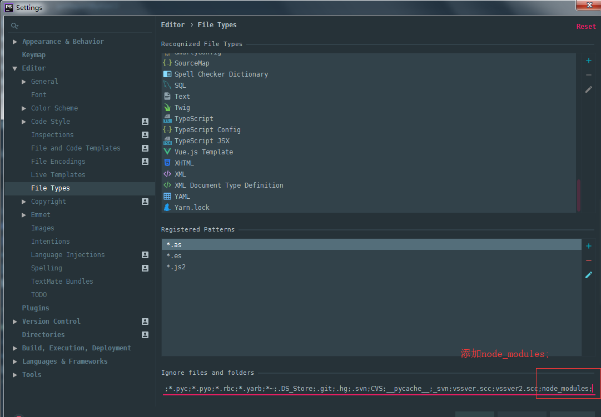


### 自动换行

```
Preferences | Editor | General | Use soft wraps in editor
```


### Less

```
// 全局安装
npm install -g less

// 开启监听
settings > Tools > File Watchers > less
```


**最新版激活码(有效期：2020-04-21)**

```
812LFWMRSH-eyJsaWNlbnNlSWQiOiI4MTJMRldNUlNIIiwibGljZW5zZWVOYW1lIjoi5q2j54mIIOaOiOadgyIsImFzc2lnbmVlTmFtZSI6IiIsImFzc2lnbmVlRW1haWwiOiIiLCJsaWNlbnNlUmVzdHJpY3Rpb24iOiIiLCJjaGVja0NvbmN1cnJlbnRVc2UiOmZhbHNlLCJwcm9kdWN0cyI6W3siY29kZSI6IklJIiwiZmFsbGJhY2tEYXRlIjoiMjAxOS0wNC0yMSIsInBhaWRVcFRvIjoiMjAyMC0wNC0yMCJ9LHsiY29kZSI6IkFDIiwiZmFsbGJhY2tEYXRlIjoiMjAxOS0wNC0yMSIsInBhaWRVcFRvIjoiMjAyMC0wNC0yMCJ9LHsiY29kZSI6IkRQTiIsImZhbGxiYWNrRGF0ZSI6IjIwMTktMDQtMjEiLCJwYWlkVXBUbyI6IjIwMjAtMDQtMjAifSx7ImNvZGUiOiJQUyIsImZhbGxiYWNrRGF0ZSI6IjIwMTktMDQtMjEiLCJwYWlkVXBUbyI6IjIwMjAtMDQtMjAifSx7ImNvZGUiOiJHTyIsImZhbGxiYWNrRGF0ZSI6IjIwMTktMDQtMjEiLCJwYWlkVXBUbyI6IjIwMjAtMDQtMjAifSx7ImNvZGUiOiJETSIsImZhbGxiYWNrRGF0ZSI6IjIwMTktMDQtMjEiLCJwYWlkVXBUbyI6IjIwMjAtMDQtMjAifSx7ImNvZGUiOiJDTCIsImZhbGxiYWNrRGF0ZSI6IjIwMTktMDQtMjEiLCJwYWlkVXBUbyI6IjIwMjAtMDQtMjAifSx7ImNvZGUiOiJSUzAiLCJmYWxsYmFja0RhdGUiOiIyMDE5LTA0LTIxIiwicGFpZFVwVG8iOiIyMDIwLTA0LTIwIn0seyJjb2RlIjoiUkMiLCJmYWxsYmFja0RhdGUiOiIyMDE5LTA0LTIxIiwicGFpZFVwVG8iOiIyMDIwLTA0LTIwIn0seyJjb2RlIjoiUkQiLCJmYWxsYmFja0RhdGUiOiIyMDE5LTA0LTIxIiwicGFpZFVwVG8iOiIyMDIwLTA0LTIwIn0seyJjb2RlIjoiUEMiLCJmYWxsYmFja0RhdGUiOiIyMDE5LTA0LTIxIiwicGFpZFVwVG8iOiIyMDIwLTA0LTIwIn0seyJjb2RlIjoiUk0iLCJmYWxsYmFja0RhdGUiOiIyMDE5LTA0LTIxIiwicGFpZFVwVG8iOiIyMDIwLTA0LTIwIn0seyJjb2RlIjoiV1MiLCJmYWxsYmFja0RhdGUiOiIyMDE5LTA0LTIxIiwicGFpZFVwVG8iOiIyMDIwLTA0LTIwIn0seyJjb2RlIjoiREIiLCJmYWxsYmFja0RhdGUiOiIyMDE5LTA0LTIxIiwicGFpZFVwVG8iOiIyMDIwLTA0LTIwIn0seyJjb2RlIjoiREMiLCJmYWxsYmFja0RhdGUiOiIyMDE5LTA0LTIxIiwicGFpZFVwVG8iOiIyMDIwLTA0LTIwIn0seyJjb2RlIjoiUlNVIiwiZmFsbGJhY2tEYXRlIjoiMjAxOS0wNC0yMSIsInBhaWRVcFRvIjoiMjAyMC0wNC0yMCJ9XSwiaGFzaCI6IjEyNzk2ODc3LzAiLCJncmFjZVBlcmlvZERheXMiOjcsImF1dG9Qcm9sb25nYXRlZCI6ZmFsc2UsImlzQXV0b1Byb2xvbmdhdGVkIjpmYWxzZX0=-ti4tUsQISyJF/zfWxSHCr+IcYrX2w24JO5bUZCPIGKSi+IrgQ0RT2uum9n96o+Eob9Z1iQ9nUZ6FJdpEW5g0Exe6sw8fLrWMoLFhtCIvVgQxEEt+M7Z2xD0esmjP1kPKXZyc/i+NCxA2EO2Sec9uifqklBGP1L3xoENAw2QsIWBfttIe6EPWhbS8TIMMr2vF/S3HrN8To5Hj5lwD/t1GHgFK1uWrhsuifAiKcVzqogybzGiR1h2+yNYTMbKxP7uPCcdYMsIyrBNVRGA3IuEJgyGQTQlFbnVQoVUTGPW2tQxprmC464wMjKi40JHh27WzjOHPwgzxDaigwn4Z0EbSpA==-MIIElTCCAn2gAwIBAgIBCTANBgkqhkiG9w0BAQsFADAYMRYwFAYDVQQDDA1KZXRQcm9maWxlIENBMB4XDTE4MTEwMTEyMjk0NloXDTIwMTEwMjEyMjk0NlowaDELMAkGA1UEBhMCQ1oxDjAMBgNVBAgMBU51c2xlMQ8wDQYDVQQHDAZQcmFndWUxGTAXBgNVBAoMEEpldEJyYWlucyBzLnIuby4xHTAbBgNVBAMMFHByb2QzeS1mcm9tLTIwMTgxMTAxMIIBIjANBgkqhkiG9w0BAQEFAAOCAQ8AMIIBCgKCAQEAxcQkq+zdxlR2mmRYBPzGbUNdMN6OaXiXzxIWtMEkrJMO/5oUfQJbLLuMSMK0QHFmaI37WShyxZcfRCidwXjot4zmNBKnlyHodDij/78TmVqFl8nOeD5+07B8VEaIu7c3E1N+e1doC6wht4I4+IEmtsPAdoaj5WCQVQbrI8KeT8M9VcBIWX7fD0fhexfg3ZRt0xqwMcXGNp3DdJHiO0rCdU+Itv7EmtnSVq9jBG1usMSFvMowR25mju2JcPFp1+I4ZI+FqgR8gyG8oiNDyNEoAbsR3lOpI7grUYSvkB/xVy/VoklPCK2h0f0GJxFjnye8NT1PAywoyl7RmiAVRE/EKwIDAQABo4GZMIGWMAkGA1UdEwQCMAAwHQYDVR0OBBYEFGEpG9oZGcfLMGNBkY7SgHiMGgTcMEgGA1UdIwRBMD+AFKOetkhnQhI2Qb1t4Lm0oFKLl/GzoRykGjAYMRYwFAYDVQQDDA1KZXRQcm9maWxlIENBggkA0myxg7KDeeEwEwYDVR0lBAwwCgYIKwYBBQUHAwEwCwYDVR0PBAQDAgWgMA0GCSqGSIb3DQEBCwUAA4ICAQAF8uc+YJOHHwOFcPzmbjcxNDuGoOUIP+2h1R75Lecswb7ru2LWWSUMtXVKQzChLNPn/72W0k+oI056tgiwuG7M49LXp4zQVlQnFmWU1wwGvVhq5R63Rpjx1zjGUhcXgayu7+9zMUW596Lbomsg8qVve6euqsrFicYkIIuUu4zYPndJwfe0YkS5nY72SHnNdbPhEnN8wcB2Kz+OIG0lih3yz5EqFhld03bGp222ZQCIghCTVL6QBNadGsiN/lWLl4JdR3lJkZzlpFdiHijoVRdWeSWqM4y0t23c92HXKrgppoSV18XMxrWVdoSM3nuMHwxGhFyde05OdDtLpCv+jlWf5REAHHA201pAU6bJSZINyHDUTB+Beo28rRXSwSh3OUIvYwKNVeoBY+KwOJ7WnuTCUq1meE6GkKc4D/cXmgpOyW/1SmBz3XjVIi/zprZ0zf3qH5mkphtg6ksjKgKjmx1cXfZAAX6wcDBNaCL+Ortep1Dh8xDUbqbBVNBL4jbiL3i3xsfNiyJgaZ5sX7i8tmStEpLbPwvHcByuf59qJhV/bZOl8KqJBETCDJcY6O2aqhTUy+9x93ThKs1GKrRPePrWPluud7ttlgtRveit/pcBrnQcXOl1rHq7ByB8CFAxNotRUYL9IF5n3wJOgkPojMy6jetQA5Ogc8Sm7RG6vg1yow==
```

