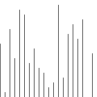

> [原文链接](https://www.cnblogs.com/isykw/p/6115461.html)

### 冒泡排序

```

$arr=array(1,43,54,62,21,66,32,78,36,76,39);
function bubbleSort($arr)
{
    $len = count($arr);
    //该层循环控制 需要冒泡的轮数
    for ($i = 1; $i < $len; $i++) {
    //该层循环用来控制每轮 冒出一个数 需要比较的次数
        for ($k = 0; $k < $len - $i; $k++) {
            if ($arr[$k] > $arr[$k + 1]) {
                $tmp         = $arr[$k + 1]; // 声明一个临时变量
                $arr[$k + 1] = $arr[$k];
                $arr[$k]     = $tmp;
            }
        }
    }
    return $arr;
}

```

示例图：


### 选择排序

```

//实现思路 双重循环完成，外层控制轮数，当前的最小值。内层 控制的比较次数
function select_sort($arr) {
    //$i 当前最小值的位置， 需要参与比较的元素
    for($i=0, $len=count($arr); $i<$len-1; $i++) {
        //先假设最小的值的位置
        $p = $i;
        //$j 当前都需要和哪些元素比较，$i 后边的。
        for($j=$i+1; $j<$len; $j++) {
        //$arr[$p] 是 当前已知的最小值
            if($arr[$p] > $arr[$j]) {
            //比较，发现更小的,记录下最小值的位置；并且在下次比较时，应该采用已知的最小值进行比较。
                $p = $j;
            }
        }
        //已经确定了当前的最小值的位置，保存到$p中。
        //如果发现 最小值的位置与当前假设的位置$i不同，则位置互换即可
        if($p != $i) {
            $tmp = $arr[$p];
            $arr[$p] = $arr[$i];
            $arr[$i] = $tmp;
        }
    }
    //返回最终结果
    return $arr;
}

```

示例图：


### 插入排序

```
function insert_sort($arr)
{
    $len=count($arr);
    for($i=1; $i<$len; $i++) {
        //获得当前需要比较的元素值。
        $tmp = $arr[$i];
        //内层循环控制 比较 并 插入
        for($j=$i-1; $j>=0; $j--) {
        //$arr[$i];//需要插入的元素; $arr[$j];//需要比较的元素
            if($tmp < $arr[$j]) {
                //发现插入的元素要小，交换位置
                //将后边的元素与前面的元素互换
                $arr[$j+1] = $arr[$j];
                //将前面的数设置为 当前需要交换的数
                $arr[$j] = $tmp;
            } else {
                //如果碰到不需要移动的元素
                //由于是已经排序好是数组，则前面的就不需要再次比较了。
                break;
            }
        }
    }
    //将这个元素 插入到已经排序好的序列内。
    //返回
    return $arr;
}

```

示例图：



### 快速排序

```
function quick_sort($arr)
{
    //判断参数是否是一个数组
    if(!is_array($arr)) return false;
    //递归出口:数组长度为1，直接返回数组
    $length = count($arr);
    if($length<=1) return $arr;
    //数组元素有多个,则定义两个空数组
    $left = $right = array();
    //使用for循环进行遍历，把第一个元素当做比较的对象
    for($i=1; $i<$length; $i++)
    {
    //判断当前元素的大小
        if($arr[$i]<$arr[0]){
            $left[]=$arr[$i];
        }else{
            $right[]=$arr[$i];
        }
    }
    //递归调用
    $left=quick_sort($left);
    $right=quick_sort($right);
    //将所有的结果合并
    return array_merge($left,array($arr[0]),$right);
}
```

示例图：

