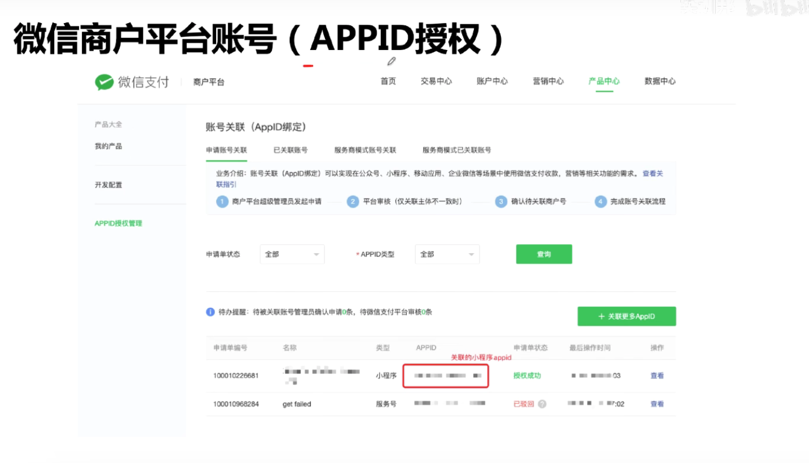
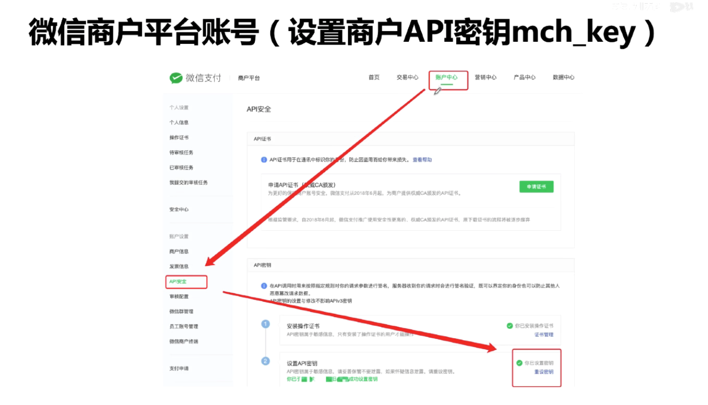

## 准备工作

#### 微信小程序支付功能限制

在 iOS 端不能用于虚拟支付

- 充会员

- 购买音/视频

  

#### 注册账号

微信小程序账号（https://mp.weixin.qq.com）

- 要认证
- 获取appid
- 生成secret
- 开通支付
- 关联商户号

微信商户平台账号（https://pay.weixin.qq.com）

- 要认证
- 获取商户号（登录账号【mch_id】）
- 设置商户API秘钥（mch_key）
- APPID授权
- 配置支付接口

